# Lab - Implement In-Memory Databases with Amazon MemoryDB   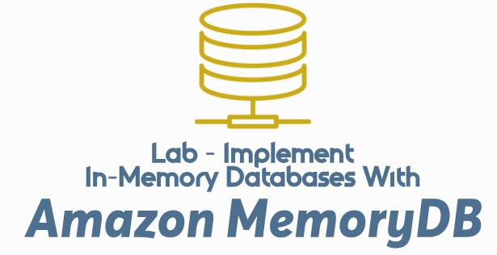

### AWS Skill Builder <a href="../../">aws_skill_builder   </a>
### Training Category: <a href="../../self_paced_lab">self_paced_lab</a>
### Software/Subject: aws   
### Course: <a href="./">curso_spl_043 (Lab - Implement In-Memory Databases with Amazon MemoryDB)   </a>

#### Parceria da AWS com a Escola da Nuvem (EDN)   

---

### Theme:
- Cloud Computing

### Used Tools:
- Operating System (OS): 
  - Linux   
  - Windows 11   
- Linux Distribution:
  - Amazon Linux   
- Cloud:
  - Amazon Web Services (AWS)   
- Cloud Services:
  - Amazon MemoryDB   
  - Amazon MemoryDB for Valkey   
  - Google Drive   
- Language:
  - HTML   
  - Markdown   
- Integrated Development Environment (IDE) and Text Editor:
  - Visual Studio Code (VS Code)   
- Versioning: 
  - Git   
- Repository:
  - GitHub   
- Command Line Interpreter (CLI):
  - Bash e Sh   
  - Valkey CLI   
- Server and Databases:
  - Valkey   

---

<a name="item0"><h3>Course Strcuture:</h3></a>
1. Lab - Implement In-Memory Databases with Amazon MemoryDB<br>
1.1 <a href="#item01.1">Tarefa 1: Criar um cluster do Amazon MemoryDB</a><br>
1.2 <a href="#item01.2">Tarefa 2: Preparar instância EC2 para conexão MemoryDB</a><br>
1.3 <a href="#item01.3">Tarefa 3: conectar ao cluster MemoryDB da instância EC2</a><br>
1.4 <a href="#item01.4">Tarefa 4: Executar operações básicas de dados usando valkey-cli</a><br>
1.5 <a href="#item01.5">Tarefa 5: Configurar o cluster para alta disponibilidade</a><br>

---

### Objective:
Este laboratório teve como objetivo provisionar um cluster **Valkey** no **Amazon MemoryDB** com um único node e shard, além de configurar a rede para permitir que uma instância **Amazon EC2**, acessada remotamente, se conectasse ao cluster utilizando o **Valkey CLI**. Foram realizadas operações básicas de dados, incluindo a criação, consulta, atualização e remoção de registros nos formatos string e JSON. Por fim, a configuração do cluster foi ajustada para alta disponibilidade, adicionando um segundo nó.

### Structure:
A estrutura do curso é formada por:
- Este arquivo de README.
- A pasta `0-aux`, pasta auxiliar com imagens utilizadas na construção desse arquivo de README.

### Development:
Este curso foi um laboratório prático realizado na plataforma **AWS Skill Builder**, cuja subscrição foi devida a uma parceria entre a **AWS** e a **Escola da Nuvem**. A infraestrutura de cloud utilizada foi fornecida através de um sandbox do **AWS Skill Builder** que possibilitava acesso ao console da **AWS**. Contudo foi necessário seguir estritamente as orientações determinadas no laboratório. Dessa maneira, a forma de interação com os recursos da cloud foram sempre através do console fornecido pelo sandbox, a não ser em casos em que o próprio laboratório instruiu para utilização de outras ferramentas de interação como **AWS CLI** ou **AWS SDK**.

O laboratório do **AWS Skill Builder** tem o foco em executar apenas o que é orientado no escopo, todos os recursos ou serviços que podem ser requisitados adicionalmente já vêm provisionados por padrão pelo laboratório. Ao iniciar o laboratório, o sandbox do **AWS Skill Builder** provisiona diversos recursos e serviços para o funcionamento através de uma ou mais pilhas do **AWS CloudFormation** de forma automática. 

O acesso ao console no sandbox do **AWS Skill Builder** é realizado por meio de uma identidade federada. O Skill Builder funciona como um provedor de identidade (IdP), autenticando o usuário e vinculando-o a uma role do **AWS IAM** provisionada automaticamente por uma das pilhas do CloudFormation. Essa role concede permissões temporárias e mínimas necessárias para a execução do laboratório, garantindo segurança e controle sobre os recursos utilizados. O laboratório, por padrão, determina a região a ser utilizada e ela não deve ser alterada, somente se o próprio laboratório indicar. As configurações não informadas no laboratório devem ser sempre mantidas como padrão que estão.

<a name="item01.1"><h4>Tarefa 1: Criar um cluster do Amazon MemoryDB</h4></a>[Back to summary](#item0)

Na primeira tarefa deste laboratório foi configurado um cluster **Valkey** no **Amazon MemoryDB** com apenas um nó para servir como solução de cache de alto desempenho em um cenário fictício de um aplicativo e e-commerce. O **Amazon MemoryDB** é um serviço de banco de dados em memória totalmente gerenciado, compatível com **ValKey** e **Redis**, que fornece desempenho ultrarrápido e durabilidade Multi-AZ. O cluster em questão foi definido com as seguintes configurações:
- `Creation method` (Método de criação):
    - `Cluster type` (Tipo de cluster): `Single-Region cluster` (Cluster de região única).
    - `Cluster creation method` (Método de criação de cluster): `Create new cluster` (Criar novo cluster).
- `Cluster info` (Informações do cluster):
    - `Name` (Nome): `lab-cluster`.
- `Subnets groups` (Grupos de sub-rede): `Create a new subnet group` (Criar um novo grupo de sub-rede)
    - `Name` (Nome): `MemoryDBSubnetGroup`.
    - `VPC ID`: foi selecionada a `LabVPC`.
    - `Selected subnets` (Sub-redes selecionadas): `Manage` (Gerenciar)
        - `Manage subnets` (Gerenciar sub-redes): foram marcadas as caixas de seleção da `Private Subnet 1` (Sub-rede Privada 1) e `Private Subnet 2` (Sub-rede Privada 2).
- `Cluster settings` (Configurações do cluster):
    - Foi desmarcada a opção `Enable vector search` (Habilitar pesquisa vetorial).
    - `Engine` (Motor): `ValKey`.
    - `Engine version compatibility` (Compatibilidade da versão do mecanismo): `7.2`.
    - `Port` (Porta): foi mantida a configuração padrão (`6379`).
    - `Parameter groups` (Grupos de parâmetros): `default.memorydb-valkey7`. Este grupo já tinha sido provisionado pelas pilhas do **AWS CloudFormation** ao iniciar o laboratório.
    - `Node type` (Tipo de nó): `db.r6g.large`.
    - `Number of shards` (Número de fragmentos): `1`.
    - `Replica nodes per shard` (Nós de réplica por fragmento): `0`.
- `Security` (Segurança): `Manage` (Gerenciar)
    - `Manage security groups` (Gerenciar grupos de segurança): `MemoryDBSecurityGroup`. Esse security group também já tinha sido criado pelo lab ao iniciá-lo. O `MemoryDBSecurityGroup` liberava tráfego de entrada na porta `6379` (a porta padrão do MemoryDB), permitindo que o cluster MemoryDB recebesse comunicação de entrada da instância EC2 nessa porta.
    - `Encryption key` (Chave de criptografia): `AWS owned key` (Chave de propriedade da AWS).
        - `Encryption in transit` (Criptografia em trânsito): `TLS`.
        - `Access control lists (ACL)` (Listas de controle de acesso (ACL)): `open-access`. Essa era uma ACL do MemoryDB também já provisionada pelo CloudFormation ao iniciar o lab. A ACL `open-access` permitia que todos os usuários autenticados executassem qualquer comando **Valkey** no cluster. Isso é adequado para fins de desenvolvimento e teste. Para ambientes de produção, deve ser criado e atribuído uma ACL mais restritiva que conceda apenas as permissões necessárias.

A imagem 01 evidencia o banco de dados **Valkey** no **Amazon MemoryDB** com um node e um shard provisionado com sucesso.

<div align="Center"><figure>
    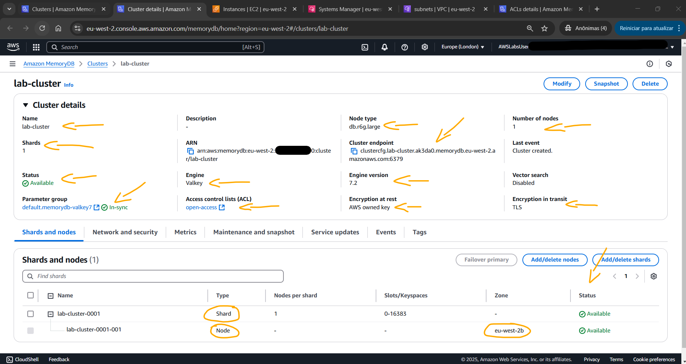<br>
    <figcaption>Imagem 01.</figcaption>
</figure></div><br>

Antes de prosseguir para a tarefa 2, os principais detalhes do cluster MemoryDB foram revisados. Dessa forma, após o provisionamento total do cluster `lab_cluster`, ele foi selecionado. Na seção `Cluster details` (Detalhes do cluster), as seguintes informações foram revisadas:
- `Endpoint` (Ponto de extremidade): Este era o endpoint de conexão utilizado para interagir com o cluster MemoryDB a partir da instância EC2. Este valor ficava vazio até que o cluster estivesse concluído a implantação e o status fosse `Available` (Disponível).
- `Shards` (Fragmentos): Observe o número de shards provisionados para o cluster. Isso determinava o particionamento e a distribuição de dados pelo cluster. Neste caso, era um único shard.
- `Nodes` (Nós): Esses eram os nós individuais que compuseram o cluster MemoryDB e seus status. Os nós eram distribuídos entre zonas de disponibilidade para alta disponibilidade. Nesse momento, apenas um node tinha sido provisionado.
- `Network` (Rede): Foi confirmado se o cluster estava implantado na VPC correta e se o grupo de sub-rede e o grupo de segurança apropriados estavam atribuídos.
- `Security` (Segurança): A lista de controle de acesso (ACL) que foi configurada para controlar a autenticação e a autorização no cluster foi revisada para confirmar quais usuários tinham quais permissões no cluster. A imagem 02 exibe como estava configurada essa lista. A lista tinha o cluster associado, mas não havia nenhum usuário adicionado. Neste caso, se uma ACL no **Amazon MemoryDB** não tivesse usuários, o cluster permitia conexões sem autenticação para qualquer cliente dentro da VPC configurada.

<div align="Center"><figure>
    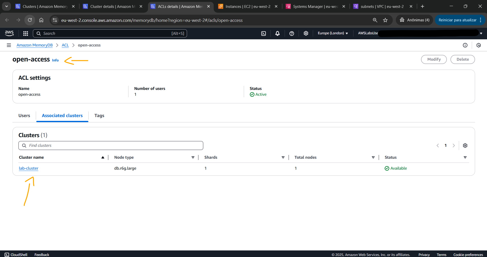<br>
    <figcaption>Imagem 02.</figcaption>
</figure></div><br>

<a name="item01.2"><h4>Tarefa 2: Preparar instância EC2 para conexão MemoryDB</h4></a>[Back to summary](#item0)

A segunda tarefa consistiu em preparar uma instância do **Amazon EC2**, já provisionada pelo laboratório, para se conectar ao cluster do **Amazon MemoryDB** construído. Para acessar remotamente de forma segura a instância, foi utilizado o recurso *Session Manager* do serviço **AWS Systems Manager (SSM)**. Com o acesso via *Session Manager* não é necessário gerenciar chaves SSH ou abrir portas, pois toda essa comunicação e autenticação é executada pelo agente do SSM que estava instalado na instância. Ao conectar, um terminal é aberto configurado com usuário padrão do SSM, que é `ssm-user`.

De dentro da instância, o software **Valkey CLI** foi instalado com o comando abaixo. Em seguida, com o comando `valkey-cli --version` foi verificada a versão instalada da CLI do **Valkey**, conforme mostrado na imagem 03.

```bash
sudo yum install gcc jemalloc-devel openssl-devel tcl tcl-devel -y 
sudo wget https://github.com/valkey-io/valkey/archive/refs/tags/7.2.7.tar.gz 
sudo tar xvzf 7.2.7.tar.gz 
cd valkey-7.2.7/ 
sudo make BUILD_TLS=yes install
```

<div align="Center"><figure>
    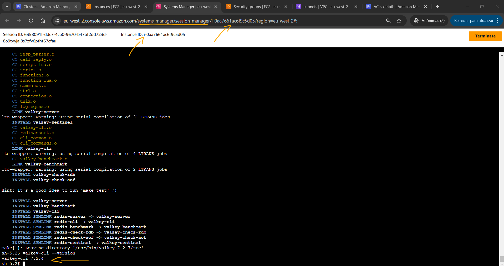<br>
    <figcaption>Imagem 03.</figcaption>
</figure></div><br>

Antes de avançar para a tarefa 3, foi necessário confirmar se o grupo de segurança vinculado ao cluster do MemoryDB (`MemoryDBSecurityGroup`) permitia tráfego de entrada do security group vinculado a instância EC2 (`EC2SecurityGroup`) na porta `6379`, porta padrão do **Valkey**. O inverso também era necessário, ou seja, o grupo de segurança da instância EC2 precisva ter a mesma regra de entrada liberando o tráfego na porta `6379` para o security group vinculado ao cluster. Portanto, essa segunda regra foi criada da seguinte forma:
- `Type` (Tipo): `Custom TCP` (TCP personalizado).
- `Port range` (Intervalo de porta): `6379`.
- `Source` (Origem): `MemoryDBSecurityGroup`.

A imagem 04 exibe lado a lado os dois security groups comprovando que cada um possuía uma regra de entrada liberando a comunicação com outro na porta `6379`.

<div align="Center"><figure>
    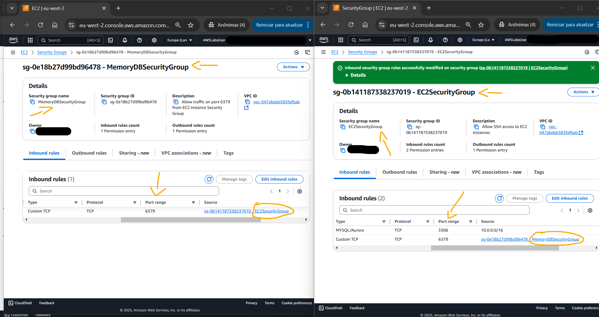<br>
    <figcaption>Imagem 04.</figcaption>
</figure></div><br>

<a name="item01.3"><h4>Tarefa 3: conectar ao cluster MemoryDB da instância EC2</h4></a>[Back to summary](#item0)

Na terceira tarefa, o objetivo foi obter o endpoint do cluster **Valkey** no **Amazon MemoryDB** e utilizá-lo no comando de conexão executado de dentro da instância **Amazon EC2** com o software **Valkey CLI**. Para capturar o endpoit do cluster era necessário que o mesmo já tivesse `Available` (Disponível), ou seja, todo provisionamento tinha que estar concluído. O endpoint era informado na seção `Cluster details` (Detalhes do cluster). O endpoint foi copiado ignorando os dois pontos e a porta (`clustercfg.lab-cluster.ak3da0.memorydb.eu-west-2.amazonaws.com`), pois isso era informado em outro parâmetro do comando. Dentro do terminal aberto pelo acesso remoto a instância do EC2, o comando `valkey-cli -h clustercfg.lab-cluster.ak3da0.memorydb.eu-west-2.amazonaws.com -p 6379 --tls -c` foi executado, passando o endpoint do cluster copiado. A imagem 05 evidencia que a comunicação foi estabelecida com sucesso.

<div align="Center"><figure>
    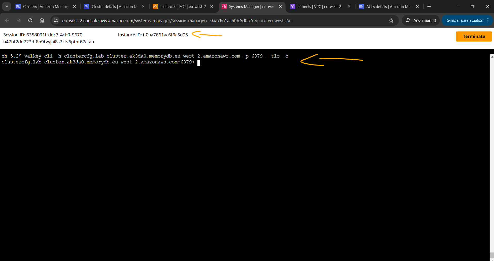<br>
    <figcaption>Imagem 05.</figcaption>
</figure></div><br>

<a name="item01.4"><h4>Tarefa 4: Executar operações básicas de dados usando valkey-cli</h4></a>[Back to summary](#item0)

Com a conexão com o **Valkey** no **Amazon MemoryDB** estabelecida através do **Valkey CLI** executado na instância **Amazon EC2** acessada remotamente, agora já era possível executar operações básicas de dados. Primeiro, os dados de amostras foram armazenados no cluster, depois os registros foram consultados, atualizados e excluídos. 6 registros foram criados com os comandos abaixo, sendo 3 registros para pessoas, cujas chaves armazenaram valores de string, e 3 registros para produtos, onde as chaves armazenaram valores JSON com três outros pares de chaves dentro. Os comandos executados foram:
- Pessoas:
    - `SET person:1 "John"`: Criava a chave `person:1` do tipo string com o valor `John`.
    - `SET person:2 "Martha"`: Criava a chave `person:2` do tipo string com o valor `Martha`.
    - `SET person:3 "Nikhil"`: Criava a chave `person:3` do tipo string com o valor `Nikhil`.
- Produtos:
    - `JSON.SET product:1 $ '{"id":1,"name":"Widget","price":9.99}'`: Criava a chave `product:1` do tipo JSON com outras três chaves (`id`, `name` e `price`), cada uma com seus respectivos valores.
    - `JSON.SET product:2 $ '{"id":2,"name":"Gadget","price":19.99}'`: Criava a chave `product:2` do tipo JSON com outras três chaves (`id`, `name` e `price`), cada uma com seus respectivos valores.
    - `JSON.SET product:3 $ "{\"id\":2,\"name\":\"Contraption\",\"price\":29.99}"`: Criava a chave `product:3` do tipo JSON com outras três chaves (`id`, `name` e `price`), cada uma com seus respectivos valores. Esse comando foi um pouco diferente, pois ao invés de utilizar aninhamento de aspas (aspas duplas dentro de aspas simples), usou o caractere de escape `\` para utilizar as aspas duplas dentro do comando.

A imagem 06 evidencia que os comandos foram executados e os registros foram criado no banco de dados.

<div align="Center"><figure>
    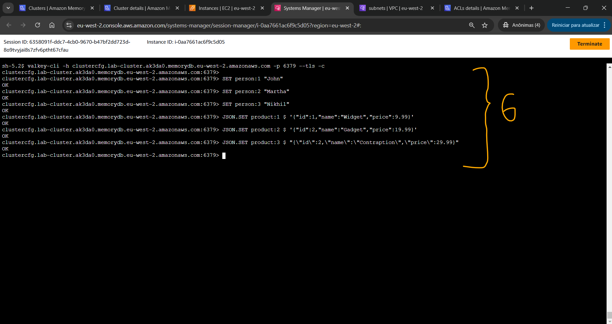<br>
    <figcaption>Imagem 06.</figcaption>
</figure></div><br>

Para recuperar registros os três seguintes comandos foram executados:
- `GET person:2`: Retornava os dados da string que foi armazenada para a chave `person:2`.
- `JSON.GET product:3`: Retornava os dados do JSON que foi armazenada para a chave `product:3`.
- `KEYS person:*`: Listava todas as chaves iniciadas com a palavra `person:` armazenadas no cluster MemoryDB, que neste caso eram as três criadas anteriormente.
- `KEYS product:*`: Listava todas as chaves iniciadas com a palavra `product:` armazenadas no cluster MemoryDB, que neste caso eram as três criadas anteriormente.

A imagem 07 exibe o resultados desses comandos.

<div align="Center"><figure>
    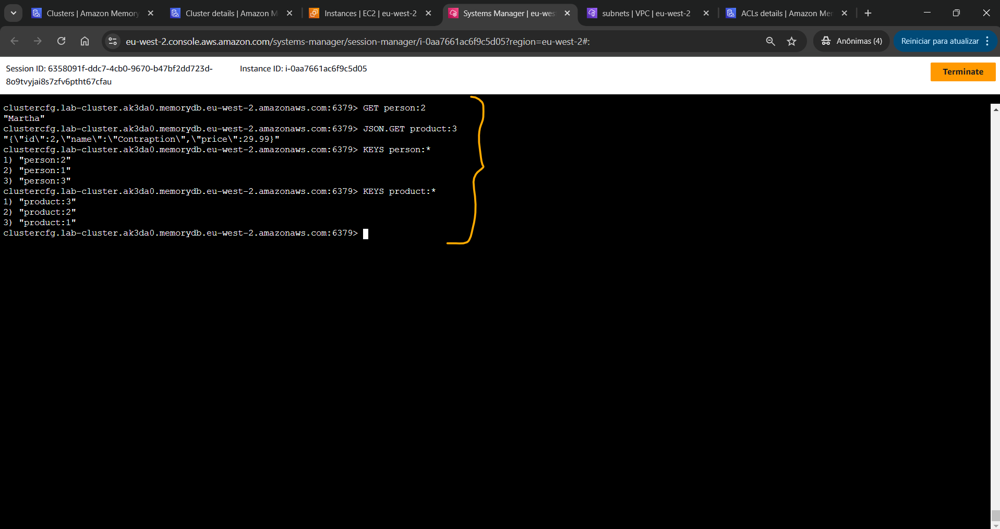<br>
    <figcaption>Imagem 07.</figcaption>
</figure></div><br>

Após consultar os dados, nesta etapa, alguns registros foram atualizados. O banco de dados estava armazenando dois tipos de dados diferentes, string e JSON. Note que o comando usado para atualizar os dados variava com base no tipo de dados que estava sendo atualizado. Os seguintes comandos foram executados:
- `SET person:1 "Pat"`: Atualizava o valor da chave `person:1` do tipo string para `Pat`.
- `GET person:1`: Consultava o nome valor da chave `person:1`.
- `JSON.SET product:3 price 10.99`: Atualizava a chave `product:3` do tipo JSON, modificando apenas o valor da chave `price` para `10.99`.
- `JSON.GET product:3 price`: Consultava o valor da chave `product:3`, acessando apenas a chave `price` dentro dele e exibindo o valor alterado.

A imagem 08 mostra o output dos comandos executados, comprovando que as alterações foram realizadas nos registros do banco de dados.

<div align="Center"><figure>
    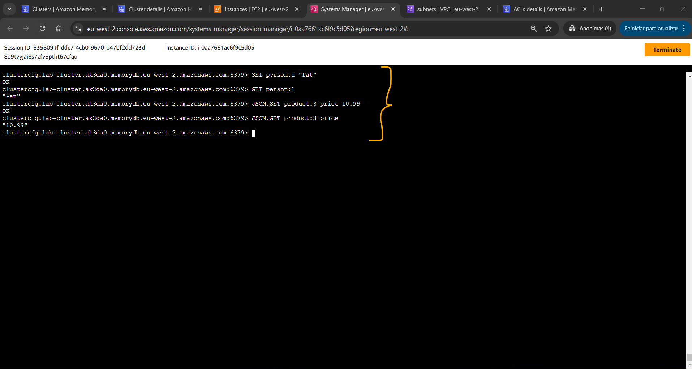<br>
    <figcaption>Imagem 08.</figcaption>
</figure></div><br>

A última etapa consistiu em remover um registro de pessoa e um registro de produto. Os comandos executados foram os seguintes:
- `DEL person:3`: Excluía a chave `person:3` do banco de dados.
- `KEYS person:*`: Consultava todas as chaves iniciadas com a palavra `person` para confirmar que a pessoa de número 3 tinha sido excluída.
- `EXISTS person:3`: Verificava a existência da chave `person:3`, que não existia mais porque tinha sido removida.
- `JSON.DEL product:2`: Excluía a chave `product:2` que era do tipo JSON.
- `KEYS product:*`: Consultava todas as chaves iniciadas com a palavra `product` para confirmar que o produto de número 2 tinha sido excluído.
- `EXISTS product:2`: Verificava a existência da chave `product:2`, que não existia mais porque tinha sido removido.

A imagem 09 evidencia a exclusão de um registro de cada.

<div align="Center"><figure>
    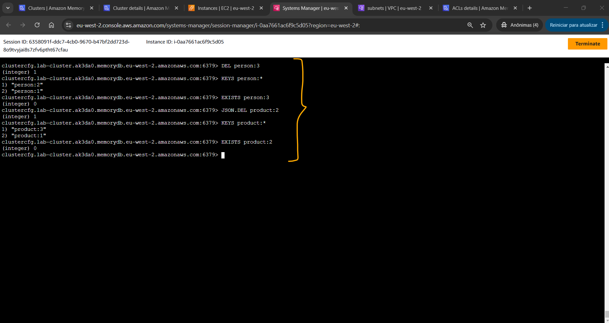<br>
    <figcaption>Imagem 09.</figcaption>
</figure></div><br>

<a name="item01.5"><h4>Tarefa 5: Configurar o cluster para alta disponibilidade</h4></a>[Back to summary](#item0)

Por fim, o objetivo da última tarefa foi alterar a configuração do cluster **Valkey** no **Amazon MemoryDB** para garantir a alta disponibilidade. Para isso, um novo nó foi adicionado ao cluster para aumentar a capacidade de leitura e habilitar a tolerância a falhas. Adicionar nós a um shard distribui operações de leitura entre o nó primário e os nós de réplica. Isso libera mais recursos no nó primário para processar operações de gravação. Além disso, se o nó primário ficar indisponível, o cluster fará failover, promovendo um dos nós somente leitura para ser o nó primário. 

Para adicionar um segundo nó ao shard existente no cluster, o cluster `lab-cluster` foi selecionado e em `Cluster details` (Detalhes do cluster), a aba `Shards e nodes` foi aberta. A opção `Add/delete nodes` (Adicionar/excluir nós) foi selecionada e na caixa de diálogo, o `New number of nodes` (Novo número de nós) foi modificado para `2`. O status do cluster mudava para `Updating` (Atualizando) e o processo de atualização poderia levar mais de 10 minutos para ser concluído.

Após o cluster ficar disponível (`Available`) novamente, os detalhes desse novo nó foram visualizados. Em `Cluster details` (Detalhes do cluster) foi verificado o valor do `Number of nodes` (Número de nós) que agora eram 2 nodes, conforme mostrado na imagem 10. Na guia `Shards and nodes` (Fragmentos e nós) foi expandido o único fragmento desse cluster (`lab-cluster-0001`). Observe que o novo nó foi adicionado em uma outra Zona de Disponibilidade. A adição de um nó em uma Zona de Disponibilidade diferente fornece recursos aprimorados de alta disponibilidade e failover para o cluster MemoryDB. Se uma Zona de Disponibilidade ficar indisponível, o cluster poderá continuar atendendo tráfego do nó na outra Zona de Disponibilidade. 

<div align="Center"><figure>
    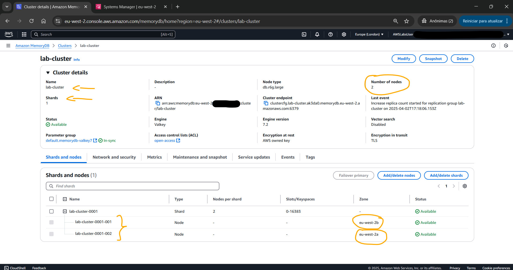<br>
    <figcaption>Imagem 10.</figcaption>
</figure></div><br>

Utilizando o **Valkey CLI** na instância **Amazon EC2** acessada remotamente, o comando `cluster nodes` foi executado para identificar o nó primário do shard. A imagem 11 exibe o output desse comando, mostrando os dois nós existentes do fragmento e quem era o primário (Gravação) e o secundário (Leitura).

<div align="Center"><figure>
    <br>
    <figcaption>Imagem 11.</figcaption>
</figure></div><br>

O nó primário é usado para operações de gravação, enquanto os outros nós são usados ​​para operações de leitura. Ter nós separados permite que seja dimensionada a capacidade de leitura. Se o nó primário ficar indisponível, o cluster fará failover para um nó somente leitura e o promoverá para primário, tornando-o um nó de leitura e gravação. Além disso, ao se conectar ao MemoryDB, é utilizado apenas o ponto de extremidade do cluster para se conectar ao cluster. O ponto de extremidade do cluster gerencia a comunicação com os shards e nós subjacentes. O último comando executado na CLI foi `exit` para encerrá-la.