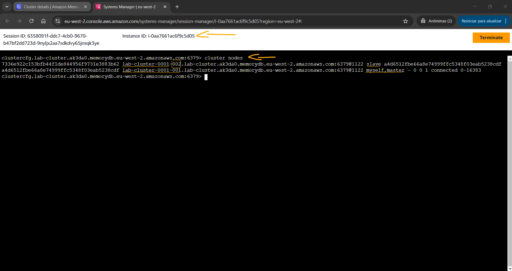

# Lab - Implement In-Memory Databases with Amazon MemoryDB   

### AWS Skill Builder <a href="../../">aws_skill_builder   </a>
### Training Category: <a href="../../self_paced_lab">self_paced_lab</a>
### Software/Subject: aws   
### Course: <a href="./">curso_spl_043 (Lab - Implement In-Memory Databases with Amazon MemoryDB)   </a>

#### Parceria da AWS com a Escola da Nuvem (EDN)   

---

### Theme:
- Cloud Computing

### Used Tools:
- Operating System (OS): 
  - Windows 11   
- Cloud:
  - Amazon Web Services (AWS)   
- Cloud Services:
  - Amazon MemoryDB   
  - Amazon MemoryDB for Redis   
  - Amazon MemoryDB for Valkey   
  - Google Drive   
- Language:
  - HTML   
  - Markdown   
- Integrated Development Environment (IDE) and Text Editor:
  - Visual Studio Code (VS Code)   
- Versioning: 
  - Git   
- Repository:
  - GitHub   

---

<a name="item0"><h3>Course Strcuture:</h3></a>
1. Lab - Implement In-Memory Databases with Amazon MemoryDB 
1.1 <a href="#item01.1">Tarefa 1: Criar um cluster do Amazon MemoryDB</a> 
1.2 <a href="#item01.2">Tarefa 2: Preparar instância EC2 para conexão MemoryDB</a> 
1.3 <a href="#item01.3">Tarefa 3: conectar ao cluster MemoryDB da instância EC2</a> 
1.4 <a href="#item01.4">Tarefa 4: Executar operações básicas de dados usando valkey-cli</a> 
1.5 <a href="#item01.5">Tarefa 5: Configurar o cluster para alta disponibilidade</a> 

---

### Objective:

Este laboratório teve como objetivo implantar **Amazon Neptune**
  

O objetivo deste laboratório foi criar um workgroup no **Amazon Athena** para consultar e analisar dados de vendas armazenados no **Amazon Simple Storage Service (S3)**. O banco de dados utilizado foi provisionado no *AWS Glue Data Catalog*. As tabelas desse banco foram criadas de duas formas: manualmente, através do Athena, e automaticamente, utilizando um *crawler* do **AWS Glue**. Os esquemas dessas tabelas foram comparados para avaliar a semelhança entre ambos os métodos. A análise dos dados foi realizada no editor de consultas do Athena, por meio da execução de consultas SQL. Por fim, alguns recursos do editor de consultas foram explorados para entender como ele processava as consultas e como as consultas podiam ser salvas.

### Structure:
A estrutura do curso é formada por:
- Este arquivo de README.
- A pasta `0-aux`, pasta auxiliar com imagens utilizadas na construção desse arquivo de README.

### Development:
Este curso foi um laboratório prático realizado na plataforma **AWS Skill Builder**, cuja subscrição foi devida a uma parceria entre a **AWS** e a **Escola da Nuvem**. A infraestrutura de cloud utilizada foi fornecida através de um sandbox do **AWS Skill Builder** que possibilitava acesso ao console da **AWS**. Contudo foi necessário seguir estritamente as orientações determinadas no laboratório. Dessa maneira, a forma de interação com os recursos da cloud foram sempre através do console fornecido pelo sandbox, a não ser em casos em que o próprio laboratório instruiu para utilização de outras ferramentas de interação como **AWS CLI** ou **AWS SDK**.

O laboratório do **AWS Skill Builder** tem o foco em executar apenas o que é orientado no escopo, todos os recursos ou serviços que podem ser requisitados adicionalmente já vêm provisionados por padrão pelo laboratório. Ao iniciar o laboratório, o sandbox do **AWS Skill Builder** provisiona diversos recursos e serviços para o funcionamento através de uma ou mais pilhas do **AWS CloudFormation** de forma automática. 

O acesso ao console no sandbox do **AWS Skill Builder** é realizado por meio de uma identidade federada. O Skill Builder funciona como um provedor de identidade (IdP), autenticando o usuário e vinculando-o a uma role do **AWS IAM** provisionada automaticamente por uma das pilhas do CloudFormation. Essa role concede permissões temporárias e mínimas necessárias para a execução do laboratório, garantindo segurança e controle sobre os recursos utilizados. O laboratório, por padrão, determina a região a ser utilizada e ela não deve ser alterada, somente se o próprio laboratório indicar. As configurações não informadas no laboratório devem ser sempre mantidas como padrão que estão.

<a name="item01.1"><h4>Tarefa 1: Criar um cluster do Amazon MemoryDB</h4></a>[Back to summary](#item0)

Na primeira tarefa deste laboratório foi configurado um cluster do **Amazon MemoryDB**

<figure>
     
    <figcaption>Imagem 01.</figcaption>
</figure>
 

<a name="item01.2"><h4>Tarefa 2: Preparar instância EC2 para conexão MemoryDB</h4></a>[Back to summary](#item0)

<figure>
     
    <figcaption>Imagem 02.</figcaption>
</figure>
 

<a name="item01.3"><h4>Tarefa 3: conectar ao cluster MemoryDB da instância EC2</h4></a>[Back to summary](#item0)

<figure>
     
    <figcaption>Imagem 03.</figcaption>
</figure>
 

<a name="item01.4"><h4>Tarefa 4: Executar operações básicas de dados usando valkey-cli</h4></a>[Back to summary](#item0)

<figure>
     
    <figcaption>Imagem 04.</figcaption>
</figure>
 

<figure>
     
    <figcaption>Imagem 05.</figcaption>
</figure>
 

<figure>
     
    <figcaption>Imagem 06.</figcaption>
</figure>
 

<figure>
     
    <figcaption>Imagem 07.</figcaption>
</figure>
 

<a name="item01.5"><h4>Tarefa 5: Configurar o cluster para alta disponibilidade</h4></a>[Back to summary](#item0)

<figure>
     
    <figcaption>Imagem 08.</figcaption>
</figure>
 

<figure>
     
    <figcaption>Imagem 09.</figcaption>
</figure>
 

<figure>
     
    <figcaption>Imagem 10.</figcaption>
</figure>
 

<a name="item01.6"><h4>Tarefa 6: Explorar recursos do editor de consultas</h4></a>[Back to summary](#item0)

<figure>
     
    <figcaption>Imagem 11.</figcaption>
</figure>
 

<figure>
     
    <figcaption>Imagem 12.</figcaption>
</figure>
 

<figure>
     
    <figcaption>Imagem 13.</figcaption>
</figure>
 

