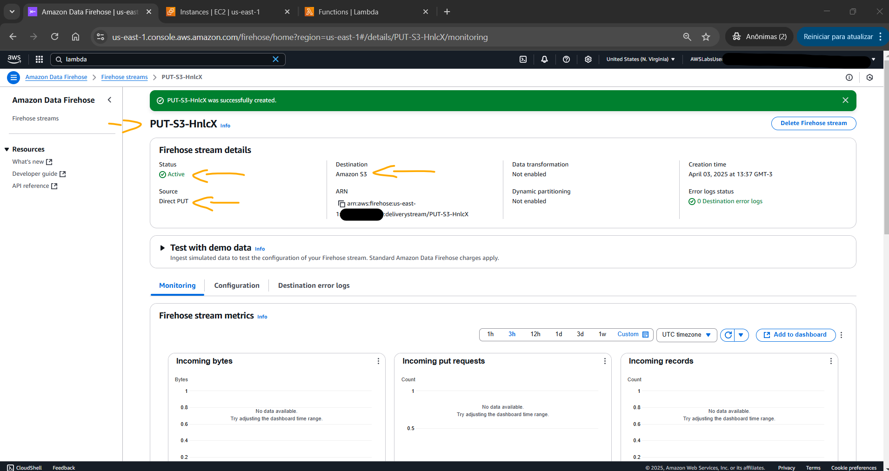
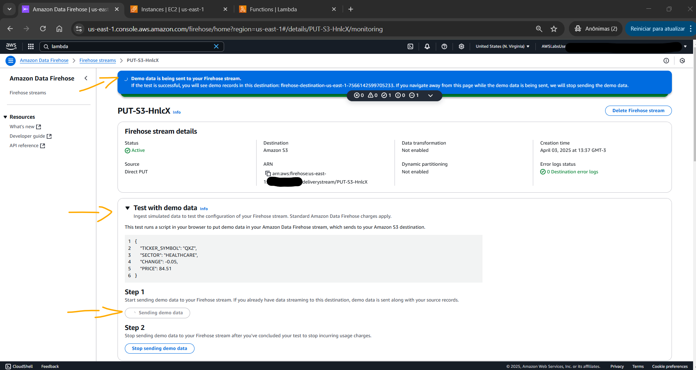
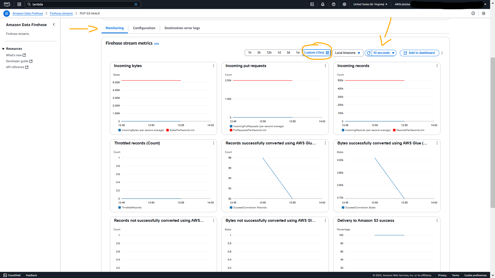
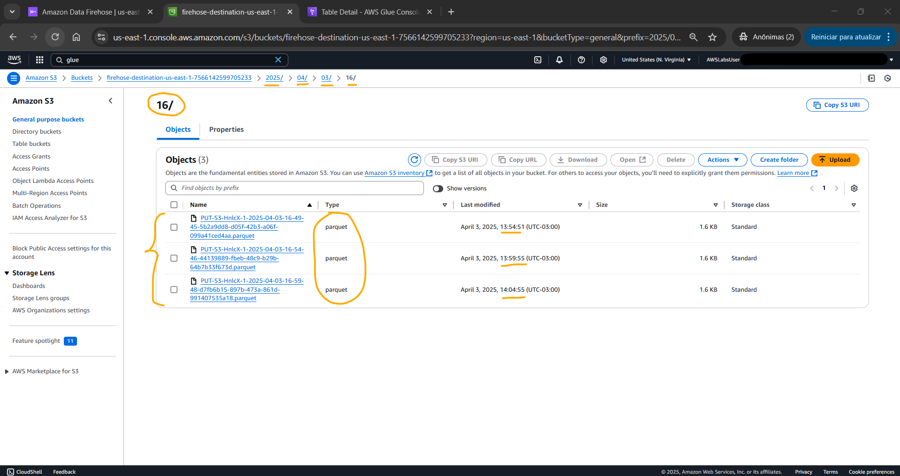
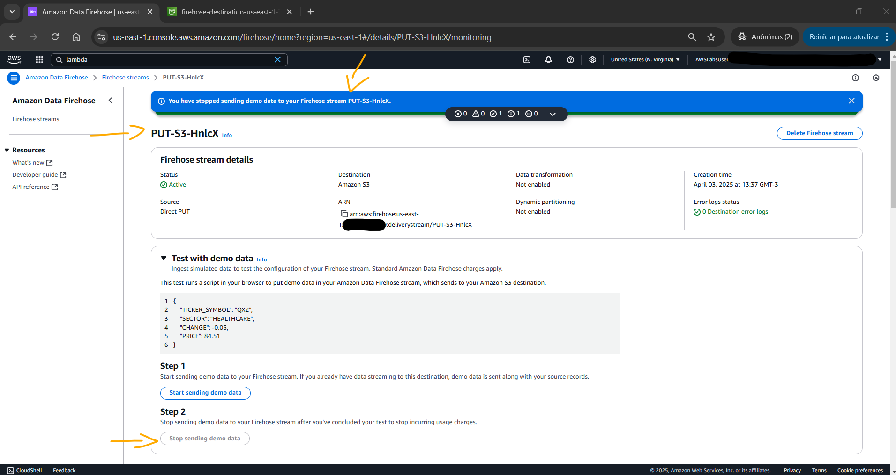
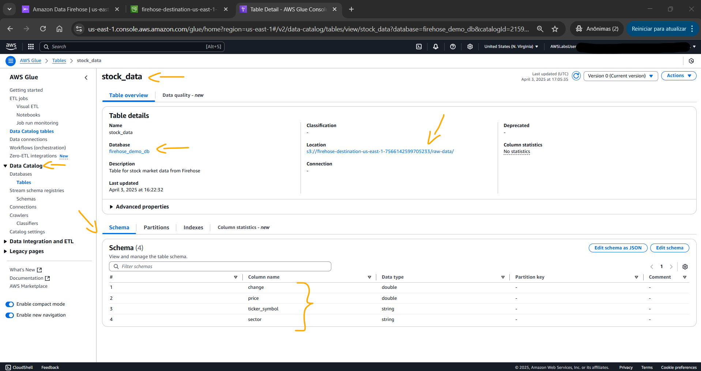

# Lab - Transform Data with Amazon Data Firehose   

### AWS Skill Builder <a href="../../">aws_skill_builder   </a>
### Training Category: <a href="../../self_paced_lab">self_paced_lab</a>
### Software/Subject: aws   
### Course: <a href="./">curso_spl_044 (Lab - Transform Data with Amazon Data Firehose)   </a>

#### Parceria da AWS com a Escola da Nuvem (EDN)   

---

### Theme:
- Cloud Computing

### Used Tools:
- Operating System (OS): 
  - Windows 11   
- Cloud:
  - Amazon Web Services (AWS)   
- Cloud Services:
  - Amazon Kinesis   
  - Amazon Data Firehose; Amazon Kinesis Data Firehose (KDF)   
  - Google Drive   
- Language:
  - HTML   
  - Markdown   
- Integrated Development Environment (IDE) and Text Editor:
  - Visual Studio Code (VS Code)   
- Versioning: 
  - Git   
- Repository:
  - GitHub   

---

<a name="item0"><h3>Course Strcuture:</h3></a>
1. Lab - Transform Data with Amazon Data Firehose<br>
1.1 <a href="#item01.1">Tarefa 1: Criar um fluxo de entrega do Amazon Data Firehose</a><br>
1.2 <a href="#item01.2">Tarefa 2: Testar o fluxo do Amazon Data Firehose</a><br>
1.3 <a href="#item01.3">Tarefa 3: Navegue pelo bucket S3 e localize os dados transformados</a><br>

---

### Objective:
O objetivo deste laboratório foi provisionar um delivery stream no **Amazon Data Firehose**, converter os dados recebidos em formato Parquet utilizando o **AWS Glue**, configurar a integração de armazenamento perfeito com o **Amazon S3**, e monitorar as métricas do Firehose em tempo real.

### Structure:
A estrutura do curso é formada por:
- Este arquivo de README.
- A pasta `0-aux`, pasta auxiliar com imagens utilizadas na construção desse arquivo de README.

### Development:
Este curso foi um laboratório prático realizado na plataforma **AWS Skill Builder**, cuja subscrição foi devida a uma parceria entre a **AWS** e a **Escola da Nuvem**. A infraestrutura de cloud utilizada foi fornecida através de um sandbox do **AWS Skill Builder** que possibilitava acesso ao console da **AWS**. Contudo foi necessário seguir estritamente as orientações determinadas no laboratório. Dessa maneira, a forma de interação com os recursos da cloud foram sempre através do console fornecido pelo sandbox, a não ser em casos em que o próprio laboratório instruiu para utilização de outras ferramentas de interação como **AWS CLI** ou **AWS SDK**.

O laboratório do **AWS Skill Builder** tem o foco em executar apenas o que é orientado no escopo, todos os recursos ou serviços que podem ser requisitados adicionalmente já vêm provisionados por padrão pelo laboratório. Ao iniciar o laboratório, o sandbox do **AWS Skill Builder** provisiona diversos recursos e serviços para o funcionamento através de uma ou mais pilhas do **AWS CloudFormation** de forma automática. 

O acesso ao console no sandbox do **AWS Skill Builder** é realizado por meio de uma identidade federada. O Skill Builder funciona como um provedor de identidade (IdP), autenticando o usuário e vinculando-o a uma role do **AWS IAM** provisionada automaticamente por uma das pilhas do CloudFormation. Essa role concede permissões temporárias e mínimas necessárias para a execução do laboratório, garantindo segurança e controle sobre os recursos utilizados. O laboratório, por padrão, determina a região a ser utilizada e ela não deve ser alterada, somente se o próprio laboratório indicar. As configurações não informadas no laboratório devem ser sempre mantidas como padrão que estão.

<a name="item01.1"><h4>Tarefa 1: Criar um fluxo de entrega do Amazon Data Firehose</h4></a>[Back to summary](#item0)

O **Amazon Data Firehose**, também conhecido como **Amazon Kinesis Data Firehose (KDF)**, é um serviço totalmente gerenciado que transmite e processa dados de forma confiável em tempo real. O serviço manipula automaticamente a ingestão, transformação e entrega de dados para vários serviços de armazenamento e análise da **AWS**. Ele pode converter automaticamente os dados recebidos em diferentes formatos e compactá-los, otimizando os custos de armazenamento e o desempenho da consulta. 

Nesta primeira tarefa do lab, foi criado um novo delivery stream (fluxo de entrega, ou Firehose stream) que processaria e armazenaria dados no **Amazon S3**. O fluxo de entrega foi configurado da seguinte forma:
- `Choose source and destination` (Escolher origem e destino):
    - `Source` (Origem): `Direct PUT`.
    - `Destination` (Destino): `Amazon S3`. A configuração de origem usava Direct PUT, que é o método mais simples para ingestão de dados e permite que os aplicativos enviem dados diretamente por meio da API Firehose. O **Amazon S3** servia como destino, fornecendo um local de armazenamento central para coletar e armazenar todos os dados processados.
- `Firehose stream name` (Nome do fluxo Firehose): 
    - `Firehose stream name` (Nome do fluxo Firehose): `PUT-S3-HnlcX`. Um nome de fluxo Firehose padrão é gerado automaticamente, mas é possível personalizá-lo. Neste caso, foi mantido o padrão.
- `Transform and convert records - optional` (Transformar e converter registros - opcional):
    - `Convert record format` (Converter formato de registro): foi habilitado `Enable record format conversion` (Conversão de formato de registro).
    - `Output format` (Formato de saída): `Apache Parquet`. A decisão de converter dados para o formato Parquet é estratégica e oferece várias vantagens significativas no pipeline de processamento de dados. O formato de armazenamento em colunas do Parquet reduz substancialmente os custos de armazenamento por meio de métodos de compactação eficientes. Ao consultar os dados, o Parquet permite um desempenho mais rápido, permitindo que os sistemas leiam apenas as colunas específicas necessárias em vez de escanear linhas inteiras. Esse formato também cria oportunidades de integração superiores com serviços de análise da **AWS**, como o **Amazon Athena**, permitindo uma análise de dados mais eficiente e econômica.
    - `AWS Glue Region` (Região do AWS Glue): foi utilizado o valor do parâmetro `Region` indicado nas instruções desse laboratório (`United States (N. Virginia)`). A integração com o **AWS Glue** fornece recursos robustos de gerenciamento de esquemas e transformação de dados, garantindo que os dados sejam devidamente estruturados e otimizados para análise.
    - `AWS Glue Database` (Banco de dados AWS Glue): `firehose_demo_db`. Esse banco de dados do **AWS Glue** já tinha sido provisionado automaticamente pelas pilhas do CloudFormation ao iniciar o lab.
    - `AWS Glue Table` (Tabela AWS Glue): `stock_data`. Essa tabela também já tinha sido provisionada ao iniciar o laboratório.
- `Destination settings` (Configurações de destino):
    - `S3 bucket`: o bucket que inicia com `firehose-destination-` foi escolhido (`firehose-destination-us-east-1-7566142599705233`).
- `Advanced settings` (Configurações avançadas):
    - `Service access` (Acesso ao serviço): `Choose existing IAM role` (Escolher função do IAM existente).
        - `Existing IAM roles` (Funções IAM existentes): `firehose-service-role-us-east-1-7566142599705233`. Essa role também já tinha sido construída ao iniciar o laboratório.

A imagem 01 evidencia o delivery stream provisionado com sucesso. A criação desse fluxo poderia levar até 5 minutos para ser concluída.

<div align="Center"><figure>
    <br>
    <figcaption>Imagem 01.</figcaption>
</figure></div><br>

<a name="item01.2"><h4>Tarefa 2: Testar o fluxo do Amazon Data Firehose</h4></a>[Back to summary](#item0)

A segunda tarefa consistiu em testar o fluxo de entrega do **Amazon Data Firehose** provisionado na tarefa anterior, utilizando dados de demonstração. Testar o fluxo do Firehose com dados de demonstração é uma etapa crucial que valida vários aspectos da configuração. Esse processo verifica não apenas a capacidade básica de ingestão de dados, mas também confirma o funcionamento adequado dos processos de transformação e do pipeline de entrega de ponta a ponta. Dentro do delivery stream construído, a seção `Test with demo data` (Testar com dados de demonstração) foi expandida e a opção `Start sending demo data` (Iniciar envio de dados de demonstração) foi selecionada para iniciar a geração dos dados de amostra.

Basicamente esse teste executava o script abaixo no navegador da máquina física **Windows** para gerar dados de demonstração no fluxo de entrega do KDF. Esse delivery stream ou Firehose stream recebia os dados, utilizava o **AWS Glue** para transformar os dados, convertendo para Parquet, em seguida os dados convertidos eram enviados ao bucket do **Amazon S3**. A tabela `stock_data` do banco de dados `firehose_demo_db` do recurso *AWS Glue Data Catalog*, apenas catalogava os arquivos armazenados no S3, os dados não passavam fisicamente por essa tabela antes de ir para o S3. Isso era útil caso consultas via **Amazon Athena** ou outros serviços fossem executadas.A imagem 02 comprova que o teste do fluxo de entrega foi parado.

```json
{ 
    "TICKER_SYMBOL": "QXZ",
    "SECTOR": "HEALTHCARE",
    "CHANGE": -0.05,
    "PRICE": 84.51
}
```

<div align="Center"><figure>
    <br>
    <figcaption>Imagem 02.</figcaption>
</figure></div><br>

Os gráficos da aba de monitoramento (`Monitoring`) foram definidos para serem atualizados a cada 10 segundos e o intervalo de tempo selecionado foi de 15 minutos. Se o gráfico exibir uma mensagem informando Nenhum dado disponível. Tente ajustar o intervalo de tempo do painel ou mostrar alguns pontos em vez de linhas, o Kinesis Data Firehose pode não ter coletado dados suficientes ainda para exibir métricas significativas. Aguarde um pouco mais e permita que o gráfico seja atualizado com mais dados. A imagem 03 exibe os gráficos de monitoramento do delivery stream criado.

<div align="Center"><figure>
    <br>
    <figcaption>Imagem 03.</figcaption>
</figure></div><br>

<a name="item01.3"><h4>Tarefa 3: Navegue pelo bucket S3 e localize os dados transformados</h4></a>[Back to summary](#item0)

Na última tarefa foi verificado se os dados de demonstração foram transformados com sucesso no formato Parquet e entregues ao bucket de destino do **Amazon S3**, concluindo o fluxo de dados de ponta a ponta que foi configurado. Também foi observado como o KDF organizava automaticamente os dados usando particionamento dinâmico, que criava uma estrutura de pasta hierárquica com base no registro de data e hora dos dados recebidos. O particionamento dinâmico foi habilitado automaticamente quando foi criado um fluxo de entrega Firehose com um destino S3. Ele usava um padrão de prefixo padrão de `ano/mês/dia/hora` para organizar os dados recebidos.

No console do S3, o bucket de destino, cujo nome era `firehose-destination-us-east-1-7566142599705233`, foi acessado. Dentro dele, as partições foram criadas baseadas em registro de data e hora. Para cada partição, um prefixo (pasta) do S3 era construída dentro do bucket. Cada uma dessas pastas foram acessadas para localizar os dados em formato `.parquet`, conforme evidenciado na imagem 04. Perceba que o tamanho de cada arquivo era determinado pelas configurações de buffer do Firehose (5 MB ou 5 minutos de coleta de dados, o que ocorrer primeiro). Pode ser que os dados levassem alguns minutos para aparecer no bucket, pois o Firehose agrupava os registros antes da entrega ao S3.

<div align="Center"><figure>
    <br>
    <figcaption>Imagem 04.</figcaption>
</figure></div><br>

Após verificar os dados no bucket de destino, o teste do fluxo de entrega, que ainda estava ativo no Firehose, foi interrompido. A imagem 05 comprova que o teste do fluxo de entrega foi parado.

<div align="Center"><figure>
    <br>
    <figcaption>Imagem 05.</figcaption>
</figure></div><br>

A imagem 06 mostra a tabela `stock_data` do banco de dados `firehose_demo_db` no recurso *AWS Glue Data Catalog* que catalogava os dados inseridos no bucket. Observe que o esquema possuía exatamente quatro linhas na coluna de nome que eram justamente as chaves do par de chaves do JSON executado no script de teste.

<div align="Center"><figure>
    <br>
    <figcaption>Imagem 06.</figcaption>
</figure></div><br>


