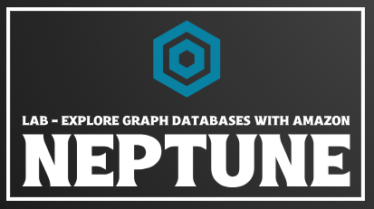
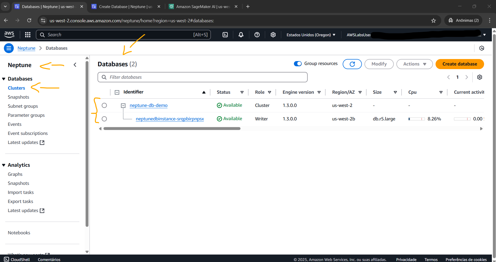
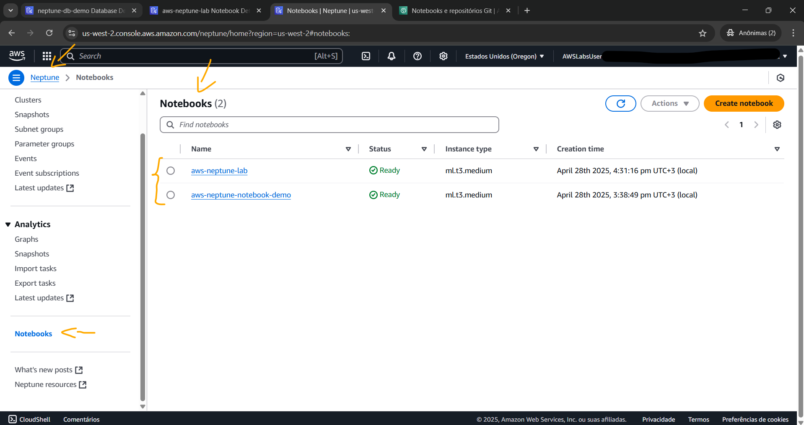
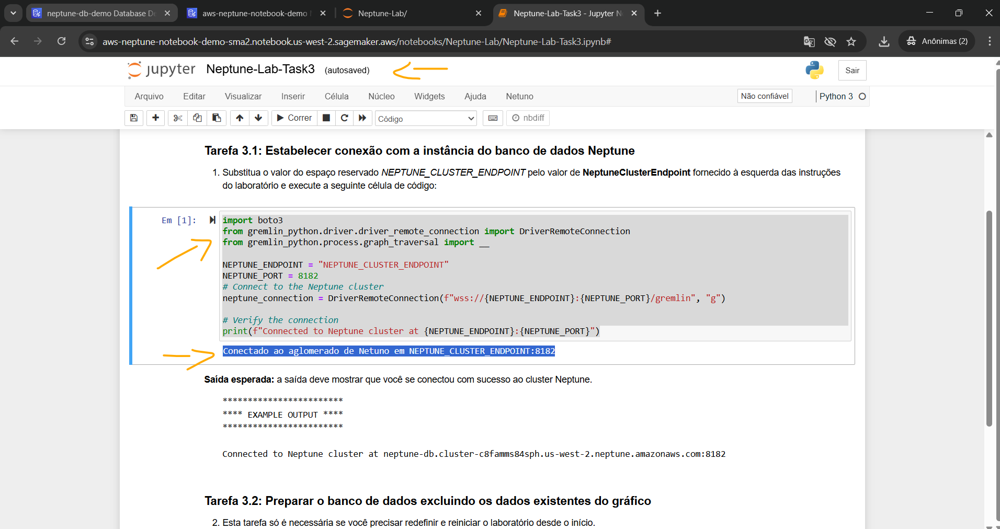
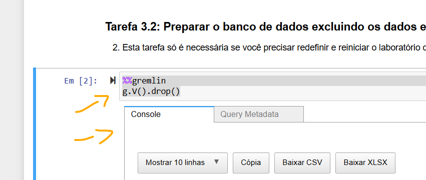
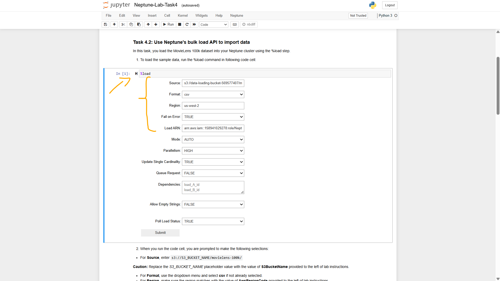
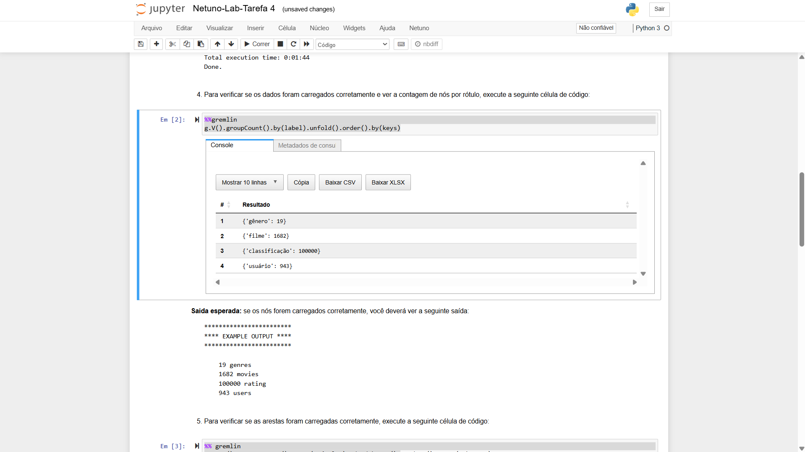

# Lab - Explore Graph Databases with Amazon Neptune   

### AWS Skill Builder <a href="../../">aws_skill_builder   </a>
### Training Category: <a href="../../self_paced_lab">self_paced_lab</a>
### Software/Subject: aws   
### Course: <a href="./">curso_spl_045 (Lab - Explore Graph Databases with Amazon Neptune)   </a>

#### Parceria da AWS com a Escola da Nuvem (EDN)   

---

### Theme:
- Cloud Computing
- Data

### Used Tools:
- Operating System (OS): 
  - Windows 11   
- Cloud:
  - Amazon Web Services (AWS)   
- Cloud Services:
  - Amazon Kinesis   
  - Amazon Data Firehose; Amazon Kinesis Data Firehose (KDF)   
  - Google Drive   
- Language:
  - HTML   
  - Markdown   
- Integrated Development Environment (IDE) and Text Editor:
  - Visual Studio Code (VS Code)   
- Versioning: 
  - Git   
- Repository:
  - GitHub   

---

<a name="item0"><h3>Course Strcuture:</h3></a>
1. Lab - Explore Graph Databases with Amazon Neptune 
1.1 <a href="#item01.1">Tarefa 1: iniciar o Amazon Neptune e criar um cluster de banco de dados</a> 
1.2 <a href="#item01.2">Tarefa 2: Criar uma instância de notebook do Amazon SageMaker</a> 
1.3 <a href="#item01.3">Tarefa 3: Estabelecer conexão com a instância do banco de dados Neptune</a> 
1.4 <a href="#item01.4">Tarefa 4: Carregar dados no Amazon Neptune usando o recurso de carregamento em massa e executar operações básicas de inserção e consulta usando Gremlin</a> 
1.5 <a href="#item01.5">Tarefa 5: Explorar a CLI para gerenciar recursos do Neptune</a> 
1.6 <a href="#item01.6">Tarefa 6: Faça um backup</a> 

---

### Objective:
Este laboratório teve como objetivo provisionar um cluster do **Amazon Neptune**, que é um banco de dados gráfico totalmente gerenciado pela **AWS**, conectar ao banco, carregar dados e executar tarefas básicas de gerenciamento.  

### Structure:
A estrutura do curso é formada por:
- Este arquivo de README.
- A pasta `0-aux`, pasta auxiliar com imagens utilizadas na construção desse arquivo de README.

### Development:
Este curso foi um laboratório prático realizado na plataforma **AWS Skill Builder**, cuja subscrição foi devida a uma parceria entre a **AWS** e a **Escola da Nuvem**. A infraestrutura de cloud utilizada foi fornecida através de um sandbox do **AWS Skill Builder** que possibilitava acesso ao console da **AWS**. Contudo foi necessário seguir estritamente as orientações determinadas no laboratório. Dessa maneira, a forma de interação com os recursos da cloud foram sempre através do console fornecido pelo sandbox, a não ser em casos em que o próprio laboratório instruiu para utilização de outras ferramentas de interação como **AWS CLI** ou **AWS SDK**.

O laboratório do **AWS Skill Builder** tem o foco em executar apenas o que é orientado no escopo, todos os recursos ou serviços que podem ser requisitados adicionalmente já vêm provisionados por padrão pelo laboratório. Ao iniciar o laboratório, o sandbox do **AWS Skill Builder** provisiona diversos recursos e serviços para o funcionamento através de uma ou mais pilhas do **AWS CloudFormation** de forma automática. 

O acesso ao console no sandbox do **AWS Skill Builder** é realizado por meio de uma identidade federada. O Skill Builder funciona como um provedor de identidade (IdP), autenticando o usuário e vinculando-o a uma role do **AWS IAM** provisionada automaticamente por uma das pilhas do CloudFormation. Essa role concede permissões temporárias e mínimas necessárias para a execução do laboratório, garantindo segurança e controle sobre os recursos utilizados. O laboratório, por padrão, determina a região a ser utilizada e ela não deve ser alterada, somente se o próprio laboratório indicar. As configurações não informadas no laboratório devem ser sempre mantidas como padrão que estão.

<a name="item01.1"><h4>Tarefa 1: iniciar o Amazon Neptune e criar um cluster de banco de dados</h4></a>[Back to summary](#item0)

A tarefa inicial do laboratório foi provisionar o cluster com uma instância de banco de dados. As configurações foram estabelecidas da seguinte forma:
- `a` (Especificações da instância):
  - `Type` (Tipo): `Provisioned` (Provisionado).
  - `Engine version` (Versão do mecanismo): `Neptune 1.3.0.0.R1`.
- `Templates` (Modelos): 
  - `Template` (Modelo): `a` (Desenvolvimento e teste).
- `Names` (Nomes):
  - `Database cluster name` (Nome do cluster do banco de dados): `neptune-db-lab`.
  - `DB instance name` (Nome da instância do BD): `neptune-db-lab-instance-1`.
- `a` (Configuração de armazenamento em cluster - novo):
  - `Configuration options` (Opções de configuração): `Neptune Standard`.
- `Instance options` (Opções de instância):
  - `Instance class` (Classe de instância): `a` (Classes expansíveis (inclui classes t)):
    - `Instance class` (Classe de instância): `db.t3.medium`:
- `Availability and durability` (Disponibilidade e Durabilidade):
  - `Deployment Multi-AZ` (Implantação Multi-AZ): `No` (Não).
- `Network and security` (Rede e segurança):
  - `Virtual Private Cloud (VPC)`: `Neptune Lab VPC`.
  - `Subnet group` (Grupo de sub-rede): `lab-neptunedbsubnetgroup`. Esse grupo de sub-rede já tinha sido construído pelas pilhas do **AWS CloudFormation** ao iniciar o lab.
  - `VPC security groups` (Grupos de segurança de VPC): `Choose existing` (Escolher existente):
    - `Existing VPC security groups` (Grupos de segurança de VPC existentes): `NeptuneLabSG`, e o grupo de segurança padrão (`default`), caso ainda não esteja selecionado.
- `Notebook configuration` (Configuração do notebook): a opção `Create notebook` (Criar notebook) foi desativada.
- `Show more` (Mostrar mais):
  - `a` (Atualização automática de versão secundária): `a` (Desativar atualização automática de versão secundária).
  - `a` (Proteção contra exclusão): `a` (Desativar proteção contra exclusão).

A imagem 01 mostra o cluster do **Amazon Neptune** provisionado com uma instância.

<figure>
     
    <figcaption>Imagem 01.</figcaption>
</figure>
 

<a name="item01.2"><h4>Tarefa 2: Criar uma instância de notebook do Amazon SageMaker</h4></a>[Back to summary](#item0)

<figure>
     
    <figcaption>Imagem 02.</figcaption>
</figure>
 

<figure>
     
    <figcaption>Imagem 03.</figcaption>
</figure>
 

<a name="item01.3"><h4>Tarefa 3: Estabelecer conexão com a instância do banco de dados Neptune</h4></a>[Back to summary](#item0)

<figure>
     
    <figcaption>Imagem 04.</figcaption>
</figure>
 

<figure>
     
    <figcaption>Imagem 05.</figcaption>
</figure>
 

<figure>
     
    <figcaption>Imagem 06.</figcaption>
</figure>
 

<a name="item01.4"><h4>Tarefa 4: Carregar dados no Amazon Neptune usando o recurso de carregamento em massa e executar operações básicas de inserção e consulta usando Gremlin</h4></a>[Back to summary](#item0)

