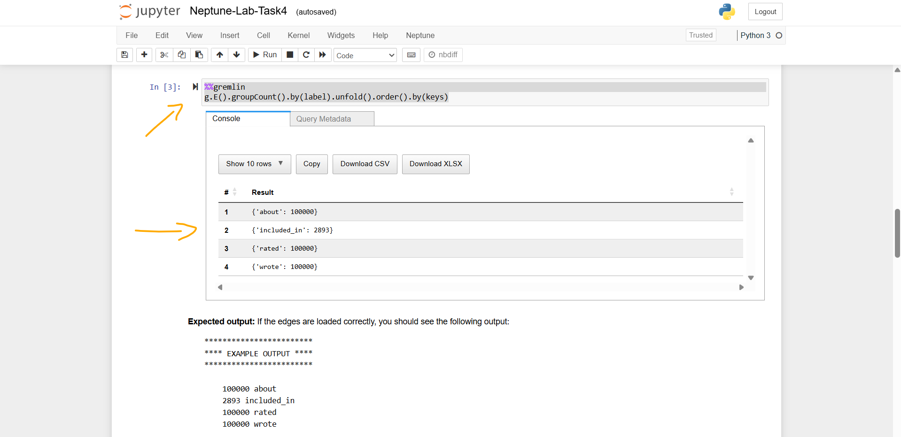
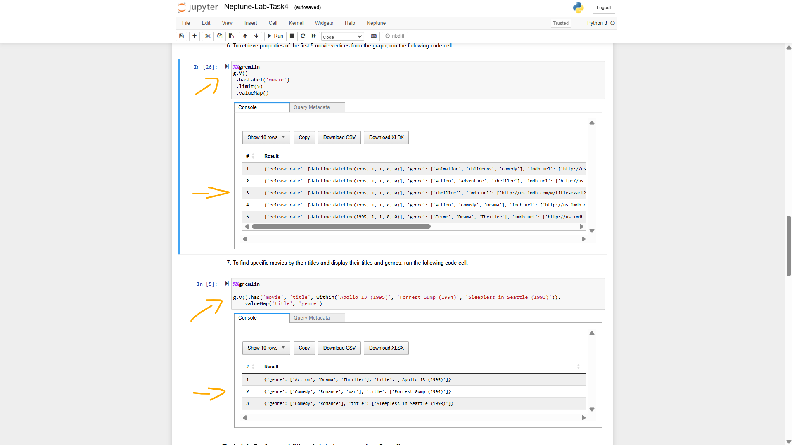
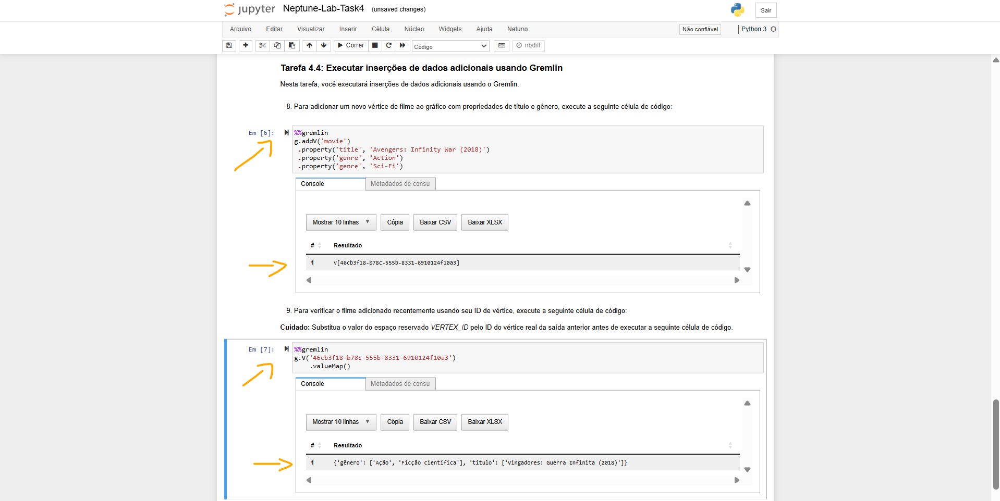
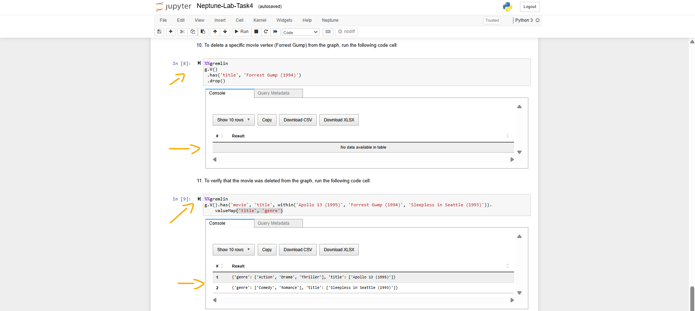

# Lab - Explore Graph Databases with Amazon Neptune   

### AWS Skill Builder <a href="../../">aws_skill_builder   </a>
### Training Category: <a href="../../self_paced_lab">self_paced_lab</a>
### Software/Subject: aws   
### Course: <a href="./">curso_spl_045 (Lab - Explore Graph Databases with Amazon Neptune)   </a>

#### Parceria da AWS com a Escola da Nuvem (EDN)   

---

### Theme:
- Cloud Computing
- Data

### Used Tools:
- Operating System (OS): 
  - Windows 11   
- Cloud:
  - Amazon Web Services (AWS)   
- Cloud Services:
  - Amazon Elastic Compute Cloud (EC2)   
  - Amazon Neptune   
  - Amazon SageMaker   
  - AWS Systems Manager (SSM)   
  - Google Drive   
- Language:
  - HTML   
  - Markdown   
  - Python   
- Integrated Development Environment (IDE) and Text Editor:
  - Visual Studio Code (VS Code)   
- Notebook Interface:
  - JupyterLab   
  - Jupyter Notebook   
- Versioning: 
  - Git   
- Repository:
  - GitHub   
- Command Line Interpreter (CLI):
  - AWS Command Line Interface (CLI)   
  - Bash e Sh   

---

<a name="item0"><h3>Course Strcuture:</h3></a>
1. Lab - Explore Graph Databases with Amazon Neptune 
1.1 <a href="#item01.1">Tarefa 1: iniciar o Amazon Neptune e criar um cluster de banco de dados</a> 
1.2 <a href="#item01.2">Tarefa 2: Criar uma instância de notebook do Amazon SageMaker</a> 
1.3 <a href="#item01.3">Tarefa 3: Estabelecer conexão com a instância do banco de dados Neptune</a> 
1.4 <a href="#item01.4">Tarefa 4: Carregar dados no Amazon Neptune usando o recurso de carregamento em massa e executar operações básicas de inserção e consulta usando Gremlin</a> 
1.5 <a href="#item01.5">Tarefa 5: Explorar a CLI para gerenciar recursos do Neptune</a> 
1.6 <a href="#item01.6">Tarefa 6: Faça um backup</a> 

---

### Objective:
Este laboratório teve como objetivo provisionar um cluster do **Amazon Neptune**, que é um banco de dados gráfico totalmente gerenciado pela **AWS**, conectar ao banco, carregar dados e executar tarefas básicas de gerenciamento.  

### Structure:
A estrutura do curso é formada por:
- Este arquivo de README.
- A pasta `0-aux`, pasta auxiliar com imagens utilizadas na construção desse arquivo de README.

### Development:
Este curso foi um laboratório prático realizado na plataforma **AWS Skill Builder**, cuja subscrição foi devida a uma parceria entre a **AWS** e a **Escola da Nuvem**. A infraestrutura de cloud utilizada foi fornecida através de um sandbox do **AWS Skill Builder** que possibilitava acesso ao console da **AWS**. Contudo foi necessário seguir estritamente as orientações determinadas no laboratório. Dessa maneira, a forma de interação com os recursos da cloud foram sempre através do console fornecido pelo sandbox, a não ser em casos em que o próprio laboratório instruiu para utilização de outras ferramentas de interação como **AWS CLI** ou **AWS SDK**.

O laboratório do **AWS Skill Builder** tem o foco em executar apenas o que é orientado no escopo, todos os recursos ou serviços que podem ser requisitados adicionalmente já vêm provisionados por padrão pelo laboratório. Ao iniciar o laboratório, o sandbox do **AWS Skill Builder** provisiona diversos recursos e serviços para o funcionamento através de uma ou mais pilhas do **AWS CloudFormation** de forma automática. 

O acesso ao console no sandbox do **AWS Skill Builder** é realizado por meio de uma identidade federada. O Skill Builder funciona como um provedor de identidade (IdP), autenticando o usuário e vinculando-o a uma role do **AWS IAM** provisionada automaticamente por uma das pilhas do CloudFormation. Essa role concede permissões temporárias e mínimas necessárias para a execução do laboratório, garantindo segurança e controle sobre os recursos utilizados. O laboratório, por padrão, determina a região a ser utilizada e ela não deve ser alterada, somente se o próprio laboratório indicar. As configurações não informadas no laboratório devem ser sempre mantidas como padrão que estão.

<a name="item01.1"><h4>Tarefa 1: iniciar o Amazon Neptune e criar um cluster de banco de dados</h4></a>[Back to summary](#item0)

A tarefa inicial do laboratório foi provisionar o cluster com uma instância de banco de dados. As configurações foram estabelecidas da seguinte forma:
- `a` (Especificações da instância):
  - `Type` (Tipo): `Provisioned` (Provisionado).
  - `Engine version` (Versão do mecanismo): `Neptune 1.3.0.0.R1`.
- `Templates` (Modelos): 
  - `Template` (Modelo): `a` (Desenvolvimento e teste).
- `Names` (Nomes):
  - `Database cluster name` (Nome do cluster do banco de dados): `neptune-db-lab`.
  - `DB instance name` (Nome da instância do BD): `neptune-db-lab-instance-1`.
- `a` (Configuração de armazenamento em cluster - novo):
  - `Configuration options` (Opções de configuração): `Neptune Standard`.
- `Instance options` (Opções de instância):
  - `Instance class` (Classe de instância): `a` (Classes expansíveis (inclui classes t)):
    - `Instance class` (Classe de instância): `db.t3.medium`:
- `Availability and durability` (Disponibilidade e Durabilidade):
  - `Deployment Multi-AZ` (Implantação Multi-AZ): `No` (Não).
- `Network and security` (Rede e segurança):
  - `Virtual Private Cloud (VPC)`: `Neptune Lab VPC`.
  - `Subnet group` (Grupo de sub-rede): `lab-neptunedbsubnetgroup`. Esse grupo de sub-rede já tinha sido construído pelas pilhas do **AWS CloudFormation** ao iniciar o lab.
  - `VPC security groups` (Grupos de segurança de VPC): `Choose existing` (Escolher existente):
    - `Existing VPC security groups` (Grupos de segurança de VPC existentes): `NeptuneLabSG`, e o grupo de segurança padrão (`default`), caso ainda não esteja selecionado.
- `Notebook configuration` (Configuração do notebook): a opção `Create notebook` (Criar notebook) foi desativada.
- `Show more` (Mostrar mais):
  - `a` (Atualização automática de versão secundária): `a` (Desativar atualização automática de versão secundária).
  - `a` (Proteção contra exclusão): `a` (Desativar proteção contra exclusão).

A imagem 01 mostra o cluster do **Amazon Neptune** provisionado com uma instância.

<figure>
     
    <figcaption>Imagem 01.</figcaption>
</figure>
 

<a name="item01.2"><h4>Tarefa 2: Criar uma instância de notebook do Amazon SageMaker</h4></a>[Back to summary](#item0)

Na segunda tarefa, o objetivo foi provisionar uma instância de notebook do **Amazon SageMaker**, pois esta seria utilizada para se conectar a instância de banco de dados do cluster do **Amazon Neptune**. A configuração da instância de notebook foi definida da seguinte forma:
- `Notebook Configuration` (Configuração do Notebook):
  - `Neptune Service` (Serviço Neptune): `Database` (Banco de dados).
  - `Cluster`: `neptune-db-lab`, que era o cluster provisionado na tarefa 1.
  - `Notebook instance type` (Tipo de instância do Notebook): `ml.t3.medium`.
  - `Notebook name` (Nome do notebook): `lab`.
  - `IAM role name` (Nome da função do IAM): `Choose an existing IAM role` (Escolher uma função do IAM existente).
    - `IAM role name` (Nome da função do IAM): `AWSNeptuneNotebookRole-Lab`. Essa role já tinha sido criada pelo laboratório ao iniciá-lo.
  - `Lifecycle configuration` (Configuração do ciclo de vida): `Use Neptune's default configuration` (Usar a configuração padrão do Neptune).
- `Network configuration` (Configuração de rede):
  - `Subnet` (Sub-rede): foi selecionada a sub-rede de nome `LabSubnet`, o ID dela foi disponibilizado no parâmetro `LabSubnet` nas instruções do lab.
  - `Security group` (Grupos de segurança): foram selecionados os grupos `NeptuneLabSG` e `default` (padrão).
  - `Internet access` (Acesso à Internet): `Direct access via Amazon SageMaker` (Acesso direto pelo Amazon SageMaker).

A criação do notebook levou algum tempo. O status alterava de `Pending` para `Ready`. A imagem 02 exibe a instância de notebook no **Amazon Neptune** criada com sucesso. Entretanto, para agilizar, o próprio laboratório já tinha provisionado um notebook exatamente igual a esse, sob o nome de `aws-neptune-notebook-demo`, que poderia ser utilizado nas tarefas adiante.

<figure>
     
    <figcaption>Imagem 02.</figcaption>
</figure>
 

<a name="item01.3"><h4>Tarefa 3: Estabelecer conexão com a instância do banco de dados Neptune</h4></a>[Back to summary](#item0)

Com a instância de notebook construída, ela foi utilizada para estabelecer conexão com a instância de banco de dados do cluster do **Amazon Neptune**. Para isso, um dos notebooks provisionados foi selecionado e dentro dele as opções `Actions` (Ações) e `Open Jupyter` (Abrir Jupyter) foram escolhidas. Assim, uma nova aba do navegador abria no **Jupyter Notebook**. Na interface do Jupyter, a pasta de nome `Neptune-Lab` foi aberta e o arquivo em **Python** `Neptune-Lab-Task3.ipynb` foi acessado. Cada célula do arquivo foi executada na ordem exibida. A imagem 03 mostra o **Jupyter Notebook** com o arquivo **Python** aberto.

<figure>
     
    <figcaption>Imagem 03.</figcaption>
</figure>
 

<a name="item01.4"><h4>Tarefa 4: Carregar dados no Amazon Neptune usando o recurso de carregamento em massa e executar operações básicas de inserção e consulta usando Gremlin</h4></a>[Back to summary](#item0)

Na quarta tarefa, foi utilizado o recurso de carregamento em massa para carregar os dados no cluster de banco de dados do **Amazon Neptune**. O **Amazon Neptune** fornece um comando `Loader` para carregar dados de arquivos externos diretamente em um cluster de banco de dados Neptune. É possível usar esse comando em vez de executar um grande número de instruções `INSERT`, etapas `addV` e `addE` ou outras chamadas de API. O comando `Neptune Loader` é mais rápido, tem menos sobrecarga, é otimizado para grandes conjuntos de dados e suporta dados Gremlin e dados RDF (Resource Description Framework) usados ​​pelo **SPARQL**.

Para isso, um outro arquivo **Python** de nome `Neptune-Lab-Task4.ipynb` foi aberto no **Jupyter Notebook** e cada célula foi executada. 

<figure>
     
    <figcaption>Imagem 04.</figcaption>
</figure>
 

<a name="item01.5"><h4>Tarefa 5: Explorar a CLI para gerenciar recursos do Neptune</h4></a>[Back to summary](#item0)

O objetivo desta quinta tarefa foi explorar comandos **AWS CLI** para gerenciar recursos do **Amazon Neptune**. Para isso, uma instância **Amazon EC2** já tinha sido provisionada pelo laboratório, cuja tag de nome era `CommandHost`. Uma conexão foi estabelecida com essa instância utilizando o recurso **Session Manager** do serviços **AWS Systems Manager (SSM)**. 

Uma nova aba do navegador da máquina física **Windows** era aberta com a conexão de terminal **Bash** para a instância EC2. Neste terminal, o comando `aws neptune describe-db-clusters` foi utilizado para listar todos os clusters de banco de dados **Amazon Neptune**, conforme mostrado na imagem 05. Em seguida, o comando `aws neptune describe-db-clusters --db-cluster-identifier neptune-db-lab` foi executado para exibir informações apenas do cluster provisionado, cujo identificador era `neptune-db-lab`. A imagem 06 exibe o output desse comando.

<figure>
     
    <figcaption>Imagem 05.</figcaption>
</figure>
 

<figure>
     
    <figcaption>Imagem 06.</figcaption>
</figure>
 

Para obter mais informações sobre a instância específica do banco de dados Neptune, o comando `aws neptune describe-db-instances --filters Name=db-cluster-id,Values=neptune-db-lab` foi executado. Até o momento, apenas comandos básicos tinham sido explorados para visualizar informações de clusters do **Amazon Neptune**. Os dois próximos comandos executados, que foi o `aws neptune describe-db-clusters --db-cluster-identifier neptune-db-lab --query 'DBClusters[0].Status'` e `aws neptune describe-db-instances --filters Name=db-cluster-id,Values=neptune-db-lab --query 'DBInstances[*].{InstanceIdentifier:DBInstanceIdentifier,Status:DBInstanceStatus}'`, verificavam se o cluster e suas instâncias estavam disponíveis. Em seguida, com o comando `aws neptune modify-db-cluster --db-cluster-identifier neptune-db-lab --engine-version 1.3.1.0 --apply-immediately` a versão do mecanismo do Neptune foi modificado de `1.3.0.0` para `1.3.1.0`. Para habilitar o registro de auditoria para o cluster foi utilizado o comando `aws neptune modify-db-cluster-parameter-group   --db-cluster-parameter-group-name neptunedbclusterparametergroup --parameters ParameterName="neptune_enable_audit_log",ParameterValue="1","ApplyMethod=pending-reboot"`. A imagem 07 exibe os outputs desses comandos.

<figure>
     
    <figcaption>Imagem 07.</figcaption>
</figure>
 

Para verificar a versão do mecanismo do Neptune foi utilizado o comando `aws neptune describe-db-clusters --db-cluster-identifier neptune-db-lab --query 'DBClusters[0].EngineVersion' --output text`, conforme exibido na imagem 08. Já com o comando `aws neptune describe-db-cluster-parameters --db-cluster-parameter-group-name neptunedbclusterparametergroup | sed -n '/neptune_enable_audit_log/,/}/p'` foi verificado a atualização dos parâmetros do cluster.

<figure>
     
    <figcaption>Imagem 08.</figcaption>
</figure>
 

<a name="item01.6"><h4>Tarefa 6: Faça um backup</h4></a>[Back to summary](#item0)

A última tarefa consistiu em realizar um snapshot manual do cluster de banco de dados do **Amazon Neptune**. Criar um snapshot manual permite criar um backup pontual do banco de dados que pode ser usado para recuperação de desastres ou migração. Dessa forma, o cluster provisionado foi novamente aberto e na página `Database` (Banco de dados), a instância de identificação `neptune-db-lab-instance-1` foi selecionada. Nas `Actions` (Ações), as opções `Choose Backup` (Escolha Backup) e `a` (Tirar instantâneo) foram selecionadas. Na página de `Snapshots` (Instantâneos), na seção `Preference` (Preferências) foi configurado o seguinte:
- `DB Cluster` (Cluster BD): `neptune-db-lab`, que foi o nome do cluster provisionado.
- `a` (Nome do instantâneo do banco de dados): `neptune-db-manual-snapshot`.

A partir daí, o serviço do Neptune iniciava o snapshot manual da instância do cluster de banco de dados. Esse processo pode levar vários minutos para ser concluído, dependendo do tamanho do banco de dados. A imagem 09 mostra o snapshot criado com sucesso. Os snapshots criados manualmente são mantidos até que sejam excluídos. Isso fornece uma maneira confiável de criar backups pontuais do banco de dados Neptune para fins de recuperação de desastres ou migração.

<figure>
     
    <figcaption>Imagem 09.</figcaption>
</figure>
 

O snapshot construído, cujo nome foi `neptune-db-manual-snapshot`, foi acessado para verificar as seguintes informações exibidas na página `Snapshot Details` (Detalhes do instantâneo):
- `Snapshot name` (Nome do instantâneo): este é o identificador exclusivo do instantâneo.
- `Snapshot type` (Tipo de instantâneo): aparece como Manual, indicando que esse backup foi solicitado manualmente.
- `DB cluster Identifier` (Identificador do cluster do BD): mostra o nome do cluster associado ao snapshot.
- `Storage` (Armazenamento): mostra a quantidade de armazenamento usada pelo backup.
- `Engine` (Mecanismo): é exibido como Neptune, indicando o mecanismo de banco de dados para o snapshot.
- `Engine version` (Versão do mecanismo): mostra a versão associada ao cluster e ao snapshot do banco de dados.
- `Snapshot creation date` (Data de criação do instantâneo): mostra o registro de data e hora em que o backup foi criado.

A imagem 10 mostra essas informações. Na seção `a` (Eventos recentes) foi possível revisar os eventos associados ao processo de criação desse snapshot. O backup é armazenado em um bucket do **Amazon S3** gerenciado pelo serviço **Amazon Neptune**. O backup pode ser utilizado para restaurar o cluster de banco de dados Neptune, se necessário.

<figure>
     
    <figcaption>Imagem 10.</figcaption>
</figure>
 