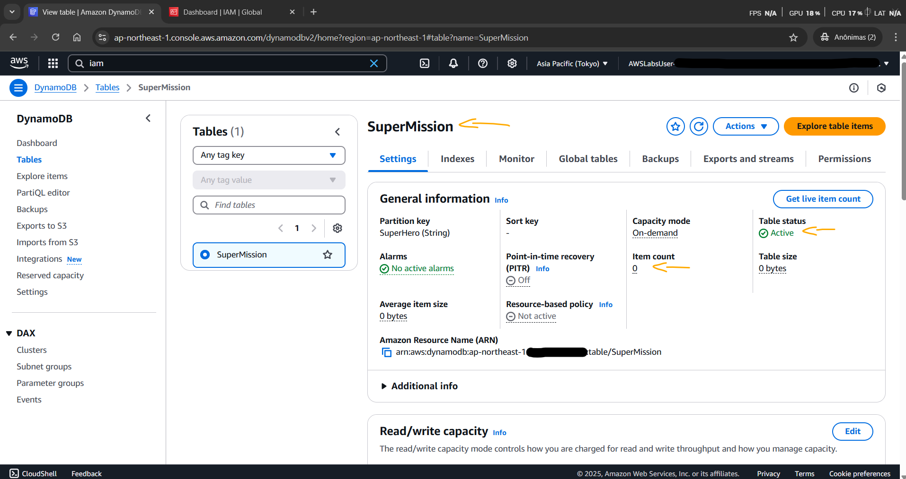
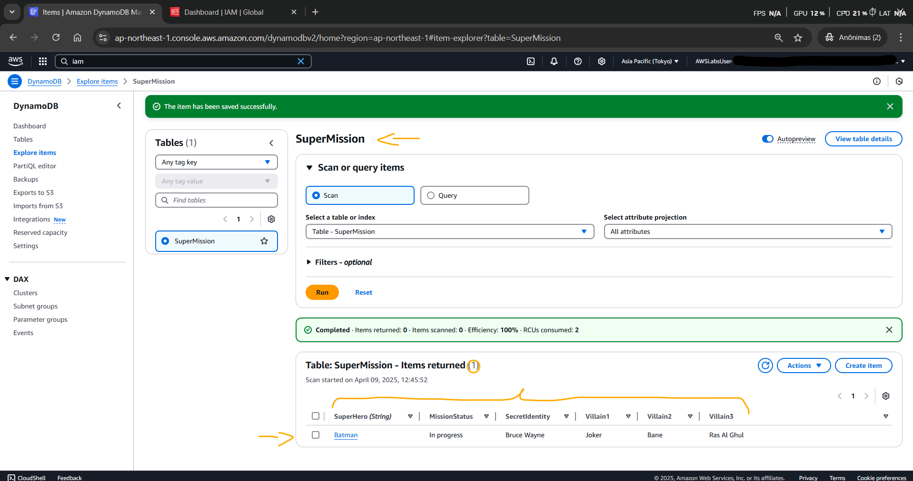
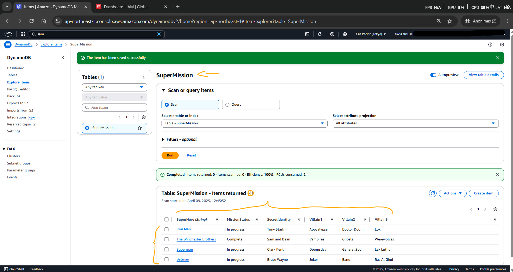
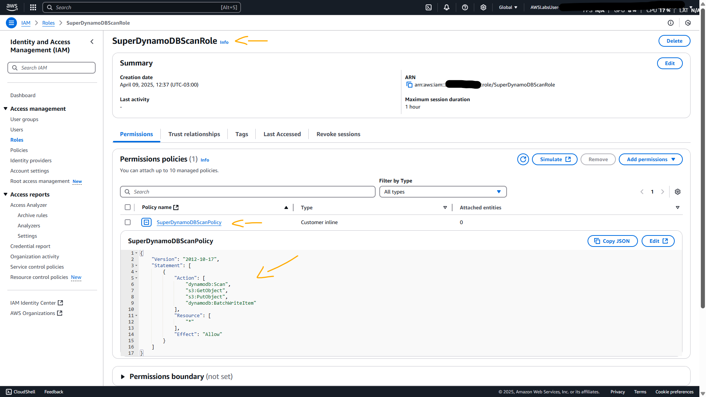
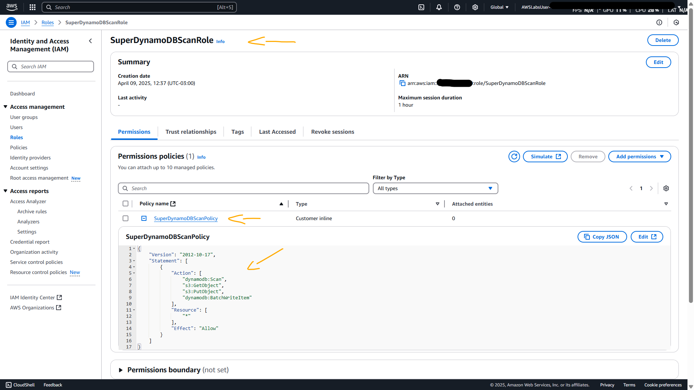

# Lab - Serverless Web Apps using Amazon DynamoDB - Part 1   

### AWS Skill Builder <a href="../../">aws_skill_builder   </a>
### Training Category: <a href="../../self_paced_lab">self_paced_lab</a>
### Software/Subject: aws   
### Course: <a href="./">curso_spl_046 (Lab - Serverless Web Apps using Amazon DynamoDB - Part 1)   </a>

#### Parceria da AWS com a Escola da Nuvem (EDN)   

---

### Theme:
- Cloud Computing
- Developement

### Used Tools:
- Operating System (OS): 
  - Windows 11   
- Cloud:
  - Amazon Web Services (AWS)   
- Cloud Services:
  - Amazon API Gateway   
  - Amazon DynamoDB   
  - AWS Identity and Access Management (IAM)   
  - AWS Lambda   
  - AWS Software Development Kit (SDK) - Node.js   
  - Google Drive   
- Language:
  - HTML   
  - JavaScript   
  - Markdown   
- Runtime Environment:
  - Node.js   
- Integrated Development Environment (IDE) and Text Editor:
  - Visual Studio Code (VS Code)   
- Versioning: 
  - Git   
- Repository:
  - GitHub   

---

<a name="item0"><h3>Course Strcuture:</h3></a>
1. Lab - Serverless Web Apps using Amazon DynamoDB - Part 1<br>
1.1 <a href="#item01.1">Tarefa 1: Crie sua tabela do DynamoDB</a><br>
1.2 <a href="#item01.2">Tarefa 2: Adicionar itens por meio do método Form</a><br>
1.3 <a href="#item01.3">Tarefa 3: Adicionar itens via JSON</a><br>
1.4 <a href="#item01.4">Tarefa 4: Revisar políticas e funções do IAM</a><br>

---

### Objective:
Este laboratório foi uma das partes de uma série de três laboratórios cujo objetivo foi criar um aplicativo de gerador de dossiê de missão de super-heróis, utilizando os serviços serverless da **AWS**. O objetivo de cada uma das três partes esta descrita abaixo:
- [Lab - Serverless Web Apps using Amazon DynamoDB - Part 1](../curso_spl_046/): No primeiro lab, foi provisionado uma tabela do **Amazon DynamoDB**, realizado o carregamento de dados, e revisando as roles e policies do **AWS IAM** necessárias para conceder acesso seguro a esses dados.
- [Lab - Serverless Web Apps using Amazon DynamoDB - Part 2](../curso_spl_047/): No laboratório 2, foi construída e testada uma função do **AWS Lambda** que interagia com a tabela do **Amazon DynamoDB** recuperando dados de duas maneiras diferentes.
- [Lab - Serverless Web Apps using Amazon DynamoDB - Part 3](../curso_spl_048/): No último lab, foi realizada a criação e configuração de uma API no **Amazon API Gateway**, seguida da geração do SDK correspondente. Em seguida, o front-end da aplicação foi integrado a esse SDK, publicado em um bucket do **Amazon S3** e testado tanto localmente quanto online.

### Structure:
A estrutura do curso é formada por:
- Este arquivo de README.
- A pasta `0-aux`, pasta auxiliar com imagens utilizadas na construção desse arquivo de README.

### Development:
Este curso foi um laboratório prático realizado na plataforma **AWS Skill Builder**, cuja subscrição foi devida a uma parceria entre a **AWS** e a **Escola da Nuvem**. A infraestrutura de cloud utilizada foi fornecida através de um sandbox do **AWS Skill Builder** que possibilitava acesso ao console da **AWS**. Contudo foi necessário seguir estritamente as orientações determinadas no laboratório. Dessa maneira, a forma de interação com os recursos da cloud foram sempre através do console fornecido pelo sandbox, a não ser em casos em que o próprio laboratório instruiu para utilização de outras ferramentas de interação como **AWS CLI** ou **AWS SDK**.

O laboratório do **AWS Skill Builder** tem o foco em executar apenas o que é orientado no escopo, todos os recursos ou serviços que podem ser requisitados adicionalmente já vêm provisionados por padrão pelo laboratório. Ao iniciar o laboratório, o sandbox do **AWS Skill Builder** provisiona diversos recursos e serviços para o funcionamento através de uma ou mais pilhas do **AWS CloudFormation** de forma automática. 

O acesso ao console no sandbox do **AWS Skill Builder** é realizado por meio de uma identidade federada. O Skill Builder funciona como um provedor de identidade (IdP), autenticando o usuário e vinculando-o a uma role do **AWS IAM** provisionada automaticamente por uma das pilhas do CloudFormation. Essa role concede permissões temporárias e mínimas necessárias para a execução do laboratório, garantindo segurança e controle sobre os recursos utilizados. O laboratório, por padrão, determina a região a ser utilizada e ela não deve ser alterada, somente se o próprio laboratório indicar. As configurações não informadas no laboratório devem ser sempre mantidas como padrão que estão.

<a name="item01.1"><h4>Tarefa 1: Crie sua tabela do DynamoDB</h4></a>[Back to summary](#item0)

A primeira tarefa desse laboratório consistiu em provisionar uma tabela no **Amazon DynamoDB**, configurando-a da seguinte forma:
- `Table Name` (Nome da tabela): `SuperMission`.
- `Partition key` (Chave de partição): `SuperHero`; `Type` (Tipo): `String`.

A imagem 01 evidencia o provisionamento da tabela.

<div align="Center"><figure>
    <br>
    <figcaption>Imagem 01.</figcaption>
</figure></div><br>

<a name="item01.2"><h4>Tarefa 2: Adicionar itens por meio do método Form</h4></a>[Back to summary](#item0)

Com a tabela construída, um item foi adicionado por meio do método de formulário (`Form`), sendo preenchido da seguinte maneira:
- `Attribute name` (Nome do atributo): `SuperHero`; `Value` (Valor): `Batman`; `Type` (Tipo): `String`.
- `Attribute name` (Nome do atributo): `MissionStatus`; `Value` (Valor): `In progress`; `Type` (Tipo): `String`.
- `Attribute name` (Nome do atributo): `Villain1`; `Value` (Valor): `Joker`; `Type` (Tipo): `String`.
- `Attribute name` (Nome do atributo): `Villain2`; `Value` (Valor): `Bane`; `Type` (Tipo): `String`.
- `Attribute name` (Nome do atributo): `Villain3`; `Value` (Valor): `Ras Al Ghul`; `Type` (Tipo): `String`.
- `Attribute name` (Nome do atributo): `SecretIdentity`; `Value` (Valor): `Bruce Wayne`; `Type` (Tipo): `String`.

A imagem 02 confirma o primeiro e único item adicionado à tabela provisionada.

<div align="Center"><figure>
    <br>
    <figcaption>Imagem 02.</figcaption>
</figure></div><br>

<a name="item01.3"><h4>Tarefa 3: Adicionar itens via JSON</h4></a>[Back to summary](#item0)

Outros três seguintes itens abaixo foram adicionados à mesma tabela, só que agora utilizando o método JSON. Para inserir os comandos abaixo, foi necessário desativar a opção `View DynamoDB JSON` (Exibir JSON do DynamoDB).

```json
{
    "SuperHero": "Superman",
    "Villain1": "Doomsday",
    "Villain2": "General Zod",
    "Villain3": "Lex Luthor",
    "MissionStatus": "In progress",
    "SecretIdentity": "Clark Kent"
}
```

```json
{
    "SuperHero": "The Winchester Brothers",
    "Villain1": "Vampires",
    "Villain2": "Ghosts",
    "Villain3": "Werewolves",
    "MissionStatus": "Complete",
    "SecretIdentity": "Sam and Dean"
}
```

```json
{
    "SuperHero": "Iron Man",
    "Villain1": "Apocalypse",
    "Villain2": "Doctor Doom",
    "Villain3": "Loki",
    "MissionStatus": "In progress",
    "SecretIdentity": "Tony Stark"
}
```

A imagem 03 exibe a tabela do **Amazon DynamoDB** agora com quatro itens.

<div align="Center"><figure>
    <br>
    <figcaption>Imagem 03.</figcaption>
</figure></div><br>

<a name="item01.4"><h4>Tarefa 4: Revisar políticas e funções do IAM</h4></a>[Back to summary](#item0)

O objetivo da última tarefa foi analisar duas IAM roles, cada uma com sua respectiva políticas que permitia o acesso aos dados no banco de dados do DynamoDB. Tanto as funções como as policies já tinham sido criadas pelas pilhas do **AWS CloudFormation** ao iniciar o laboratório. Dessa forma, a role de nome `SuperDynamoDBScanRole` foi selecionada e a sua política foi expandida. A política se chamava `SuperDynamoDBScanPolicy` e permitia acesso às APIs Scan e BatchWriteItem no DynamoDB, e GetObject e PutObject no **Amazon S3**. O JSON dessa política é apresentado abaixo, e a imagem 04 mostra essa role com sua política.

```json
{
    "Version": "2012-10-17",
    "Statement": [
        {
            "Action": [
                "dynamodb:Scan",
                "s3:GetObject",
                "s3:PutObject",
                "dynamodb:BatchWriteItem"
            ],
            "Resource": [
                "*"
            ],
            "Effect": "Allow"
        }
    ]
}
```

<div align="Center"><figure>
    <br>
    <figcaption>Imagem 04.</figcaption>
</figure></div><br>

A segunda role, cujo nome era `SuperDynamoDBScanRole`, possuía a policy `SuperDynamoDBQueryPolicy` que permitia que o usuário ou entidade que assumisse a função executasse uma operação de consulta, mas apenas em relação aos atributos específicos da tabela. Este recurso poderoso permitia implementar segurança em nível de coluna nas tabelas do DynamoDB. O comando JSON dessa política é mostrada abaixo. A imagem 05 exibe no console essa role com sua política de permissão.

```json
{
    "Version": "2012-10-17",
    "Statement": [
        {
            "Condition": {
                "ForAllValues:StringEquals": {
                    "dynamodb:Attributes": [
                        "SuperHero",
                        "MissionStatus",
                        "Villain1",
                        "Villain2",
                        "Villain3"
                    ]
                }
            },
            "Action": [
                "dynamodb:Query"
            ],
            "Resource": "*",
            "Effect": "Allow"
        }
    ]
}
```

<div align="Center"><figure>
    <br>
    <figcaption>Imagem 05.</figcaption>
</figure></div><br>