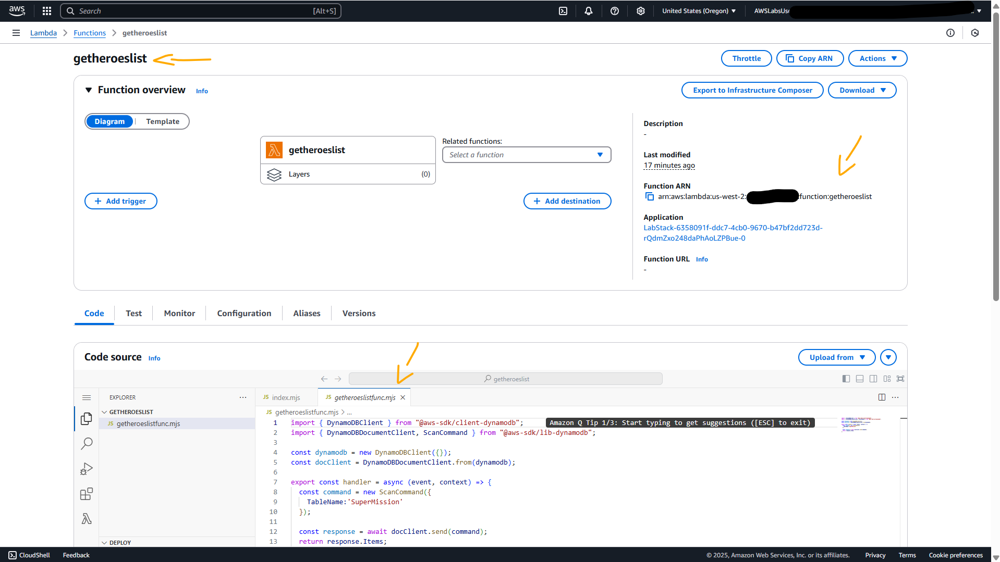

# Lab - Serverless Web Apps using Amazon DynamoDB - Part 3   

### AWS Skill Builder <a href="../../">aws_skill_builder   </a>
### Training Category: <a href="../../self_paced_lab">self_paced_lab</a>
### Software/Subject: aws   
### Course: <a href="./">curso_spl_048 (Lab - Serverless Web Apps using Amazon DynamoDB - Part 3)   </a>

#### Parceria da AWS com a Escola da Nuvem (EDN)   

---

### Theme:
- Cloud Computing
- Developement

### Used Tools:
- Operating System (OS): 
  - Windows 11   
- Cloud:
  - Amazon Web Services (AWS)   
- Cloud Services:
  - Amazon API Gateway   
  - Amazon DynamoDB   
  - AWS Identity and Access Management (IAM)   
  - AWS Lambda   
  - AWS Software Development Kit (SDK) - Node.js   
  - Google Drive   
- Language:
  - HTML   
  - JavaScript   
  - Markdown   
- Runtime Environment:
  - Node.js   
- Integrated Development Environment (IDE) and Text Editor:
  - Visual Studio Code (VS Code)   
- Versioning: 
  - Git   
- Repository:
  - GitHub   

---

<a name="item0"><h3>Course Strcuture:</h3></a>
1. Lab - Serverless Web Apps using Amazon DynamoDB - Part 3<br>
1.1 <a href="#item01.1">Tarefa 1: Verificar Recursos</a><br>
1.2 <a href="#item01.2">Tarefa 2: Criar e implantar uma API</a><br>
1.3 <a href="#item01.3">Tarefa 3: Gere o SDK para sua API</a><br>
1.4 <a href="#item01.4">Tarefa 4: Publicar com S3</a><br>

---

### Objective:
Este laboratório foi uma das partes de uma série de três laboratórios cujo objetivo foi criar um aplicativo de gerador de dossiê de missão de super-heróis, utilizando os serviços serverless da **AWS**. O objetivo de cada uma das três partes esta descrita abaixo:
- [Lab - Serverless Web Apps using Amazon DynamoDB - Part 1](../curso_spl_046/): No primeiro lab, foi provisionado uma tabela do **Amazon DynamoDB**, realizado o carregamento de dados, e revisando as roles e policies do **AWS IAM** necessárias para conceder acesso seguro a esses dados.
- [Lab - Serverless Web Apps using Amazon DynamoDB - Part 2](../curso_spl_047/): No laboratório 2, foi construída e testada uma função do **AWS Lambda** que interagia com a tabela do **Amazon DynamoDB** recuperando dados de duas maneiras diferentes.
- [Lab - Serverless Web Apps using Amazon DynamoDB - Part 3](../curso_spl_048/): No último lab, foi realizada a criação e configuração de uma API no **Amazon API Gateway**, seguida da geração do SDK correspondente. Em seguida, o front-end da aplicação foi integrado a esse SDK, publicado em um bucket do **Amazon S3** e testado tanto localmente quanto online.

### Structure:
A estrutura do curso é formada por:
- Este arquivo de README.
- A pasta `0-aux`, pasta auxiliar com imagens utilizadas na construção desse arquivo de README.
- A pasta `resource` com os arquivos utilizados.

### Development:
Este curso foi um laboratório prático realizado na plataforma **AWS Skill Builder**, cuja subscrição foi devida a uma parceria entre a **AWS** e a **Escola da Nuvem**. A infraestrutura de cloud utilizada foi fornecida através de um sandbox do **AWS Skill Builder** que possibilitava acesso ao console da **AWS**. Contudo foi necessário seguir estritamente as orientações determinadas no laboratório. Dessa maneira, a forma de interação com os recursos da cloud foram sempre através do console fornecido pelo sandbox, a não ser em casos em que o próprio laboratório instruiu para utilização de outras ferramentas de interação como **AWS CLI** ou **AWS SDK**.

O laboratório do **AWS Skill Builder** tem o foco em executar apenas o que é orientado no escopo, todos os recursos ou serviços que podem ser requisitados adicionalmente já vêm provisionados por padrão pelo laboratório. Ao iniciar o laboratório, o sandbox do **AWS Skill Builder** provisiona diversos recursos e serviços para o funcionamento através de uma ou mais pilhas do **AWS CloudFormation** de forma automática. 

O acesso ao console no sandbox do **AWS Skill Builder** é realizado por meio de uma identidade federada. O Skill Builder funciona como um provedor de identidade (IdP), autenticando o usuário e vinculando-o a uma role do **AWS IAM** provisionada automaticamente por uma das pilhas do CloudFormation. Essa role concede permissões temporárias e mínimas necessárias para a execução do laboratório, garantindo segurança e controle sobre os recursos utilizados. O laboratório, por padrão, determina a região a ser utilizada e ela não deve ser alterada, somente se o próprio laboratório indicar. As configurações não informadas no laboratório devem ser sempre mantidas como padrão que estão.

<a name="item01.1"><h4>Tarefa 1: Verificar Recursos</h4></a>[Back to summary](#item0)

A primeira tarefa deste laboratório consistiu em verificar todos os recursos provisionados e revisados nos dois labs anteriores dessa série de três. Primeiro foi verificada a tabela `SuperMission` provisionada no **Amazon DynamoDB** contendo quatro itens, conforme comprovado na imagem 01. Em seguida, foram verificadas as duas funções Lambda (`getheroeslist` e `getmissiondetails`), cada uma com sua IAM role (`SuperDynamoDBScanRole` e `SuperDynamoDBQueryRole`) com sua respectiva política de permissão. As imagens 02 e 03 exibem essas duas funções Lambda respectivamente. Por fim, as roles foram revisadas para confirmar se as políticas estavam anexadas corretamente (`SuperDynamoDBScanPolicy` e `SuperDynamoDBQueryPolicy`), conforme apresentado na imagem 04.

<div align="Center"><figure>
    <br>
    <figcaption>Imagem 01.</figcaption>
</figure></div><br>

<div align="Center"><figure>
    <br>
    <figcaption>Imagem 02.</figcaption>
</figure></div><br>

<div align="Center"><figure>
    <br>
    <figcaption>Imagem 03.</figcaption>
</figure></div><br>

<div align="Center"><figure>
    <br>
    <figcaption>Imagem 04.</figcaption>
</figure></div><br>

<a name="item01.2"><h4>Tarefa 2: Criar e implantar uma API</h4></a>[Back to summary](#item0)

Com todos os recursos confirmados, nesta tarefa o objetivo foi provisionar e configurar uma API do tipo REST no **Amazon API Gateway**, criando dois recursos (`Resources`), um para cada função Lambda. Uma rota (`Route`) ou recurso representa um endpoint da API, como uma URL. É como se fosse um caminho específico. Para cada uma das rotas, um método HTTP foi definido para que se ele fosse executado na rota, uma ação fosse disparada. Um método é uma ação HTTP que é associada a um recurso, definindo o que pode ser feito com aquele recurso. Um estágio de implantação dessa API também foi configurado e implantado. A API foi configurada da seguinte forma:
- `API type` (Tipo de API): `RESTful`.
- `API Details` (Detalhes da API): `New API` (Nova API).
- `API Name` (Nome da API): `SuperheroesMission`.
- `Description` (Descrição): `Demo`.
- `Resource 1`:
    - `Resource details` (Detalhes do recurso):
        - `Proxy resource` (Recurso de proxy): manter desativado.
        - `Resource path` (Caminho do recurso): `/`.
        - `Resource name` (Nome do recurso): `getheroeslist`.
        - `CORS (Cross Origin Resource Sharing)` (CORS (Compartilhamento de Recursos de Origem Cruzada)): ativar.
    - `Method details` (Detalhes do método):
        - `Method type` (Tipo de método): `POST`.
        - `Integration type` (Tipo de integração): `Lambda function` (Função Lambda).
        - `Lambda Function` (Função Lambda): `getheroeslist`.
    - `Enable CORS` (Habilitar CORS):
        - `CORS settings` (Configuração do CORS):
            - `Gateway Responses` (Respostas de Gateway): foram marcadas as caixas `Default 4XX` e `Default 5XX`. Isso permitia que fossem visualizados os erros 4xx e 5xx no navegador caso precisasse solucionar problemas.
            - `Access-Control-Allow-Methods` (Métodos de permissão de controle de acesso): foram marcadas as caixas `OPTIONS` e `POST`.
- `Resource 2`:
    - `Resource details` (Detalhes do recurso):
        - `Proxy resource` (Recurso de proxy): manter desativado.
        - `Resource path` (Caminho do recurso): `/`.
        - `Resource name` (Nome do recurso): `getmissiondetails`.
        - `CORS (Cross Origin Resource Sharing)` (CORS (Compartilhamento de Recursos de Origem Cruzada)): ativar.
    - `Method details` (Detalhes do método):
        - `Method type` (Tipo de método): `POST`.
        - `Integration type` (Tipo de integração): `Lambda function` (Função Lambda).
        - `Lambda Function` (Função Lambda): `getmissiondetails`.
    - `Enable CORS` (Habilitar CORS):
        - `CORS settings` (Configuração do CORS):
            - `Gateway Responses` (Respostas de Gateway): foram marcadas as caixas `Default 4XX` e `Default 5XX`. Isso permitia que fossem visualizados os erros 4xx e 5xx no navegador caso precisasse solucionar problemas.
            - `Access-Control-Allow-Methods` (Métodos de permissão de controle de acesso): foram marcadas as caixas `OPTIONS` e `POST`.
- `Deploy API` (Implantar API):
    - `Stage` (Estágio): `*New stage*` (\*Novo Estágio\*):
    - `Stage name` (Nome do estágio): `Demo1`.

Cross-Origin Resource Sharing (CORS) é um mecanismo de segurança dos navegadores que define quais origens (sites ou domínios) estão autorizadas a fazer requisições para uma API. Em outras palavras, quando uma aplicação web hospedada em um domínio (como https://meusite.com) tenta acessar uma API em outro domínio (por exemplo, https://minhaapi.amazonaws.com), o navegador bloqueia essa comunicação por padrão, a menos que a API permita explicitamente o acesso, informando isso por meio de cabeçalhos específicos. A imagem 05 exibe o provisionamento do estágio dessa API.

<div align="Center"><figure>
    <br>
    <figcaption>Imagem 05.</figcaption>
</figure></div><br>

<a name="item01.3"><h4>Tarefa 3: Gere o SDK para sua API</h4></a>[Back to summary](#item0)

Com a API devidamente provisionada e configurada, a tarefa 3 teve como objetivo a geração do SDK para o estágio `Demo1` da aplicação, indo nas opções `Stage actions` (Ações de estágio) e `Generate SDK` (Gerar SDK). A plataforma escolhida para o SDK foi **JavaScript**, e o pacote gerado, um arquivo .zip, foi salvo localmente na máquina física **Windows**. Esse pacote continha todos os arquivos necessários para consumir a API via **JavaScript**, permitindo sua integração com aplicações web executadas no navegador.

Após o download, o conteúdo do arquivo .zip foi extraído, e a página **HTML** [index.html](https://us-west-2-tcprod.s3.us-west-2.amazonaws.com/courses/spl-134/v2.1.17.prod-543f0654/scripts/index.html), que serviria como front-end da aplicação, foi salva na pasta do SDK, cujo nome era [apiGateway-js-sdk](./resource/apiGateway-js-sdk/).

A página **HTML** foi então aberta no navegador local da máquina **Windows** para validar o funcionamento da API. Na interface, a caixa de lista suspensa `What's your Super Hero name?` (Qual é o nome do seu super-herói?) disparava uma requisição para o recurso `getheroeslist` da API implementada no **Amazon API Gateway**. Esse recurso acionava a função Lambda `getheroeslist`, que consultava na tabela provisionada no **Amazon DynamoDB** o nome de todos os heróis e retornava os dados para popular a lista suspensa, permitindo a seleção de um herói.

Após a escolha do herói e o clique no botão `GO` (Ir), era disparada uma nova requisição, desta vez para o recurso `getmissiondetails` da mesma API. Esse recurso invocava a função Lambda `getmissiondetails`, que por sua vez consultava na mesma tabela do banco de dados os detalhes da missão associada ao herói selecionado. A Imagem 06 ilustra a execução com o herói `Batman` sendo escolhido como exemplo.

<div align="Center"><figure>
    <br>
    <figcaption>Imagem 06.</figcaption>
</figure></div><br>

<a name="item01.4"><h4>Tarefa 4: Publicar com S3</h4></a>[Back to summary](#item0)

Na tarefa 3, o teste da comunicação do front-end da aplicação web com a API do **Amazon API Gateway** foi realizada localmente. Neste última tarefa, o objetivo foi publicar essa aplicação web no **Amazon S3** para que pudesse ser acessada via internet. Para isso, um bucket foi provisionado da seguinte forma:
- `Bucket name` (Nome do balde): `splbucket5988`, substituindo apenas `NUMBER` por um número aleatório de 4 dígitos, pois os nomes dos buckets devem ser exclusivos.
- `Region` (Região): `us-west-2 (Oregon)`.
- `Object Ownership` (Propriedade do objeto): foram selecionadas as seguintes configurações:
    - `ACLs enabled` (ACLs habilitados).
    - `Object Ownership` (Propriedade do objeto): `Bucket owner preferred` (Proprietário do bucket preferido).
- `Block Public Access settings for this bucket` (Configurações de bloqueio de acesso público para este bucket): 
    - Foi desmarcada a opção `Block all public access` (Bloquear todo o acesso público).
    - Foi marcada a opção `I acknowledge that the current settings might result in this bucket and the objects within becoming public.` (Reconheço que as configurações atuais podem fazer com que esse bucket e os objetos dentro dele se tornem públicos).

Após criar o bucket de nome `splbucket5988`, as seguintes configurações foram realizadas:
- `Permissions` (Permissões): a política de bucket abaixo foi adicionada, substituindo `BUCKET` apenas pelo nome do bucket S3 recém-criado.
- `Properties` (Propriedades): 
    - `Static website hosting` (Hospedagem de site estático): `Enable` (Habilitar).
    - `Hosting type` (Tipo de hospedagem): `Host a static website` (Hospedar um site estático).
    - `Index document` (Documento de índice): `index.html`.
    - `Error document - optional` (Documento de erro - opcional): `index.html`. O mesmo documento foi utilizado para Índice e Erro, pois alguns navegadores exibem sua própria mensagem de erro quando ocorre um erro, ignorando o documento de erro retornado pelo **Amazon S3**. Por exemplo, quando ocorre um erro `HTTP 404 Não Encontrado`, o **Google Chrome** pode ignorar o documento de erro retornado pelo **Amazon S3** e exibir seu próprio erro.

```json
{
  "Version": "2012-10-17",
  "Statement": [
    {
      "Sid": "PublicReadForGetBucketObjects",
      "Effect": "Allow",
      "Principal": "*",
      "Action": "s3:GetObject",
      "Resource": "arn:aws:s3:::splbucket5988/*"
    }
  ]
}
```

Por fim, a aba `Objects` (Objetos) foi acessada para fazer o upload da pasta do SDK da API (`apiGateway-jf-sdk`), contendo agora o arquivo `index.html` que era o front-end da aplicação web. Com o carregamento concluído, a URL da aplicação web foi acessada pelo navegador da máquina física **Windows**, (`https://splbucket5988.s3.us-west-2.amazonaws.com/apiGateway-js-sdk/index.html`), substituído `BUCKET` pelo nome do bucket provisionado. Na interface da aplicação, um novo herói foi escolhido para verificar os detalhes da sua missão. A imagem 07 evidencia a aplicação web acessada pela internet e interagindo com a API criada no **Amazon API Gateway**.

<div align="Center"><figure>
    <br>
    <figcaption>Imagem 07.</figcaption>
</figure></div><br>