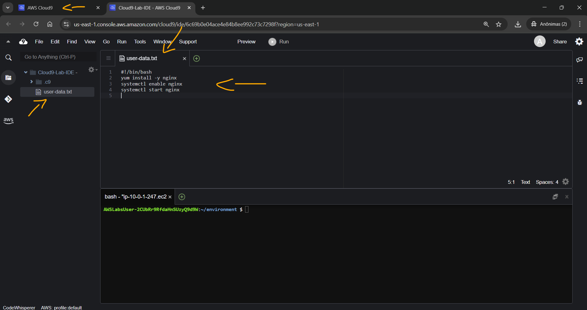
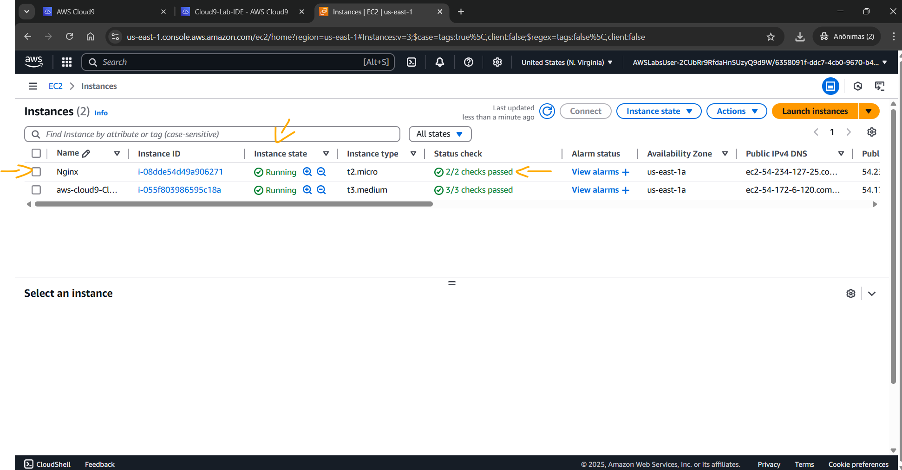
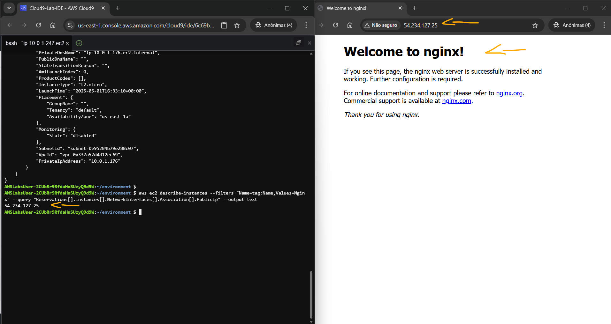

# Lab - Using the AWS CLI for Automation   

### AWS Skill Builder <a href="../../">aws_skill_builder   </a>
### Training Category: <a href="../../self_paced_lab">self_paced_lab</a>
### Software/Subject: aws   
### Course: <a href="./">curso_spl_049 (Lab - Using the AWS CLI for Automation)   </a>

#### Parceria da AWS com a Escola da Nuvem (EDN)   

---

### Theme:
- Cloud Computing
- Developement

### Used Tools:
- Operating System (OS): 
  - Linux   
  - Windows 11   
- Linux Distribution:
  - Amazon Linux   
- Cloud:
  - Amazon Web Services (AWS)   
- Cloud Services:
  - Amazon Elastic Compute Cloud (EC2)   
  - AWS Cloud9   
  - Google Drive   
- Language:
  - HTML   
  - Markdown   
- Integrated Development Environment (IDE) and Text Editor:
  - Visual Studio Code (VS Code)   
- Versioning: 
  - Git   
- Repository:
  - GitHub   
- Command Line Interpreter (CLI):
  - AWS Command Line Interface (CLI)   
  - Bash e Sh   
- Server and Databases:
  - Nginx   
- Tools:
  - Yellowdog Updater Modified (YUM)   

---

<a name="item0"><h3>Course Strcuture:</h3></a>
1. Lab - Using the AWS CLI for Automation<br>
1.1 <a href="#item01.1">Tarefa 1: Revisar o arquivo de dados do usuário</a><br>
1.2 <a href="#item01.2">Tarefa 2: Atualizar o comando AWS CLI para criar uma instância do Amazon EC2</a><br>
1.3 <a href="#item01.3">Tarefa 3: Verifique se os dados do usuário foram executados com sucesso</a><br>

---

### Objective:
Este laboratório teve como objetivo a utilização da **AWS Command Line Interface (CLI)** para provisionar a instância **Amazon Elastic Compute Cloud (EC2)** com dados do usuário, e também interagir com ela recuperando seu IP para verificar se o script de dados do usuário foi executado corretamente e se o site hospedado dentro da instância estava funcionando no servidor web **Nginx** instalado pelo script. 

### Structure:
A estrutura do curso é formada por:
- Este arquivo de README.
- A pasta `0-aux`, pasta auxiliar com imagens utilizadas na construção desse arquivo de README.
- A pasta `resource` com os arquivos utilizados.

### Development:
Este curso foi um laboratório prático realizado na plataforma **AWS Skill Builder**, cuja subscrição foi devida a uma parceria entre a **AWS** e a **Escola da Nuvem**. A infraestrutura de cloud utilizada foi fornecida através de um sandbox do **AWS Skill Builder** que possibilitava acesso ao console da **AWS**. Contudo foi necessário seguir estritamente as orientações determinadas no laboratório. Dessa maneira, a forma de interação com os recursos da cloud foram sempre através do console fornecido pelo sandbox, a não ser em casos em que o próprio laboratório instruiu para utilização de outras ferramentas de interação como **AWS CLI** ou **AWS SDK**.

O laboratório do **AWS Skill Builder** tem o foco em executar apenas o que é orientado no escopo, todos os recursos ou serviços que podem ser requisitados adicionalmente já vêm provisionados por padrão pelo laboratório. Ao iniciar o laboratório, o sandbox do **AWS Skill Builder** provisiona diversos recursos e serviços para o funcionamento através de uma ou mais pilhas do **AWS CloudFormation** de forma automática. 

O acesso ao console no sandbox do **AWS Skill Builder** é realizado por meio de uma identidade federada. O Skill Builder funciona como um provedor de identidade (IdP), autenticando o usuário e vinculando-o a uma role do **AWS IAM** provisionada automaticamente por uma das pilhas do CloudFormation. Essa role concede permissões temporárias e mínimas necessárias para a execução do laboratório, garantindo segurança e controle sobre os recursos utilizados. O laboratório, por padrão, determina a região a ser utilizada e ela não deve ser alterada, somente se o próprio laboratório indicar. As configurações não informadas no laboratório devem ser sempre mantidas como padrão que estão.

<a name="item01.1"><h4>Tarefa 1: Revisar o arquivo de dados do usuário</h4></a>[Back to summary](#item0)

A primeira tarefa consistiu em utilizar o **AWS Cloud9**, que é o Ambiente de Desenvolvimento Integrado (IDE) da **AWS**, para analisar o arquivo de dados do usuário. O arquivo de dados do usuário (`user data`) em uma instância do **Amazon EC2** é um script ou dado que é passado para a instância durante sua inicialização. Ele permite personalizar a configuração e o comportamento da instância durante a inicialização. Os dados do usuário são executados pelo pacote cloud-init na instância na primeira inicialização e normalmente são usados ​​para automatizar a instalação e a configuração da instância. O Cloud9 podia ser acessado pelo seu próprio console ou utilizando a URL de conexão direta que foi fornecido no parâmetro `Cloud9Environment` nas instruções do laboratório (`https://us-east-1.console.aws.amazon.com/cloud9/ide/6c69b0e04ace4e84b8ee992c73c7298f`). Todas as telas inicias que fossem abertas podiam ser fechadas. 

Na interface do Cloud9, o arquivo de dados do usuário cujo nome era [user-data.txt](./resource/user-data.txt) foi aberto. Os dados do usuário fornecidos eram um script **Bash** executado automaticamente quando uma instância do **Amazon EC2** era iniciada. Abaixo, os comandos específicos foram detalhados para explicar sua finalidade:
- `#!/bin/bash`: Isso é chamado de shebang e indica que o script deve ser interpretado e executado usando o shell **Bash**.
- `yum install -y nginx`: Este comando usa o gerenciador de pacotes **yum** (específico para certas distribuições **Linux**, incluindo o **Amazon Linux**) para instalar o servidor web **Nginx**. O sinalizador -y é usado para responder automaticamente "sim" a qualquer solicitação durante a instalação.
- `systemctl enable nginx`: Este comando permite que o serviço **Nginx** inicie automaticamente na inicialização do sistema. Assim, sempre que a instância do **Amazon EC2** for reiniciada, o **Nginx** também será iniciado.
- `systemctl start nginx`: Este comando inicia o serviço **Nginx** imediatamente após sua instalação, tornando o servidor web ativo e pronto para servir páginas web.

Algumas considerações importantes:
- O uso de um shebang (`#!/bin/bash`) é essencial para informar ao sistema operacional qual interpretador usar para executar o script. Nesse caso, ele especifica que o script deve ser executado com o shell **Bash**.
- O script pressupõe que a instância esteja executando uma distribuição **Linux** que usa o gerenciador de pacotes **yum**, como o **Amazon Linux**. Se estiver usando uma distribuição diferente, pode ser necessário usar um gerenciador de pacotes diferente, como o **apt-get** para sistemas baseados em **Ubuntu**/**Debian** ou o **dnf** para sistemas baseados em **Fedora**.
  - Além disso, o script pressupõe que os repositórios e dependências necessários já estejam configurados na instância para permitir a instalação do **Nginx**. Em alguns casos, pode ser necessária uma configuração adicional para configurar os repositórios necessários antes de usar o **yum** para instalar pacotes.
- O **Nginx** é um servidor web popular usado para fornecer conteúdo estático e processar solicitações da web. Ao instalar e habilitar o **Nginx**, a instância estará pronta para servir páginas da web e processar o tráfego de entrada. Outros servidores web estão disponíveis, como o **Apache HTTP Server** e o **Apache Tomcat**, para citar alguns. Cada um tem suas próprias dependências e configurações a serem consideradas ao instalar usando a opção de dados do usuário.
- O conteúdo do arquivo de dados do usuário deve ser salvo em formato de texto simples e passado como dados do usuário ao iniciar a instância do EC2. A **AWS** executa o script de dados do usuário automaticamente durante a inicialização da instância.

A imagem 01 mostra o arquivo de user data aberto no ambiente do **AWS Cloud9**.

<div align="Center"><figure>
    <br>
    <figcaption>Imagem 01.</figcaption>
</figure></div><br>

<a name="item01.2"><h4>Tarefa 2: Atualizar o comando AWS CLI para criar uma instância do Amazon EC2</h4></a>[Back to summary](#item0)

Na tarefa 2, o comando **AWS CLI** abaixo foi completado com os valores dos parâmetros faltantes e executado no terminal do Cloud9. Esse comando provisionava a instância do **Amazon EC2**. Para os três valores de parâmetros faltantes foram utilizados os valores nos seguintes parâmetros na instrução do laboratório: `AMI` (`ami-0f88e80871fd81e91`), `SecurityGroupID` (`sg-0017d73dc52d898bd`), `PublicSubnet` (`subnet-0e95284b79e288c07`). O comando foi executado no terminal dentro da pasta `/home/ec2-user/environment`, que era onde o arquivo de dados do usuário estava armazenado.

```bash
aws ec2 run-instances --image-id ami-0f88e80871fd81e91 --instance-type t2.micro --security-group-ids sg-0017d73dc52d898bd --subnet-id subnet-0e95284b79e288c07 --tag-specifications 'ResourceType=instance,Tags=[{Key=Name,Value=Nginx}]' --user-data file://user-data.txt
```

Abaixo é detalhado cada parâmetro desse comando:
- `aws ec2-run-instances`: Este é o comando da **AWS CLI** para iniciar o processo de provisionamento de instâncias do EC2.
- `--image-id ???`: Esta opção especifica o ID da imagem de máquina da Amazon (AMI) da instância que será utilizada.
- `--instance-type t2.micro`: Especifica o tipo de instância que deseja-se iniciar. Neste caso, é um tipo de instância `t2.micro`, que é um tipo de instância de baixo custo, de uso geral e com recursos modestos. É ótimo para provas de conceito, mas não é o que seria utilizado para um servidor web de produção.
- `–-security-group-ids ???`: Esta opção especifica os IDs do grupo de segurança para a instância. É preciso substituir as interrogações pelos IDs do grupo de segurança que deseja-se associar à instância. Isso é usado para permitir que o tráfego web de entrada acesse o servidor web **Nginx**.
- `--subnet-id`: Esta opção especifica o ID da sub-rede onde a instância é iniciada. É necessário substituir as interrogações pelo ID da sub-rede real.
- `--tag-specifications 'ResourceType=instance,Tags=[{Key-Name,Value=Nginx}]'`: Esta opção permite especificar tags para a instância iniciada. Nesse caso, uma tag com a chave `Name` e o valor `Nginx` é adicionada à instância. As tags são usadas para rotular e categorizar recursos para melhor organização.
- `--user-data file://user-data.txt`: Esta opção permite que seja fornecido dados do usuário à instância. Os dados do usuário podem ser usados ​​para executar scripts ou realizar determinadas configurações quando a instância é iniciada. Nesse caso, os dados do usuário estão sendo lidos de um arquivo chamado `user-data.txt`.

A imagem 02 evidencia que a instância do **Amazon EC2** foi provisionada com sucesso.

<div align="Center"><figure>
    <br>
    <figcaption>Imagem 02.</figcaption>
</figure></div><br>

<a name="item01.3"><h4>Tarefa 3: Verifique se os dados do usuário foram executados com sucesso</h4></a>[Back to summary](#item0)

Na última tarefa foi verificado se o user data tinha sido executado corretamente e se o servidor web **Nginx** estava em execução. Dessa forma, foi necessário obter o IP ou DNS público da instância e acessá-lo em outra aba do navegador da máquina física **Windows**. Se o site retornasse uma página, significava que o servidor web estava em funcionamento e que o arquivo user data tinha sido executado com sucesso. Para obter o IP público da instância EC2, foi utilizado o seguinte comando **AWS CLI**: `aws ec2 describe-instances --filters "Name=tag:Name,Values=Nginx" --query "Reservations[].Instances[].NetworkInterfaces[].Association[].PublicIp" --output text`. Nesse comando, a instância com tag de nome `Nginx` era filtrada no lado do servidor utilizando o parâmetro `--filters`, enquanto o parâmetro `--query` realiza o filtro no lado do cliente, retornando apenas o IP público da instância. Com o IP obitdo, o mesmo foi utilizado em outra aba do navegador para exibir a página padrão do servidor web **Nginx**, conforme mostrado na imagem 03. Pode ser que seja necessário forçar a requisição HTTP ao invés de HTTPS.

<div align="Center"><figure>
    <br>
    <figcaption>Imagem 03.</figcaption>
</figure></div><br>