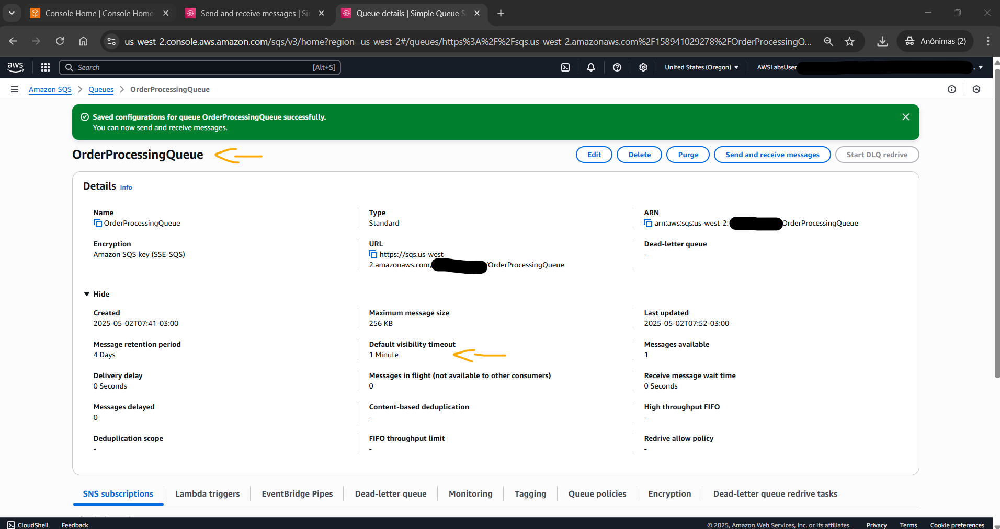

# Lab - Create Queues and Handle Messages using Amazon Simple Queue Service (Amazon SQS)   

### AWS Skill Builder <a href="../../">aws_skill_builder   </a>
### Training Category: <a href="../../self_paced_lab">self_paced_lab</a>
### Software/Subject: aws   
### Course: <a href="./">curso_spl_050 (Lab - Create Queues and Handle Messages using Amazon Simple Queue Service (Amazon SQS))   </a>

#### Parceria da AWS com a Escola da Nuvem (EDN)   

---

### Theme:
- Cloud Computing
- Developer

### Used Tools:
- Operating System (OS): 
  - Windows 11   
- Cloud:
  - Amazon Web Services (AWS)   
- Cloud Services:
  - Amazon Simple Queue Service (SQS)   
  - Google Drive   
- Language:
  - HTML   
  - Markdown   
- Integrated Development Environment (IDE) and Text Editor:
  - Visual Studio Code (VS Code)   
- Versioning: 
  - Git   
- Repository:
  - GitHub   

---

<a name="item0"><h3>Course Strcuture:</h3></a>
1. Lab - Create Queues and Handle Messages using Amazon Simple Queue Service (Amazon SQS)<br>
1.1 <a href="#item01.1">Tarefa 1: Criar e configurar a fila do Amazon SQS</a><br>
1.2 <a href="#item01.2">Tarefa 2: Enviar mensagens para a fila SQS</a><br>
1.3 <a href="#item01.3">Tarefa 3: Recuperar e excluir mensagens</a><br>
1.4 <a href="#item01.4">Tarefa 4: Configurar uma fila de mensagens mortas para lidar com mensagens com falha</a><br>
1.5 <a href="#item01.5">Tarefa 5: Habilitar e configurar a pesquisa longa em uma fila SQS</a><br>

---

### Objective:
Este laboratório teve como objetivo provisionar uma fila padrão no **Amazon Simple Queue Service (SQS)**, enviar e recuperar mensagens nessa fila, configurar uma fila de mensagens mortas (Dead-Letter Queue - DLQ) para lidar com mensagens com falha e configurar a pesquisa longa (Long Polling) na fila SQS, comparando com a pesquisa curta (Short Polling).

### Structure:
A estrutura do curso é formada por:
- Este arquivo de README.
- A pasta `0-aux`, pasta auxiliar com imagens utilizadas na construção desse arquivo de README.

### Development:
<a name="item01.1"><h4>Tarefa 1: Criar e configurar a fila do Amazon SQS</h4></a>[Back to summary](#item0)

A tarefa inicial do lab foi provisionar uma fila do tipo padrão (`Standard`) no **Amazon SQS** para funcionar como um sistema de enfileiramento de mensagens de um aplicativo de uma plataforma de e-commerce hipotética. Esse fila processaria pedidos de diferentes componentes do aplicativo. O **Amazon SQS** oferece dois tipos de filas: padrão e FIFO (First-In-First-Out). Para o sistema de processamento de pedidos de alto volume, onde mensagens duplicadas ocasionais são aceitáveis, mas alta taxa de transferência é essencial, como é o caso deste cenário, o tipo utilizado é o padrão. Além disso, foram definidas as configurações essenciais da fila que determinavam como as mensagens seriam processadas, protegidas e retidas.

Considereações sobre os dois tipos de filas do SQS:
- Fila Padrão:
  - Entrega de mensagem pelo menos uma vez.
  - Ordenação de mensagens de melhor esforço.
  - Taxa de transferência ilimitada.
  - Ideal para aplicações de alto rendimento.
- Fila FIFO:
  - Processamento de mensagens exatamente uma vez.
  - Ordem estrita das mensagens.
  - Limitado a 300 mensagens por segundo.
  - Melhor para aplicações que exigem ordenação estrita.

A fila SQS foi provisionada com a seguinte configuração:
- `Details` (Detalhes):
  - `Type` Tipo: `Standard` (Padrão).
  - `Name` (Nome): `OrderProcessingQueue` (Fila de processamento de pedidos). Os nomes das filas devem ser exclusivos na conta da **AWS** na região atual.
- `Configuration` (Configuração):
  - `Visibility timeout` (Tempo limite de visibilidade): foi mantido o padrão de `30 Seconds`. Essa configuração controla quanto tempo uma mensagem fica invisível para outros consumidores após ser recebida.
  - `Message retention period` (Período de retenção de mensagens): foi mantido o padrão de `4 Days`. Essa configuração controla quanto tempo as mensagens permanecem na fila antes da exclusão automática.
  - `Delivery delay` (Atraso na entrega): foi mantido o padrão de `0 Seconds`. Essa configuração controla quanto tempo esperar antes de disponibilizar novas mensagens para processamento.
  - Todas as outras configurações foram mantidas com seus valores padrão.
-  `Encryption` (Criptografia):
  - `Server-side encryption` (Criptografia do lado do servidor): `Enabled` (Habilitada).
  - `Encryption key type` (Tipo de chave de criptografia): `Amazon SQS key (SSE-SQS)`. A criptografia do lado do servidor é ativada automaticamente com a chave do Amazon SQS (SSE-SQS), fornecendo criptografia de mensagens em repouso integrada usando chaves gerenciadas pelo **Amazon SQS**.

A imagem 01 ilustra a fila padrão do **Amazon SQS** provisionada com sucesso.

<div align="Center"><figure>
    <br>
    <figcaption>Imagem 01.</figcaption>
</figure></div><br>

<a name="item01.2"><h4>Tarefa 2: Enviar mensagens para a fila SQS</h4></a>[Back to summary](#item0)

Com a fila `OrderProcessingQueue` construída, o objetivo da tarefa 2 foi enviar mensagens para esta fila, simulando a realização de um pedido na plataforma de e-commerce. Portanto, esta fila foi acessada e a opção `Send and receive messages` (Enviar e receber mensagens) foi selecionada. Dentro dessa página, no campo `Menssage body` (Corpo da mensagem) foi passado o JSON abaixo. Esse JSON representava uma mensagem de pedido típica contendo informações do cliente, detalhes do pedido e dados de preços. Em seguida, o envio da mensagem foi realizado, conforme mostrado na imagem 02.

```json
{
    "orderId": "12345",
    "customerName": "John Doe",
    "items": [
        {
            "productId": "ABC123",
            "quantity": 2,
            "price": 29.99
        }
    ],
    "orderTotal": 59.98,
    "timestamp": "2025-03-31T10:00:00Z"
}
```

<div align="Center"><figure>
    <br>
    <figcaption>Imagem 02.</figcaption>
</figure></div><br>

Ainda na fila `OrderProcessingQueue`, na seção `Details` (Detalhes), foi expandida a seção `More` (Mais) para verificar que a métrica `Messages available` (Mensagens disponíveis) agora era 1, já que uma mensagem tinha sido enviada para fila. Na aba `Monitoring` (Monitoramento), foi localizado a barra de séries temporais e alterado o período para `1h` para visualizar as métricas da última hora, e o intervalo de atualização dos gráficos para `10 segundos`. Ao visualizar as métricas pela primeira vez, é bem provável ver uma mensagem informando `No data available. Try adjusting the dashboard time range.` (Nenhum dado disponível. Tente ajustar o intervalo de tempo do painel.). Isso é normal, pois o SQS precisa de tempo para coletar e exibir dados de métricas. As métricas começam a ser preenchidas conforme era interagido com a fila em tarefas subsequentes. Algumas das métricas são explicadas abaixo:
- `Approximate Age Of Oldest Message` (Idade aproximada da mensagem mais antiga): Idade da mensagem mais antiga na fila.
- `Approximate Number Of Messages Delayed` (Número aproximado de mensagens atrasadas): Mensagens com entrega atrasada que ainda não estão disponíveis para processamento.
- `Approximate Number Of Messages Not Visible` (Número aproximado de mensagens não visíveis): Mensagens que estão “em trânsito” (temporariamente ocultas durante o processamento).
- `Approximate Number Of Messages Visible` (Número aproximado de mensagens visíveis): Mensagens atualmente disponíveis para recuperação.
- `Number Of Empty Receives` (Número de Recebimentos Vazios): Número de solicitações ReceiveMessage vazias.
- `Number Of Messages Deleted` (Número de mensagens excluídas): Número total de mensagens removidas da fila.
- `Number Of Messages Received` (Número de mensagens recebidas): Número total de mensagens recuperadas da fila.
- `Number Of Messages Sent` (Número de mensagens enviadas): Número total de mensagens enviadas para a fila.
- `Sent Message Size` (Tamanho da mensagem enviada): Tamanho das mensagens enviadas para a fila em bytes.

O prefixo "Aproximado" nos nomes das métricas indicava que, devido à natureza distribuída do SQS, o número mostrado poderia não ser exato em um determinado momento. A imagem 03 mostra algumas dessas métricas. 

<div align="Center"><figure>
    <br>
    <figcaption>Imagem 03.</figcaption>
</figure></div><br>

<a name="item01.3"><h4>Tarefa 3: Recuperar e excluir mensagens</h4></a>[Back to summary](#item0)

Na tarefa anterior foi implantado o lado do produtor, criando uma mensagem na fila do **Amazon SQS**. Nesta terceira tarefa, o objetivo foi implementar o lado do consumidor do sistema, recuperando a mensagem na fila e excluindo-a. Em um ambiente de produção, os serviços de processamento de pedidos recuperariam e processariam essas mensagens automaticamente. No entanto, antes de implementar o processamento automatizado, é crucial entender como as mensagens se movem ao longo de seu ciclo de vida na fila.

Quando um serviço de processamento de pedidos recupera uma mensagem, o tempo limite de visibilidade garante que outros serviços não tentem processar o mesmo pedido, ajudando a manter a consistência dos dados no sistema distribuído. Essa configuração determina por quanto tempo as mensagens permanecem invisíveis para outros consumidores após serem recuperadas. Dessa forma, o `Visibility timeout` (Tempo limite de visibilidade) da fila SQS `OrderProcessingQueue` foi alterado para `60 Seconds` (1 minuto). Por padrão, o tempo limite de visibilidade é definido como `30` segundos. A imagem 04 evidencia o aumento do tempo limite de visibilidade neste fila.

<div align="Center"><figure>
    <br>
    <figcaption>Imagem 04.</figcaption>
</figure></div><br>

Para recuperar mensagens na fila foi selecionada a opção `Send and receive messages` (Enviar e receber mensagens). Dentro dessa página, na seção `Receive messages` (Receber mensagens) foi selecionada a opção `Poll for messages` (Sondagem de mensagens) para recuperar as mensagens que estivessem na fila. Foi necessário aguardar um tempo até que fosse concluída a pesquisa. A mensagem enviada anteriormente à fila foi listada, conforme imagem 05. Esta foi selecionada e a opção `Show details` (Exibir detalhes) foi escolhida. Os detalhes da mensagem foram revisados navegados pelos seguintes guias:
- Aba `Body` (Corpo): Observe a estrutura JSON da mensagem, que é a mesma mensagem de processamento de pedidos que foi enviada na tarefa anterior.
- Aba `Attributes` (Atributos): Observe que não há atributos de mensagem para esta mensagem específica.
- Aba `Details` (Detalhes):
  - `Message ID` (ID da mensagem): um identificador exclusivo para a mensagem (`9c60142c-d4ad-4352-aab1-d0cf7f021685`).
  - `Size` (Tamanho): o tamanho da mensagem em bytes (`255 bytes`).
  - `MD5 of message body` (MD5 do corpo da mensagem): um hash para verificar a integridade da mensagem.
  - `Sender account ID` (ID da conta do remetente): o ID da conta da **AWS** do remetente da mensagem.
  - `Sent` (Enviado): o registro de data e hora em que a mensagem foi enviada.
  - `First received` (Primeiro recebido): o registro de data e hora em que a mensagem foi recebida pela primeira vez.
  - `Receive count` (Contagem de recebimento): o número de vezes que esta mensagem foi recebida.
  - `Message attributes count` (Contagem de atributos de mensagem): O número de atributos personalizados (se houver).

<div align="Center"><figure>
    <br>
    <figcaption>Imagem 05.</figcaption>
</figure></div><br>

O ID da mensagem é usado para identificar exclusivamente a mensagem no sistema SQS. A contagem de recebimentos ajuda a rastrear quantas vezes uma mensagem foi recuperada, o que pode ser útil para identificar mensagens problemáticas que são processadas repetidamente.

A etapa final desta tarefa foi excluir a mensagem processada, garantindo que a mensagem processada não fosse processada novamente, gerando uma duplicação de pedidos no sistema. Após revisar a mensagem, ela foi escolhida novamente e a opção `Delete` (Excluir) foi selecionada. No pop-up de confirmação, foi selecionado `Delete` (Excluir), removendo essa mensagem da fila SQS. Ao sondar novamente a fila, nenhuma mensagem apareciam, pois a fila agora estava vazia, conforme exibido na imagem 06.

<div align="Center"><figure>
    <br>
    <figcaption>Imagem 06.</figcaption>
</figure></div><br>

<a name="item01.4"><h4>Tarefa 4: Configurar uma fila de mensagens mortas para lidar com mensagens com falha</h4></a>[Back to summary](#item0)

À medida que o sistema de processamento de pedidos lidaria com volumes crescentes de transações, tornava-se evidente que nem todas as mensagens poderiam ser processadas com sucesso. O processamento de mensagens poderia falhar por vários motivos: problemas temporários de rede, interrupções de serviço ou inconsistências de dados. Essas mensagens com falha, se não fossem tratadas corretamente, poderiam congestionar a fila principal e dificultar a identificação de problemas sistêmicos no pipeline de processamento. Portanto, o objetivo da tarefa 4 foi provisionar uma Dead-Letter Queue (DLQ), que é uma fila de mensagens mortas. Essa é uma fila especial que captura mensagens problemáticas, permitindo que a equipe de desenvolvimento analise falhas enquanto mantém a fila de processamento principal funcionando sem problemas. A DLQ foi construída da seguinte maneira:
- `Details` (Detalhes):
  - `Type` Tipo: `Standard` (Padrão). A DLQ deve ser sempre do mesmo tipo (padrão ou FIFO) que a fila principal.
  - `Name` (Nome): `OrderProcessingDLQ` (Processamento de pedidos DLQ).
  - Todas as demais configurações foram mantidas com seus valores padrão.

A imagem 07 exibe a segunda fila provisionada no **Amazon SQS**, que seria configurada como DLQ.

<div align="Center"><figure>
    <br>
    <figcaption>Imagem 07.</figcaption>
</figure></div><br>

Para configurar a DLQ, foi necessário ir na fila principal, `OrderProcessingQueue`, e editar a seguinte definição `Dead-letter queue - Optional` (Fila de mensagens mortas - Opcional):
- `Set this queue to receive undeliverable messages` (Definir esta fila para receber mensagens não entregues): `Enabled` (Habilitado).
  - `Choose queue` (Escolher fila): o ARN da fila principal foi selecionado (`OrderProcessingDLQ`).
  - `Maximum receives` (Receber o máximo): `3`. A configuração de recebimento máximo determina quantas vezes uma mensagem pode ser recebida da fila principal antes de ser movida para a fila DLQ. Isso ajuda a identificar mensagens problemáticas que falham consistentemente no processamento.

A imagem 08 comprova que a segunda fila do SQS foi configurada corretamente como DLQ da fila principal.

<div align="Center"><figure>
    <br>
    <figcaption>Imagem 08.</figcaption>
</figure></div><br>

<a name="item01.5"><h4>Tarefa 5: Habilitar e configurar a pesquisa longa em uma fila SQS</h4></a>[Back to summary](#item0)

Com toda infraestrutura básica de filas implementada e o tratamento de erros configurado, o foco muda para a otimização da eficiência do sistema. No cenário hipotético, a equipe de desenvolvimento notou que, durante períodos de baixa demanda, os serviços de processamento de pedidos fazem chamadas frequentes à API para verificar novos pedidos, a maioria dos quais retorna sem retorno. Essa consulta ineficiente não só aumenta os custos, como também sobrecarrega desnecessariamente o sistema. Dessa forma, a quinta e última tarefa consistiu em implementar na fila a pesquisa longa (Long Polling), otimizando o processo de recuperação de pedidos. Essa configuração permite que o serviço SQS aguarde a chegada dos pedidos antes de responder a uma solicitação de recebimento, ajudando a reduzir chamadas de API desnecessárias e, ao mesmo tempo, mantendo a capacidade de resposta do sistema aos pedidos recebidos.

O primeiro passo foi alterar o `Receive message wait time` (Tempo de espera para receber mensagem) desta fila para `20` segundos. O tempo de espera para recebimento de mensagens pode ser definido entre 0 e 20 segundos. Um valor de 0 utiliza polling curto, enquanto qualquer valor entre 1 e 20 permite polling longo. Quanto maior o tempo mais longa é a sondagem. A imagem 09 exibe essa alteração na fila SQS.

<div align="Center"><figure>
    <br>
    <figcaption>Imagem 09.</figcaption>
</figure></div><br>

O segundo passo foi simular diferentes padrões de chegada de pedidos e comparar o comportamento das pesquisas curtas (Short Polling) e longas (Long Polling) em diferentes cenários. A aba de monitoramento (`Monitoring`) da fila foi acessada, alterando nas barras de séries temporais, o período para `1h` para visualizar as métricas da última hora, e o intervalo de atualização dos gráficos para `10 segundos`. Os valores das métricas foram acompanhados para comparar o short polling com o long polling:

Na página `Send and receive messages` (Enviar e receber mensagens), na seção `Receive messages` (Receber mensagens) foi configurado `Edit poll settings` (Editar configurações da sondagem), definindo `Polling duration` (Duração da sondagem) para `1` segundo. Esse foi um teste criado para verificar a performance do short polling. Em seguida, o JSON abaixo foi enviado como mensagem de teste para a fila. Na seção `Message attributes - Optional` (Atributos da mensagem - Opcional) foi configurado o seguinte:
- `Name` (Nome): `OrderType` (Tipo de pedido).
- `Type` (Tipo): `String`.
- `Value` (Valor): `Standard` (Padrão).

```json
{
    "orderId": "ORD001",
    "product": "Widget A",
    "quantity": 100,
    "priority": "standard"
}
```

Após enviar a mensagem de teste, na seção `Receive messages` (Receber mensagens), a sondagem de mensagens foi feita clicado em `Poll for messages` (Sondar mensagens). Observe que como uma pesquisa curta (Short Polling), já que a duração da sondagem era 1 segundo, a rapidez com que a mensagem aparecia e a operação de pesquisa era concluída. A imagem 10 mostra o resultado desse teste.

<div align="Center"><figure>
    <br>
    <figcaption>Imagem 10.</figcaption>
</figure></div><br>

Com o teste da sondagem curta concluído, essa mensagem foi apagada e as mesmas configurações foram alteradas agora para uma long polling. Na página `Send and receive messages` (Enviar e receber mensagens), na seção `Receive messages` (Receber mensagens) foi configurado `Edit poll settings` (Editar configurações da sondagem), definindo `Polling duration` (Duração da sondagem) para `30` segundos. Em seguida, o JSON abaixo foi enviado como mensagem de teste para a fila. Na seção `Message attributes - Optional` (Atributos da mensagem - Opcional) foi configurado o seguinte:
- `Name` (Nome): `OrderType` (Tipo de pedido).
- `Type` (Tipo): `String`.
- `Value` (Valor): `express`.

```json
{
    "orderId": "ORD002",
    "product": "Widget B",
    "quantity": 200,
    "priority": "express"
}
```

Após enviar a segunda mensagem de teste, na seção `Receive messages` (Receber mensagens), a sondagem de mensagens foi feita clicado em `Poll for messages` (Sondar mensagens). Perceba que com a pesquisa longa as seguintes situações ocorreram, conforme apresentado na imagem 11:
- A mensagem aparece imediatamente quando disponível.
- A operação de sondagem continua pela duração configurada.
- O sistema continua verificando se há mensagens adicionais.

<div align="Center"><figure>
    <br>
    <figcaption>Imagem 11.</figcaption>
</figure></div><br>

A última etapa consistiu em comparar as métricas dos diferentes tipos de sondagem, analisando como diferentes configurações de sondagem afetavam o desempenho da fila. Ao comparar as métricas antes e depois da implementação do polling longo, insights foram obtidos sobre como essa otimização pode reduzir custos e melhorar a escalabilidade do sistema de processamento de pedidos.

O preço do **Amazon SQS** é baseado principalmente no número de solicitações de API feitas, com o primeiro 1 milhão de solicitações por mês sendo gratuito. Esta tarefa demonstra como as configurações de polling impactam significativamente o número de chamadas de API. Pollings curtos, como visto na métrica "Número de Recebimentos Vazios", podem levar a inúmeras chamadas de API mesmo quando não há mensagens disponíveis, potencialmente aumentando os custos. Pollings longos, por outro lado, reduzem os recebimentos vazios e, consequentemente, as chamadas de API, otimizando os custos. Além disso, embora a transferência de dados dentro da mesma região da **AWS** (por exemplo, entre o SQS e o Lambda) seja gratuita, a transferência entre regiões incorre em custos. Para minimizar despesas, recomenda-se usar pollings longos, enviar mensagens em lote sempre que possível e gerenciar cuidadosamente a transferência de dados entre regiões.