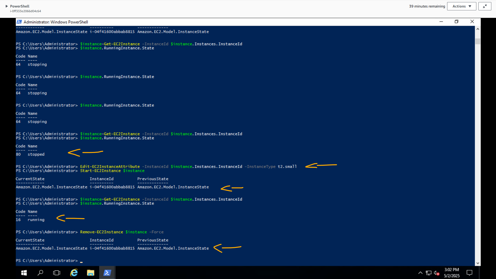

# Lab - AWS Tools for Windows PowerShell: Getting Started   

### AWS Skill Builder <a href="../../">aws_skill_builder   </a>
### Training Category: <a href="../../self_paced_lab">self_paced_lab</a>
### Software/Subject: aws   
### Course: <a href="./">curso_spl_051 (Lab - AWS Tools for Windows PowerShell: Getting Started)   </a>

#### Parceria da AWS com a Escola da Nuvem (EDN)   

---

### Theme:
- Cloud Computing
- Developer

### Used Tools:
- Operating System (OS): 
  - Windows 11   
- Cloud:
  - Amazon Web Services (AWS)   
- Cloud Services:
  - Amazon Elastic Compute Cloud (EC2)   
  - Amazon Polly   
  - Amazon Simple Notification Service (SNS)   
  - Amazon Simple Storage Service (S3)   
  - AWS Systems Manager (SSM)   
  - AWS Tools for Windows PowerShell   
  - Google Drive   
- Language:
  - HTML   
  - Markdown   
- Integrated Development Environment (IDE) and Text Editor:
  - Visual Studio Code (VS Code)   
- Versioning: 
  - Git   
- Repository:
  - GitHub   
- Command Line Interpreter (CLI):
  - Windows PowerShell   

---

<a name="item0"><h3>Course Strcuture:</h3></a>
1. Lab - AWS Tools for Windows PowerShell: Getting Started<br>
1.1 <a href="#item01.1">Tarefa 1: Faça login na sua instância do Amazon EC2</a><br>
1.2 <a href="#item01.2">Tarefa 2: Iniciar o AWS Tools para Windows PowerShell</a><br>
1.3 <a href="#item01.3">Tarefa 3: usar o PowerShell para iniciar uma nova instância do Amazon EC2</a><br>
1.4 <a href="#item01.4">Tarefa 4: Modifique sua instância do Amazon EC2</a><br>
1.5 <a href="#item01.5">Tarefa 5: Usando o Amazon S3</a><br>
1.6 <a href="#item01.6">Tarefa 6: Enviar notificações usando o Amazon SNS</a><br>
1.7 <a href="#item01.7">Tarefa 7: Faça seu computador falar com o Amazon Polly</a><br>

---

### Objective:
O objetivo deste laboratório foi explorar o uso do **AWS Tools for Windows PowerShell** como ferramenta para administração e automação de recursos da **AWS** por meio do **Windows PowerShell**, dentro de uma instância **Windows Server** do **Amazon EC2**. Para isso, foram realizadas diversas interações com serviços da **AWS**, incluindo o provisionamento e modificação de uma instância EC2, criação de um bucket e upload de objeto no **Amazon S3**, criação de um tópico no **Amazon SNS** com adição de assinante e envio de notificação, além da conversão de texto em fala utilizando o **Amazon Polly**.

### Structure:
A estrutura do curso é formada por:
- Este arquivo de README.
- A pasta `0-aux`, pasta auxiliar com imagens utilizadas na construção desse arquivo de README.
- A pasta `resource` com os arquivos utilizados.

### Development:
O **AWS Tools for Windows PowerShell** e o *AWS Tools for PowerShell Core* são módulos do PowerShell criados com base na funcionalidade exposta pelo **AWS SDK for .NET**. O AWS PowerShell Tools permite que seja criados scripts de operações nos recursos da **AWS** a partir da linha de comando do PowerShell. Embora os cmdlets sejam implementados usando os clientes de serviço e métodos do SDK, eles oferecem uma experiência idiomática do PowerShell para especificar parâmetros e manipular resultados. Por exemplo, os cmdlets do Tools for Windows PowerShell oferecem suporte ao pipeline do PowerShell, ou seja, é possível executar o pipeline de objetos do PowerShell para dentro e para fora dos cmdlets.

O **AWS Tools for Windows PowerShell** e o *AWS Tools for PowerShell Core* são flexíveis na forma como permitem que sejam manipuladas as credenciais, incluindo suporte para a infraestrutura do **AWS Identity and Access Management (IAM)**. É possível usar as ferramentas com credenciais de usuário do IAM, tokens de segurança temporários e funções do IAM.

O **AWS Tools for Windows PowerShell** oferece suporte ao mesmo conjunto de serviços e regiões suportados pelo SDK. Ele também pode ser instalado no próprio computador, permitindo que seja controlado os recursos da **AWS** de qualquer computador conectado à internet.

<a name="item01.1"><h4>Tarefa 1: Faça login na sua instância do Amazon EC2</h4></a>[Back to summary](#item0)

A primeira tarefa deste laboratório foi conectar-se a instância do **Amazon Elastic Compute Cloud (EC2)** utilizando o recurso *Fleet Manager* do **AWS Systems Manager (SSM)**. O navegador de internet utilizado na máquina física foi o **Google Chrome**, pois é o único que permite colagem bidirecional entre sessões RDP e a máquina física local. Uma outra forma de conexão, também utilizando protocolo RDP, era com o software **Remote Desktop Connection (RDC)** (Conexão Área de Trabalho Remota) que já vem instalado em máquinas **Windows**. Em ambos os casos, foi preciso do arquivo de chave privada do par de chaves vinculado a essa instância para autenticação do usuário que faria a conexão. Esse arquivo foi fornecido nas instruções do laboratório. Em seguida, o recurso *Fleet Manager* do SSM foi aberto e a instância selecionada para conexão. O laboratório facilitou essa etapa fornecendo o link direto para configuração dessa conexão através do parâmetro `Ec2InstanceSessionRDP` nas instruções (`https://us-west-2.console.aws.amazon.com/systems-manager/fleet-manager/remote-desktop?region=us-west-2&nodeIds=i-0ff333e2066d04c64`). Nas configurações de conexão foram determinados o tipo de autenticação que era par de chaves, passando o arquivo de chave privada formato `.PEM` baixado, e o nome de usuário que seria autenticado, que foi o usuário padrão de instância **Windows Server** (`Administrator`). Com essas informações, a conexão remota gráfica foi estabelecida com sucesso, fornecendo a interface para utilização, conforme mostrado na imagem 01.

<div align="Center"><figure>
    <br>
    <figcaption>Imagem 01.</figcaption>
</figure></div><br>

<a name="item01.2"><h4>Tarefa 2: Iniciar o AWS Tools para Windows PowerShell</h4></a>[Back to summary](#item0)

Na GUI da instância EC2 conectada, o **Windows PowerShell** foi aberto e no prompt de comando foi passado o comando `Get-EC2KeyPair` para verificar se respondia. Esse comando consultava todos os pares de chaves existentes na cloud **AWS** na região definida nas configurações. Isso comprovava que o **AWS Tools for Windows PowerShell** estava instalado e configurado corretamente. A imagem 02 exibe o retorno do comando mostrando o par de chaves que foi o utilizado para se conectar a essa instância do **Amazon EC2**.

<div align="Center"><figure>
    <br>
    <figcaption>Imagem 02.</figcaption>
</figure></div><br>

<a name="item01.3"><h4>Tarefa 3: usar o PowerShell para iniciar uma nova instância do Amazon EC2</h4></a>[Back to summary](#item0)

A tarefa 3 consistiu em provisionar uma outra instância do **Amazon EC2** usando cmdlets do **AWS Tools for Windows PowerShell**. Para isso, primeiro foi necessário extrair informações que seriam necessárias para configurar a instância. A primeira delas foi o ID do grupo de segurança que seria vinculado a instância. Portanto, o comando `Get-EC2SecurityGroup` foi executado e em `GroupId` foi copiado o ID do security group cujo `GroupName` era `PowerShellSG` (`sg-05013c9d917e3771b`). Para obter as sub-redes foi utilizado o comando `Get-EC2Subnet -Filter @{Name="tag:Name";Value="Lab VPC Public Subnet"}`, extraindo o ID da subnet na AZ `us-west-2a` (`subnet-06ec1a440e24aa866`). Com essas informações, o comando `$instance = New-EC2Instance -InstanceType t2.micro -SecurityGroupId sg-05013c9d917e3771b -ImageId ami-05d713ee92dbc9d6d -SubnetId subnet-06ec1a440e24aa866` foi executado, passando também a AMI utilizada que foi fornecida no parâmetro `AMI_ID` nas instruções do lab (`ami-05d713ee92dbc9d6d`). Abaixo é explicado cada parte desse comando:
- `New-EC2Instance`: inicia uma nova instância do **Amazon EC2** com base nos parâmetros passados.
- `InstanceType`: identifica o tipo de instância da nova máquina virtual, que vem com certas quantidades de CPU e RAM. Neste caso foi provisionada uma instância `t2.micro`.
- `SubnetId`: o ID da sub-rede pública na VPC.
- `SecurityGroupId`: identifica a lista de regras que permitirão o acesso da rede à instância.
- `ImageId`: identifica qual AMI usar ao iniciar a instância, o que inclui o sistema operacional, aplicativos, dados, etc.

Além de executar o comando, todas as informações eram mantidas na variável `$instance`, o que facilitava a consulta. O comando `$instance.Instances` foi executado para mostrar as principais informações dessa instância. A imagem 03 exibe o output desses comandos, comprovando que a instância do EC2 foi provisionada com sucesso.

<div align="Center"><figure>
    <br>
    <figcaption>Imagem 03.</figcaption>
</figure></div><br>

<a name="item01.4"><h4>Tarefa 4: Modifique sua instância do Amazon EC2</h4></a>[Back to summary](#item0)

Com a instância provisionada e funcionando, o próximo passo foi modificar algumas configurações dela. Para modificar uma instância, primeiro foi necessário pará-la com o comando `Stop-EC2Instance $instance`. Em seguida, esses dois comandos foram executados para verificar se o status da instância estava parado (`stopped`): `$instance=Get-EC2Instance -InstanceId $instance.Instances.InstanceId` e `$instance.RunningInstance.State`. Com a instância parada, foi executado o comando `Edit-EC2InstanceAttribute -InstanceId $instance.Instances.InstanceId -InstanceType t2.small` que alterava o tipo de instância de `t2.micro` para `t2.small`. Após modificação, o comando `Start-EC2Instance $instance` foi executado para iniciar a instância novamente. Por fim, o último comando executado foi para encerrar a instância (`Remove-EC2Instance $instance -Force`). A imagem 04 exibe os outputs desses comandos.

<div align="Center"><figure>
    <br>
    <figcaption>Imagem 04.</figcaption>
</figure></div><br>

<a name="item01.5"><h4>Tarefa 5: Usando o Amazon S3</h4></a>[Back to summary](#item0)

Na quinta tarefa, o objetivo foi construir um novo bucket no **Amazon S3** e interagir com ele, utilizando os cmdlets do **AWS Tools for Windows PowerShell**. Dessa forma, o comando `New-S3Bucket -BucketName mybucket-5988` foi executado para provisionar o bucket. Um arquivo de texto vazio foi elaborado na instância com o comando `New-Item file.txt -type file`. Em seguida, esse arquivo foi copiado para o bucket criando um novo objeto através do comando `Write-S3Object -File file.txt -Bucketname mybucket-5988`. Por fim, com o comando `Get-S3Object -Bucketname mybucket-5988`, esse objeto foi listado no bucket, conforme evidenciado na imagem 05.

<div align="Center"><figure>
    <br>
    <figcaption>Imagem 05.</figcaption>
</figure></div><br>

<a name="item01.6"><h4>Tarefa 6: Enviar notificações usando o Amazon SNS</h4></a>[Back to summary](#item0)

A tarefa 6 consistiu em criar um novo tópico no **Amazon SNS** e enviar notificações para ele, tudo isso utilizado os comandos do **AWS Tools for Windows PowerShell**. O **Amazon Simple Notification Service (SNS)** é um serviço web que coordena e gerencia a entrega ou o envio de mensagens para endpoints ou clientes assinantes. No **Amazon SNS**, existem dois tipos de clientes, os publicadores e os assinantes, também chamados de produtores e consumidores. Os publicadores se comunicam de forma assíncrona com os assinantes, produzindo e enviando uma mensagem para um tópico, que é um ponto de acesso lógico e um canal de comunicação. Os assinantes (ou seja, servidores web, endereços de e-mail, filas do **Amazon SQS**, funções do **AWS Lambda**) consomem ou recebem a mensagem ou notificação por meio de um dos protocolos suportados (ou seja, Amazon SQS, HTTP/S, e-mail, SMS, Lambda) quando estão inscritos no tópico.

Para criar o tópico do SNS foi utilizado o comando `$topic=New-SNSTopic -Name Lab` e em seguida as informações do tópico criado foram exibidas executando `$topic`. Com o comando `Connect-SNSNotification -TopicArn $topic -Protocol email -Endpoint phcstudy@proton.me` e passando um endereço de email como endpoint, esse endereço é subscrito no tópico como consumidor. Entretanto, um email era enviado antes para confirmar a subscrição. Com o tópico com um assinante inscrito, uma mensagem foi enviada ao tópico com o comando `Publish-SNSMessage -TopicArn $topic -Message "Greetings from SNS!"`. Após alguns segundos, essa mensagem era recebida no email cadastrado, conforme imagem 06. A imagem 07 exibe os outputs dos comandos executados.

<div align="Center"><figure>
    <br>
    <figcaption>Imagem 06.</figcaption>
</figure></div><br>

<div align="Center"><figure>
    <br>
    <figcaption>Imagem 07.</figcaption>
</figure></div><br>

<a name="item01.7"><h4>Tarefa 7: Faça seu computador falar com o Amazon Polly</h4></a>[Back to summary](#item0)

O serviço utilizado na última tarefa foi o **Amazon Polly**. Com ele foi gerado uma fala a partir de um texto fornecido. Aqui foi preciso que o software utilizado para a conexão remota tivesse suporte a audio. O conjunto de comandos abaixo foram executados. O primeiro armazenva a mensagem que seria convertida em fala em uma variável. O segundo criava um novo arquivo chamado `polly.mp3` no diretório atual para gravar o áudio gerado. O terceiro chamava o serviço **Amazon Polly** para sintetizar a fala do texto contido em `$message`. O último copiava conteúdo do stream de áudio retornado pelo Polly (armazenado em `$POLSpeech.AudioStream`) para o arquivo MP3 (`$FileStream`).

```ps1
$message = "Hello from Amazon Polly and PowerShell!"
$FileStream = [System.IO.FileStream]::new("polly.mp3", [System.IO.FileMode]::Create)
$POLSpeech = Get-POLSpeech -Text $message -VoiceId Joanna -OutputFormat mp3 -Region us-west-2
$POLSpeech.AudioStream.CopyTo($FileStream)
```

Com os comandos `Start-Service "Windows Audio"` e `ii polly.mp3`, o arquivo [polly.mp3](./resource/polly.mp3) foi reproduzido no **Windows Media Player**. A imagem 08 mostra a execução desses comandos. 

<div align="Center"><figure>
    <br>
    <figcaption>Imagem 08.</figcaption>
</figure></div><br>