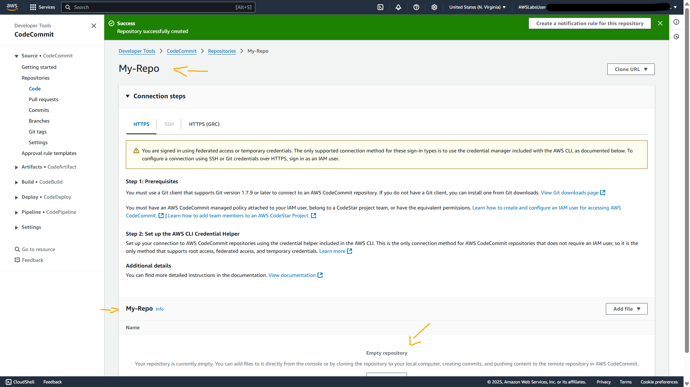
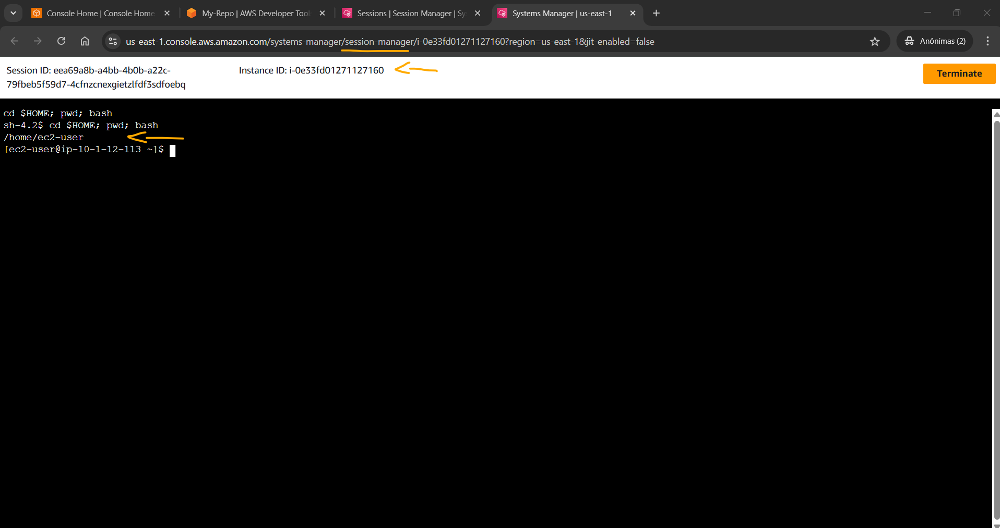
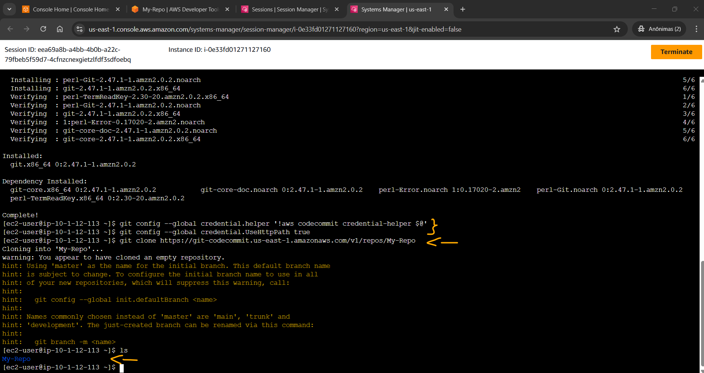
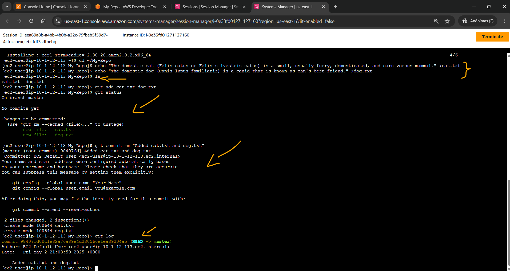
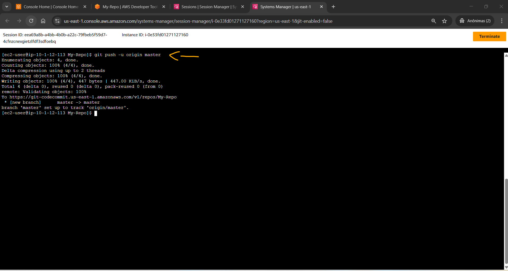
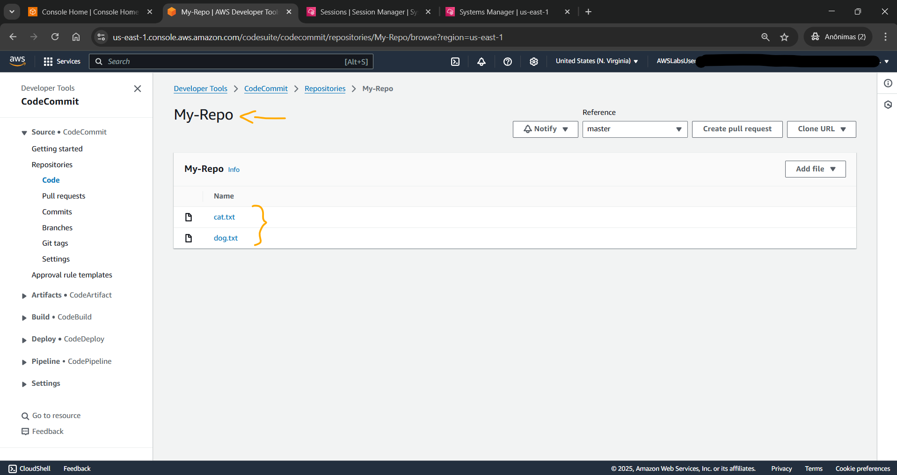

# Lab - Working with AWS CodeCommit   

### AWS Skill Builder <a href="../../">aws_skill_builder   </a>
### Training Category: <a href="../../self_paced_lab">self_paced_lab</a>
### Software/Subject: aws   
### Course: <a href="./">curso_spl_052 (Lab - Working with AWS CodeCommit)   </a>

#### Parceria da AWS com a Escola da Nuvem (EDN)   

---

### Theme:
- Cloud Computing
- Developer

### Used Tools:
- Operating System (OS): 
  - Linux   
  - Windows 11   
- Linux Distribution:
  - Amazon Linux   
- Cloud:
  - Amazon Web Services (AWS)   
- Cloud Services:
  - Amazon Elastic Compute Cloud (EC2)   
  - AWS CodeCommit  
  - AWS Systems Manager (SSM)   
  - Google Drive   
- Language:
  - HTML   
  - Markdown   
- Integrated Development Environment (IDE) and Text Editor:
  - Visual Studio Code (VS Code)   
- Versioning: 
  - Git   
- Repository:
  - GitHub   
- Command Line Interpreter (CLI):
  - Bash e Sh   
  - Git Bash   

---

<a name="item0"><h3>Course Strcuture:</h3></a>
1. Lab - Working with AWS CodeCommit 
1.1 <a href="#item01.1">Tarefa 1: Criar um repositório do AWS CodeCommit</a> 
1.2 <a href="#item01.2">Tarefa 2: conectar-se à instância do Amazon EC2</a> 
1.3 <a href="#item01.3">Tarefa 3: Criar um repositório local usando Git</a> 
1.4 <a href="#item01.4">Tarefa 4: Fazendo uma alteração no código e primeiro confirmando no repositório</a> 
1.5 <a href="#item01.5">Tarefa 5: Envie seu primeiro commit</a> 

---

### Objective:
Este laboratório teve como objetivo provisionar um repositório de código no **AWS CodeCommit**, criar um repositório local com **Git** em uma instância **Linux** do **Amazon EC2** acessada remotamente com o **AWS Systems Manger**, elaborar dois arquivos de texto nesse repositório local e enviá-los para o repositório remoto, mantendo ambos sincronizados.

### Structure:
A estrutura do curso é formada por:
- Este arquivo de README.
- A pasta `0-aux`, pasta auxiliar com imagens utilizadas na construção desse arquivo de README.

### Development:
<a name="item01.1"><h4>Tarefa 1: Criar um repositório do AWS CodeCommit</h4></a>[Back to summary](#item0)

Na primeira tarefa do laboratório foi construído um repositório de código no serviço **AWS CodeCommit**, configurando da seguinte maneira:
- `Repository name` (Nome do repositório): `My-Repo`.
- `Description` (Descrição): `My first repository`.

A imagem 01 mostra o repositório remoto no **AWS CodeCommit**.

<figure>
     
    <figcaption>Imagem 01.</figcaption>
</figure>
 

<a name="item01.2"><h4>Tarefa 2: conectar-se à instância do Amazon EC2</h4></a>[Back to summary](#item0)

Uma instância do **Amazon EC2** já tinha sido provisionada pelas pilhas do **AWS CloudFormation** ao iniciar o lab. Essa instância foi utilizada para estabelecer uma conexão remota utilizando o recurso *Session Manager* do **AWS Systems Manager (SSM)**. O laboratório facilitou o trabalho fornecendo a URL desse acesso remoto no parâmetro `Ec2InstanceSessionUrl` nas instruções (`https://us-east-1.console.aws.amazon.com/systems-manager/session-manager/i-0e33fd01271127160`). Uma nova aba foi aberta com terminal com uma sessão **Bash** iniciada no usuário `ec2-user`, conforme exibido na imagem 02.

<figure>
     
    <figcaption>Imagem 02.</figcaption>
</figure>
 

<a name="item01.3"><h4>Tarefa 3: Criar um repositório local usando Git</h4></a>[Back to summary](#item0)

Na sessão do terminal, o comando `sudo yum install -y git` foi executado para instalar o **Git**. Em seguida, com os comandos `git config --global credential.helper '!aws codecommit credential-helper $@'` e `git config --global credential.UseHttpPath true` foi configurado o auxiliar de credenciais do **Git** com o perfil de credenciais da **AWS** e permitido que o auxiliar de credenciais do **Git** enviasse o caminho para os repositórios. Para clonar o repositório remoto localmente foi utilizado o comando `git clone https://git-codecommit.us-east-1.amazonaws.com/v1/repos/My-Repo`, passando a URL do repositório remoto obtido no console do CodeCommit. A imagem 03 evidencia que o clone do repositório remoto foi realizado para o repositório local na instância do **Amazon EC2**.

<figure>
     
    <figcaption>Imagem 03.</figcaption>
</figure>
 

<a name="item01.4"><h4>Tarefa 4: Fazendo uma alteração no código e primeiro confirmando no repositório</h4></a>[Back to summary](#item0)

A tarefa 4 consistiu em fazer alterações no repositório local para que ele estivesse a frente do repositório remoto. Primeiro, foi executado o comando `cd ~/My-Repo` para entrar na pasta do repositório local. Depois, esses dois comandos foram executados para criar dois arquivos de texto no repositório local (`echo "The domestic cat (Felis catus or Felis silvestris catus) is a small, usually furry, domesticated, and carnivorous mammal." >cat.txt` e `echo "The domestic dog (Canis lupus familiaris) is a canid that is known as man's best friend." >dog.txt`). Com o comando `ls` os arquivos foram listados dentro do repositório local. Para adicionar os arquivos criados a área de staging (ou índice) do **Git** foi executado o comando `git add cat.txt dog.txt`. Com o comando `git status` foi mostrado o estado atual do repositório local, listando os arquivos adicionados ao índice e que precisavam ser commitados. Com o comando `git commit -m "Added cat.txt and dog.txt"` foi criado um novo commit do que estava na área de staging, determinando a seguinte mensagem para identificação do commit `Added cat.txt and dog.txt`. Por fim, com o comando `git log` foram visualizados os detalhes sobre o commit que acabou de ser feito. A imagem 04 apresenta o output de todos esses comandos **Git** executados na sessão **Bash** da instância EC2.

<figure>
     
    <figcaption>Imagem 04.</figcaption>
</figure>
 

<a name="item01.5"><h4>Tarefa 5: Envie seu primeiro commit</h4></a>[Back to summary](#item0)

Na última tarefa foi realizado o envio do commit do repositório local para o repositório remoto com o comando `git push -u origin master`, conforme imagem 05. Ao acessar o repositório remoto pelo console do **AWS CodeCommit**, os arquivos criados no repositório local foram visualizados, conforme exibido na imagem 06.

<figure>
     
    <figcaption>Imagem 05.</figcaption>
</figure>
 

<figure>
     
    <figcaption>Imagem 06.</figcaption>
</figure>
 