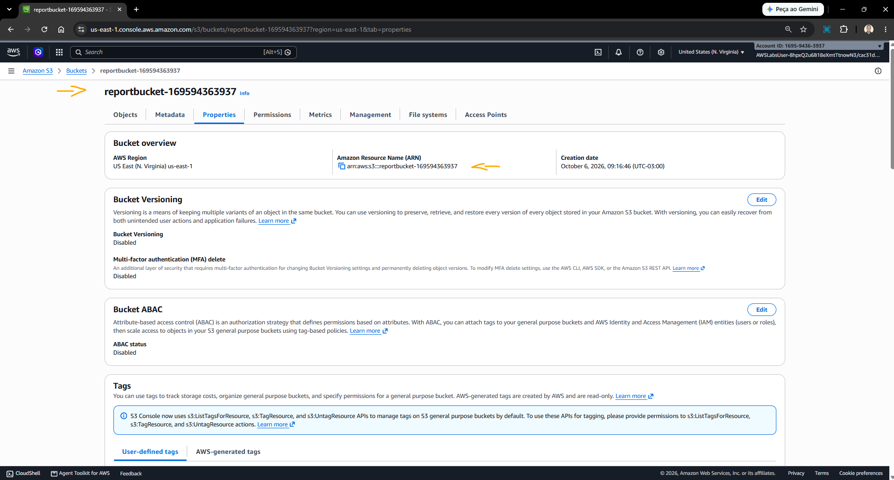
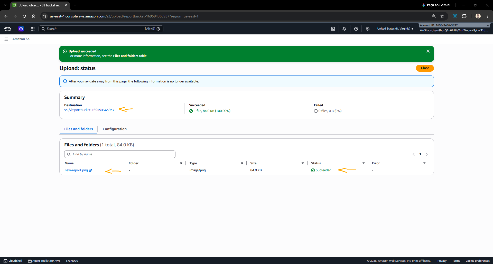
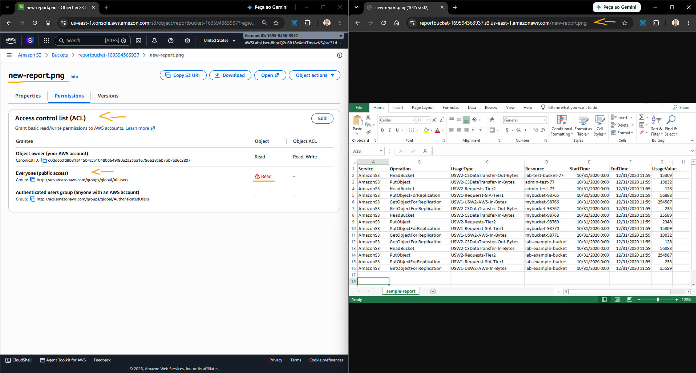
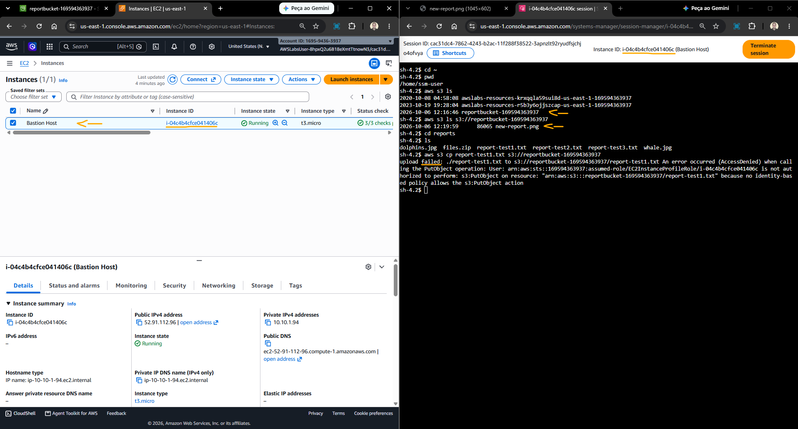
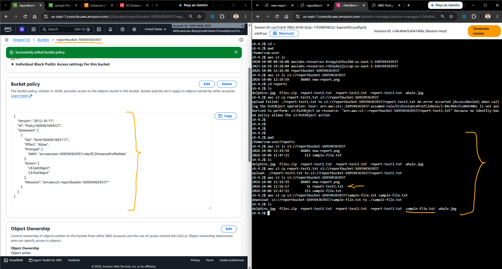
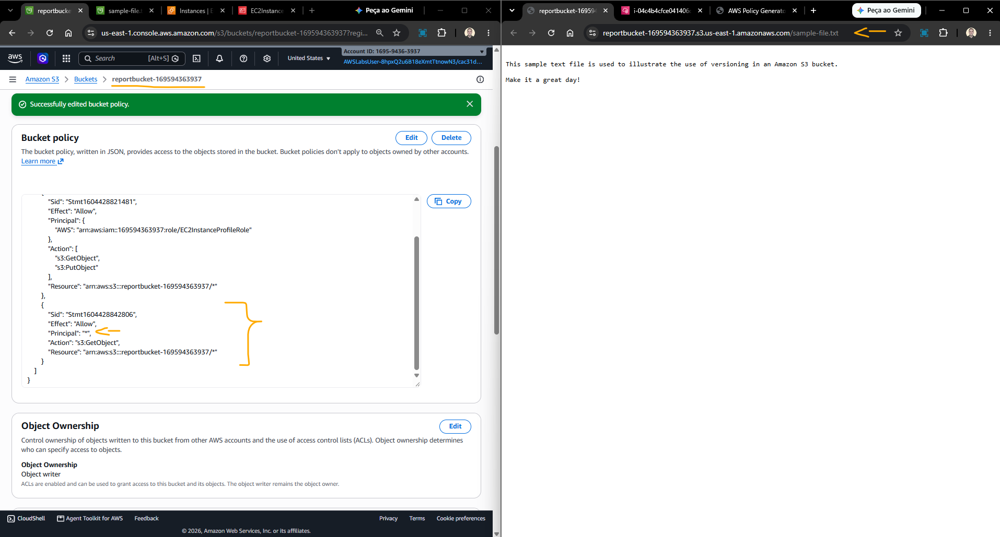
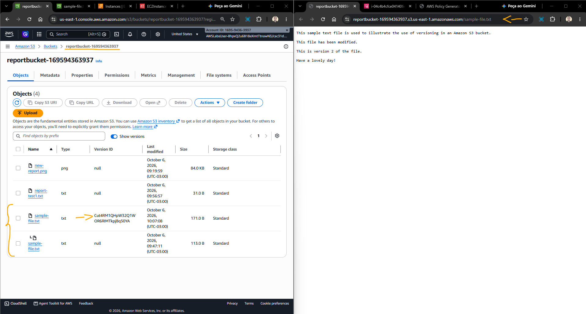
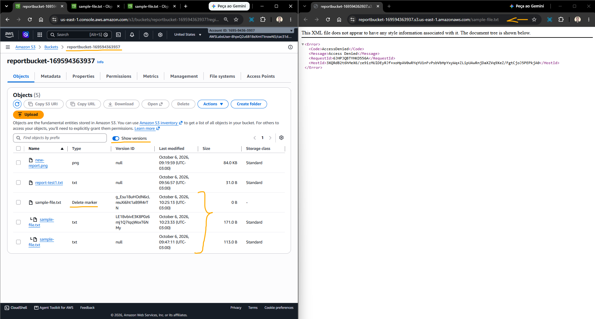

# Lab - Introduction to Amazon Simple Storage Service (S3)   

### AWS Skill Builder <a href="../../">aws_skill_builder   </a>
### Training Category: <a href="../../self_paced_lab">self_paced_lab</a>
### Software/Subject: aws   
### Course: <a href="./">spl_056 (Lab - Introduction to Amazon Simple Storage Service (S3))   </a>

#### <a href="https://github.com/PedroHeeger/my_tech_journey/blob/main/credentials/certificates/online_courses/cloud/aws/skb/spl/261006_spl_056_en.pdf">Certificate</a>

---

### Theme:
- Cloud Computing

### Used Tools:
- Operating System (OS): 
  - Windows 11   
- Cloud:
  - Amazon Web Services (AWS)   
- Cloud Services:
  - Amazon Elastic Compute Cloud (EC2)   
  - Amazon Simple Storage Service (S3)   
  - AWS Identity and Access Management (IAM)   
  - Google Drive   
- Language:
  - HTML   
  - Markdown   
- Integrated Development Environment (IDE) and Text Editor:
  - Visual Studio Code (VS Code)   
- Versioning: 
  - Git   
- Repository:
  - GitHub   

---

<a name="item0"><h3>Course Strcuture:</h3></a>
1. <a href="#item01">Tarefa 1: Criar um bucket</a> 
2. <a href="#item02">Tarefa 2: Carregar um objeto para o bucket</a> 
3. <a href="#item03">Tarefa 3: Tornar um objeto público</a> 
4. <a href="#item04">Tarefa 4: Testar a conectividade da instância EC2</a> 
5. <a href="#item05">Tarefa 5: Criar uma política de bucket</a> 
6. <a href="#item06">Tarefa 6: Explorar o versionamento</a> 

---

### Objective:
O objetivo deste laboratório foi compreender o funcionamento do **Amazon Simple Storage Service (S3)** no armazenamento e gerenciamento de objetos, explorando diferentes mecanismos de controle de acesso, como Access Control Lists (ACLs) e Bucket Policies. Também foi analisada a interação entre uma instância Amazon EC2 e o bucket por meio do AWS Systems Manager Session Manager, bem como o acesso aos objetos via HTTPS. Por fim, foi explorado o funcionamento do versionamento de objetos, incluindo a criação de novas versões, a recuperação de versões anteriores e o comportamento dos objetos durante processos de exclusão e restauração.

### Structure:
- [README.md](./README.md): Este documento de README, escrito em **Markdown**, com o conteúdo do laboratório.
- [resource](./resource): Pasta com todos os recursos utilizados neste laboratório.
- [0-aux](./0-aux/): Pasta auxiliar com imagens utilizadas na construção dos arquivos de README desse laboratório.

### Development:
<a name="item01"><h4>Tarefa 1: Criar um bucket</h4></a>[Back to summary](#item0)

A primeira tarefa deste laboratório consistiu na criação de um bucket no Amazon S3, que seria utilizado posteriormente para armazenamento de objetos e realização de testes com diferentes configurações e recursos disponibilizados pelo serviço.

O bucket foi criado com as seguintes configurações:
- Bucket Name: `reportbucket-<Account ID>`. O nome do bucket foi definido a partir do ID da conta utilizada no laboratório (`reportbucket-169594363937`).
- Access Control Lists (ACLs): As ACLs foram habilitadas.
- Object Ownership: A opção `Object Writer` foi selecionada, fazendo com que a conta responsável pelo upload seja considerada a proprietária do objeto. Já a opção `Bucket owner preferred` permite que o proprietário do bucket assuma a propriedade dos objetos enviados com a ACL predefinida `bucket-owner-full-control`. Caso essa ACL não seja utilizada, a propriedade permanece com a conta que realizou o upload.

A imagem 01 mostra o bucket provisionado.

<figure>
     
    <figcaption>Imagem 01.</figcaption>
</figure>
 

<a name="item02"><h4>Tarefa 2: Carregar um objeto para o bucket</h4></a>[Back to summary](#item0)

O próximo passo foi a adição de um objeto no bucket criado. O objeto adicionado foi uma captura de tela, fornecida pelo lab, de um relatório diário fictício, cujo nome era [new-report.png](./resource/new-report.png). Para realizar o upload, foi necessário acessar o bucket e selecionar a imagem previamente baixada.

A imagem 02 exibe o objeto criado no bucket após a adição da captura de tela.

<figure>
     
    <figcaption>Imagem 02.</figcaption>
</figure>
 

<a name="item03"><h4>Tarefa 3: Tornar um objeto público</h4></a>[Back to summary](#item0)

Antes de configurar a instância para se conectar ao bucket provisionado, foi realizado um teste de segurança para verificar as configurações de acessibilidade do bucket e do objeto. Inicialmente, foi realizada uma tentativa de acesso direto ao objeto, com o objetivo de confirmar se ele estava configurado como privado por padrão. Para isso, o objeto foi acessado dentro do bucket, sua URL foi copiada e, posteriormente, acessada por meio de um navegador web (`https://reportbucket-169594363937.s3.us-east-1.amazonaws.com/new-report.png`). Como esperado, foi retornado um erro de acesso negado, indicando que o objeto não estava disponível publicamente.

Após a confirmação de que o objeto estava privado por padrão, o próximo passo foi torná-lo público para permitir seu acesso externo. No console do Amazon S3, foi utilizada a opção de tornar o objeto público por meio de ACL. Entretanto, essa alteração não pôde ser realizada inicialmente, pois o bucket estava configurado para bloquear o acesso público. Dessa forma, nenhum objeto poderia ser disponibilizado publicamente enquanto essa configuração estivesse ativa.

Para permitir a alteração, foi necessário acessar as configurações do bucket provisionado e, na seção Permissions, editar a opção Block public access (bucket settings). Nessa seção, foram desmarcadas as opções relacionadas ao bloqueio de acesso público:
- Block all public access: Bloqueia todas as formas de acesso público ao bucket e aos objetos.
- Block public access to buckets and objects granted through new access control lists (ACLs): Impede que novas ACLs concedam acesso público ao bucket ou aos objetos.
- Block public access to buckets and objects granted through any access control lists (ACLs): Bloqueia qualquer acesso público concedido por ACLs, incluindo ACLs existentes.
- Block public access to buckets and objects granted through new public bucket or access point policies: Impede que novas políticas de bucket ou access point concedam acesso público ao bucket ou aos objetos.
- Block public and cross-account access to buckets and objects through any public bucket or access point policies: Impede que políticas públicas de bucket ou de access point concedam acesso público ou entre diferentes contas AWS.

Após a confirmação das alterações, foi possível tornar o objeto público utilizando uma ACL. Como resultado, o objeto passou a ser acessível externamente por meio de sua URL, conforme apresentado na imagem 03.

<figure>
     
    <figcaption>Imagem 03.</figcaption>
</figure>
 

<a name="item04"><h4>Tarefa 4: Testar a conectividade da instância EC2</h4></a>[Back to summary](#item0)

A quarta tarefa do laboratório consistiu na conexão de uma instância EC2, previamente provisionada e denominada Bastion Host, ao bucket criado no Amazon S3. A instância utilizada já possuía um perfil de instância associado a uma IAM Role, contendo as respectivas policies responsáveis por conceder permissões para interagir com o S3.

O primeiro passo foi estabelecer uma conexão com a instância por meio do Session Manager, recurso do AWS Systems Manager que permite acessar a instância sem a necessidade de abrir portas específicas no firewall ou no grupo de segurança da Amazon VPC. O agente do SSM já estava instalado na instância.

A conexão do Session Manager com a instância é realizada por meio do protocolo HTTPS, utilizando a porta 443. Dessa forma, não foi necessário criar uma regra de entrada para a porta 22 (SSH) no grupo de segurança da instância.

Após o estabelecimento da sessão, foram executados os seguintes comandos:
- `cd ~`: Alterar para o diretório inicial do usuário, `/home/ssm-user/`.
- `pwd`: Verificar o diretório de trabalho atual.
- `aws s3 ls`: Listar os buckets disponíveis na conta.
- `aws s3 ls s3://reportbucket-169594363937`: Listar os objetos armazenados no bucket criado. Nesse momento, havia apenas um objeto armazenado.
- `cd reports`: Alterar para o diretório reports, destinado aos arquivos de relatório na instância.
- `ls`: Listar os arquivos presentes no diretório atual.
- `aws s3 cp report-test1.txt s3://reportbucket-169594363937`: Tentar copiar o arquivo `report-test1.txt` do diretório da instância para o bucket no S3. A operação não foi permitida, pois a IAM Role associada à instância não possuía uma policy que concedesse permissão de escrita no bucket, dispondo apenas de permissões de leitura.

A imagem 04 apresenta os comandos executados dentro da instância e a interação realizada com o bucket no Amazon S3.

<figure>
     
    <figcaption>Imagem 04.</figcaption>
</figure>
 

<a name="item05"><h4>Tarefa 5: Criar uma política de bucket</h4></a>[Back to summary](#item0)

Uma política de bucket é um conjunto de permissões associado a um bucket do Amazon S3. Ela pode ser utilizada para controlar o acesso aos recursos armazenados no bucket, incluindo os objetos contidos nele. Nesta tarefa, o AWS Policy Generator foi utilizado para elaborar uma política de bucket que permitisse à instância EC2 realizar operações de leitura e escrita no bucket, possibilitando que novos relatórios fossem armazenados como objetos no S3.

Primeiramente, foi baixado um arquivo de texto fornecido pelo laboratório, denominado [sample-file.txt](./resource/sample-file.txt), que foi posteriormente adicionado ao bucket como um novo objeto. Em seguida, a URL desse objeto foi copiada e utilizada para tentar acessá-lo publicamente. Entretanto, o acesso foi negado, pois o objeto não possuía uma permissão para acesso público.

Para permitir que a instância EC2 realizasse operações de leitura e escrita no bucket, foi utilizada uma política de bucket, evitando a necessidade de configurar permissões individualmente para cada objeto. Na IAM Role vinculada à instância, denominada `EC2InstanceProfileRole`, o ARN foi copiado (`arn:aws:iam::169594363937:role/EC2InstanceProfileRole`). Em seguida, o ARN do bucket de relatórios também foi copiado (`arn:aws:s3:::reportbucket-169594363937`), e a seção Permissions do bucket foi acessada. Em Bucket policy, foi selecionada a opção Edit, sendo exibido um editor de políticas inicialmente vazio.

Os Amazon Resource Names (ARNs) identificam exclusivamente os recursos da AWS. Cada seção do ARN é separada pelo caractere : e representa uma parte específica da identificação do recurso. De forma geral, um ARN segue o formato: `arn:partition:service:region:account-id:resource`. No caso do Amazon S3, os campos de região e ID da conta não são utilizados na identificação de buckets. Esses campos permanecem vazios, mas os caracteres : utilizados como separadores continuam presentes.

As políticas de bucket podem ser criadas manualmente no formato JSON ou utilizando o AWS Policy Generator. Neste caso, foi utilizado o gerador para facilitar a criação da política.

O AWS Policy Generator foi acessado pelo endereço AWS Policy Generator (https://awspolicygen.s3.amazonaws.com/policygen.html). As políticas da AWS utilizam o formato JSON para definir permissões de acesso de maneira granular aos recursos e serviços. Embora seja possível escrever uma política manualmente, o AWS Policy Generator permite criá-la por meio de uma interface gráfica.

Na janela do AWS Policy Generator, foram definidas as seguintes configurações:
- `Type of Policy` (Tipo de política): foi selecionado `S3 Bucket Policy`.
- `Effect` (Efeito): foi selecionado `Allow` (Permitir).
- `Principal` (Principal): foi inserido o ARN da IAM Role `EC2InstanceProfileRole` (`arn:aws:iam::169594363937:role/EC2InstanceProfileRole`).
- `Actions` (Ações): foram selecionadas as ações `PutObject` e `GetObject`. A ação GetObject concede permissão para recuperar objetos do Amazon S3, enquanto PutObject permite enviar ou gravar objetos no bucket.
- Nome de recurso da Amazon (ARN): foi inserido o ARN do bucket, acrescentando `/*` ao final (`arn:aws:s3:::reportbucket-169594363937/*`). O ARN identifica o recurso ao qual a política será aplicada. Nesse caso, o uso de /* faz com que a permissão seja aplicada aos objetos contidos no bucket.
- Após o preenchimento das informações, foi selecionado `Add Statement` e, em seguida, `Generate Policy`. Uma nova janela foi exibida contendo a política gerada no formato JSON. O resultado deve ser semelhante ao arquivo [policy.json](./resource/policy.json).

A política gerada foi então utilizada para criar a Bucket Policy no bucket construído

Após a criação da política, a sessão do SSM foi novamente utilizada para estabelecer uma conexão com a instância EC2. Dentro da sessão, foram executados os seguintes comandos:
- `pwd`: Verificar o diretório atual.
- `aws s3 ls s3://reportbucket-169594363937`: Listar os objetos armazenados no bucket de relatórios.
- `ls`: Listar os arquivos presentes no diretório atual, que deve ser o diretório de relatórios.
- `aws s3 cp report-test1.txt s3://reportbucket-169594363937`: Copiar o arquivo `report-test1.txt` da instância para o bucket, criando um novo objeto.
- `aws s3 ls s3://reportbucket-169594363937`: Listar novamente os objetos do bucket para confirmar se o arquivo foi copiado com sucesso.
- `aws s3 cp s3://reportbucket-169594363937/sample-file.txt sample-file.txt`: Baixar o arquivo `sample-file.txt` do bucket para a instância EC2.
- `ls`: Listar os arquivos presentes no diretório atual, confirmando que o arquivo foi baixado para a instância.

A imagem 05 ilustra que a instância EC2 conseguiu interagir com o bucket do Amazon S3, realizando operações de upload e download de objetos por meio das permissões concedidas à IAM Role associada à instância via bucket policy.

<figure>
     
    <figcaption>Imagem 05.</figcaption>
</figure>
 

Por fim, o arquivo de texto armazenado no bucket foi novamente acessado por meio de sua URL para verificar se o acesso público havia sido habilitado. Entretanto, o acesso continuou sendo negado. Isso ocorreu porque a política de bucket criada concedia permissões somente à IAM Role associada à instância EC2, não permitindo o acesso público ao objeto.

Para permitir o acesso público, o AWS Policy Generator foi novamente utilizado para criar uma nova declaração. Dessa vez, foi definido * como Principal, permitindo que qualquer entidade pudesse acessar o objeto, e a ação GetObject foi selecionada para conceder permissão de leitura.

Após a geração da nova política, o arquivo [policy2.json](./resource/policy2.json) foi utilizado para substituir a política de bucket anterior. Em seguida, a URL do objeto foi novamente acessada por meio de um navegador web. Dessa vez, o objeto pôde ser visualizado com sucesso, confirmando que o acesso público havia sido concedido.

A imagem 06 apresenta o objeto de texto sendo acessado diretamente por meio de sua URL em um navegador web.

<figure>
     
    <figcaption>Imagem 06.</figcaption>
</figure>
 

<a name="item06"><h4>Tarefa 6: Explorar o versionamento</h4></a>[Back to summary](#item0)

O versionamento é um recurso que permite manter múltiplas versões de um mesmo objeto dentro de um bucket. Ele pode ser utilizado para preservar, recuperar e restaurar versões anteriores dos objetos armazenados no Amazon S3, permitindo a recuperação de dados em situações como exclusões acidentais ou falhas de aplicações. A última tarefa do laboratório consistiu em explorar o funcionamento do versionamento no bucket provisionado.

Para habilitar o versionamento, foi necessário acessar as Properties do bucket e, na seção Bucket Versioning, ativar a opção Enable. O versionamento é configurado no nível do bucket e, consequentemente, aplica-se aos objetos armazenados nele. Não é possível habilitar o versionamento individualmente para objetos específicos.

Para testar o funcionamento do recurso, o arquivo [sample-file2.txt](./resource/sample-file2.txt) foi baixado. Esse arquivo corresponde a uma segunda versão do conteúdo de `sample-file.txt`. Embora o arquivo tenha sido disponibilizado com o número 2 em seu nome para permitir que ambos os arquivos permanecessem na pasta de recursos, era necessário que, no momento do upload para o bucket, ele possuísse exatamente o mesmo nome do objeto original.

No bucket, a aba Objects foi acessada e a opção `Show versions` foi habilitada. Os três objetos existentes apresentavam o Version ID como null, pois haviam sido criados antes da ativação do versionamento. Em seguida, o novo arquivo de texto foi renomeado para `sample-file.txt`, mantendo o mesmo nome do objeto existente, e carregado no bucket, criando uma nova versão do objeto. Ao acessar o objeto por meio de sua URL, a versão mais recente era disponibilizada, que, nesse caso, correspondia ao conteúdo enviado posteriormente.

A imagem 07 exibe a nova versão adicionada ao bucket, sendo a única que possui um Version ID específico, por ter sido criada após a ativação do versionamento. A imagem também demonstra o acesso público à nova versão por meio de sua URL. Um ponto importante observado é que as diferentes versões são agrupadas sob o mesmo nome de objeto. Dessa forma, ao habilitar a opção Show versions, as duas versões de sample-file.txt são exibidas conjuntamente, sendo a versão mais recente apresentada como a versão atual do objeto.

<figure>
     
    <figcaption>Imagem 07.</figcaption>
</figure>
 

Ao selecionar o objeto e acessar a seção de versões, foram exibidas as duas versões existentes. A versão anterior apresentava o Version ID como null, pois o objeto havia sido criado antes da ativação do versionamento. Essa versão ainda podia ser selecionada e, conceitualmente, utilizada para restaurar o conteúdo anterior. Entretanto, a política de bucket configurada anteriormente concedia apenas a permissão `s3:GetObject`, que permite acessar o objeto atual, mas não versões específicas. Para permitir o acesso às versões anteriores, seria necessário adicionar a permissão `s3:GetObjectVersion` à política do bucket.

Com relação à exclusão de objetos versionados, na seção Objects do bucket, a visualização foi alterada para ocultar as versões. Em seguida, o objeto sample-file.txt foi selecionado e excluído. Quando o versionamento está habilitado, o Amazon S3 não remove permanentemente a versão atual do objeto. Em vez disso, é criado um delete marker, que passa a ser a versão atual associada ao nome do objeto e faz com que ele deixe de ser exibido na visualização padrão do bucket. As versões anteriores permanecem armazenadas e podem ser visualizadas novamente ao habilitar a opção `Show versions`.

A imagem 08 evidencia a exclusão do objeto versionado e a criação do delete marker.

<figure>
     
    <figcaption>Imagem 08.</figcaption>
</figure>
 

Ao remover o delete marker, o objeto é restaurado e volta a ser exibido na visualização padrão do bucket. Também é possível excluir uma versão específica do objeto. Nesse caso, a exclusão da versão não cria um novo delete marker, pois o versionamento permite que cada versão seja gerenciada individualmente. Quando a versão atual do objeto é excluída permanentemente, a versão imediatamente anterior passa a ser considerada a versão atual do objeto e volta a ser disponibilizada na visualização padrão do bucket.