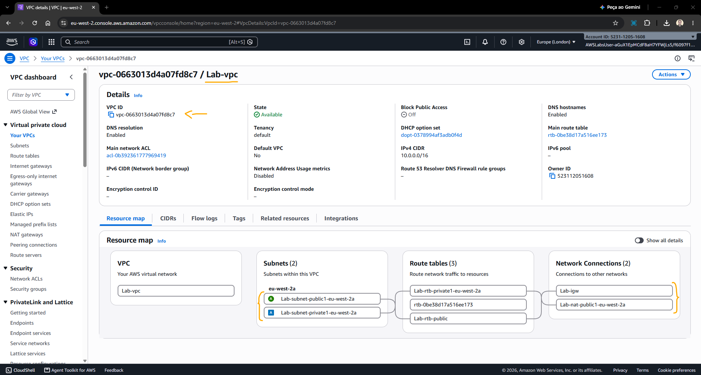
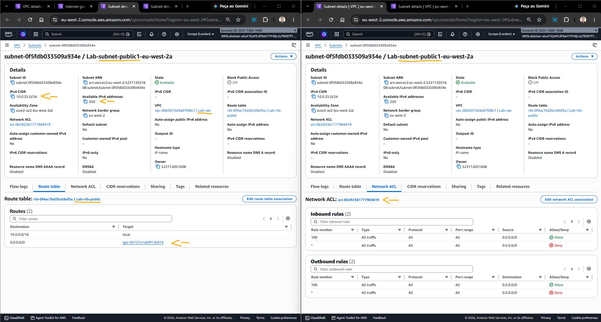
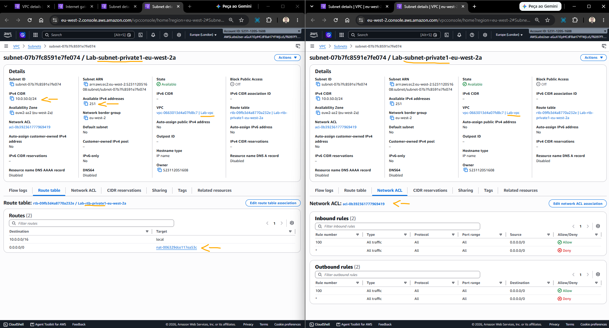
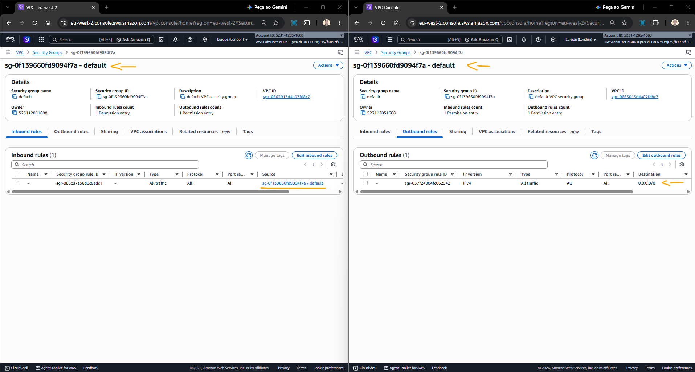

# Lab - Introduction to Amazon Virtual Private Cloud (VPC)   

### AWS Skill Builder <a href="../../">aws_skill_builder   </a>
### Training Category: <a href="../../self_paced_lab">self_paced_lab</a>
### Software/Subject: aws   
### Course: <a href="./">spl_057 (Lab - Introduction to Amazon Virtual Private Cloud (VPC))   </a>

#### <a href="https://github.com/PedroHeeger/my_tech_journey/blob/main/credentials/certificates/online_courses/cloud/aws/skb/spl/261006_spl_057_en.pdf">Certificate</a>

---

### Theme:
- Cloud Computing
- Network

### Used Tools:
- Operating System (OS): 
  - Windows 11   
- Cloud:
  - Amazon Web Services (AWS)   
- Cloud Services:
  - Amazon Virtual Private Cloud (VPC)   
  - Google Drive   
- Language:
  - HTML   
  - Markdown   
- Integrated Development Environment (IDE) and Text Editor:
  - Visual Studio Code (VS Code)   
- Versioning: 
  - Git   
- Repository:
  - GitHub   

---

<a name="item0"><h3>Course Strcuture:</h3></a>
1. <a href="#item01">Tarefa 1: Criar uma VPC da Amazon</a> 
2. <a href="#item02">Tarefa 2: Explore sua VPC</a> 

---

### Objective:
O objetivo deste laboratório foi compreender como provisionar rapidamente uma rede virtual utilizando o assistente do **Amazon VPC**, explorando os principais recursos que a compõem, como sub-redes públicas e privadas, tabelas de rotas, Internet Gateway, NAT Gateway, Network ACLs e Security Groups.

### Structure:
- [README.md](./README.md): Este documento de README, escrito em **Markdown**, com o conteúdo do laboratório.
- [0-aux](./0-aux/): Pasta auxiliar com imagens utilizadas na construção dos arquivos de README desse laboratório.

### Development:
<a name="item01"><h4>Tarefa 1: Criar uma VPC da Amazon</h4></a>[Back to summary](#item0)

A primeira tarefa deste laboratório consistiu na criação de uma rede virtual no **Amazon Virtual Private Cloud (VPC)** utilizando o assistente de criação de VPC. O assistente permite provisionar automaticamente uma VPC e seus principais componentes a partir dos parâmetros especificados, simplificando o processo em comparação à criação manual de cada recurso.

A rede virtual provisionada foi composta por:
- Uma sub-rede pública.
- Uma sub-rede privada.
- Um Internet Gateway.
- Um NAT Gateway.

A VPC foi configurada com os seguintes parâmetros:
- Create VPC: foi selecionada a opção `VPC and more`, permitindo visualizar e personalizar os parâmetros da rede.
- Name tag auto-generation: `Auto-generate` e inserido `Lab` na caixa de texto.
- Number of Availability Zones (AZs): `1`.
- Number of public subnets: `1`.
- Number of private subnets: `1`.
- Customize subnets CIDR blocks: `10.0.25.0/24`.
- Private subnet CIDR block: `10.0.50.0/24`.
- NAT gateways ($) - updated: `Zonal`.
- NAT gateways ($): `In 1 AZ`.
- VPC endpoints: `None`. Nenhum endpoint do tipo S3 Gateway foi selecionado.

A imagem 01 mostra a VPC provisionada com os recursos definidos.

<figure>
     
    <figcaption>Imagem 01.</figcaption>
</figure>
 

<a name="item02"><h4>Tarefa 2: Explore sua VPC</h4></a>[Back to summary](#item0)

Nesta tarefa, a VPC provisionada foi selecionada, denominada `Lab-vpc`, e seus principais recursos foram acessados e verificados:
- Internet Gateway (IGW): Conecta a VPC à Internet, permitindo a comunicação entre recursos da VPC e a Internet. É um componente altamente disponível e escalável, não impondo limitações de largura de banda ao tráfego de rede.
- NAT Gateway (NGW):
    - Permite que recursos em uma sub-rede privada iniciem conexões de saída para a Internet. O tráfego é encaminhado da sub-rede privada para o NAT Gateway e, posteriormente, para o Internet Gateway.
    - As conexões são iniciadas pelos recursos da sub-rede privada, não sendo possível iniciar conexões de entrada diretamente da Internet para esses recursos. Dessa forma, o NAT Gateway permite acesso externo sem tornar os recursos da sub-rede privada diretamente acessíveis pela Internet.
- Subnets: Uma sub-rede é um subconjunto de uma VPC e está associada a uma única Zona de Disponibilidade. Cada sub-rede possui um intervalo de endereços IP definido por um bloco CIDR.
    - As sub-redes utilizadas no laboratório foram 10.0.25.0/24 e 10.0.50.0/24.
    - Um bloco /24 possui 256 endereços IPv4, dos quais 250/251 são utilizáveis na AWS, pois 5/6 endereços são reservados pelo serviço.
    - O IPv6 também é suportado, mas não faz parte deste laboratório.
- Route Tables (RT):
    - Cada sub-rede está associada a uma tabela de rotas, que determina para onde o tráfego deve ser encaminhado de acordo com seu destino.
    - Public Route Table:
        - A rota 10.0.0.0/16 | local permite a comunicação entre os recursos dentro da VPC.
        - A rota 0.0.0.0/0 | igw- direciona o tráfego IPv4 destinado à Internet para o Internet Gateway. A presença dessa rota permite que a sub-rede seja utilizada como uma sub-rede pública.
    - Private Route Table:
        - A rota 10.0.0.0/16 | local permite a comunicação entre os recursos dentro da VPC.
        - A rota 0.0.0.0/0 | nat- direciona o tráfego destinado à Internet para o NAT Gateway, permitindo conexões de saída dos recursos da sub-rede privada.
        - A tabela não possui uma rota direta para o Internet Gateway, impedindo que os recursos da sub-rede sejam acessados diretamente pela Internet e caracterizando-a como uma sub-rede privada.
- Network ACL (NACL): Atua como um firewall sem estado no nível da sub-rede, controlando o tráfego de entrada e saída. A NACL utilizada possui as configurações padrão:
    - A regra 100 de entrada permite todo o tráfego de qualquer origem.
    - A regra 100 de saída permite todo o tráfego para qualquer destino.
    - A regra * é aplicada quando nenhuma regra anterior corresponde ao tráfego e, por padrão, bloqueia esse tráfego.
- Security Groups: Funcionam como firewalls virtuais associados às instâncias e controlam o tráfego de entrada e saída no nível da instância.
    - A VPC possui um grupo de segurança padrão, utilizado quando nenhum grupo específico é definido durante a criação de uma instância.
    - O grupo de segurança padrão permite a comunicação entre recursos associados ao próprio grupo por meio de uma regra de autorreferência. Tráfego proveniente de outras origens permanece bloqueado.
    - Outros grupos de segurança podem ser criados conforme a necessidade, permitindo definir regras específicas para recursos como servidores web, servidores de aplicação e bancos de dados.

A imagem 02 exibe o lado público da rede, composto pela sub-rede pública, sua tabela de rotas, contendo a rota padrão direcionada ao Internet Gateway (IGW), e sua Network ACL.

<figure>
     
    <figcaption>Imagem 02.</figcaption>
</figure>
 

A imagem 03 apresenta o lado privado da rede, composto pela sub-rede privada, sua tabela de rotas, contendo a rota padrão direcionada ao NAT Gateway (NGW), e sua Network ACL.

<figure>
     
    <figcaption>Imagem 03.</figcaption>
</figure>
 

A imagem 04 mostra o único Security Group da VPC, correspondente ao grupo de segurança padrão. Ele possui uma regra de saída permitindo tráfego para qualquer destino e uma regra de entrada que permite tráfego somente de recursos associados ao próprio Security Group.

<figure>
     
    <figcaption>Imagem 04.</figcaption>
</figure>
 